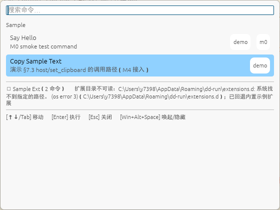

应用启动后查看内存占用约70M左右

1.有问题，启动后显示黑色面板，且未在屏幕中间（注意：显示界面样式与设计文档不一样）
截图：


2.通过
3.通过
4.通过
5.通过
6.通过（但是测试选择太少，不清楚Tab/Shift+Tab移动方向是否存在问题）
7.终端未打印内容
8.通过
9.通过（面板隐藏前会先变黑然后隐藏）
10.再次唤起后，会显示上次隐藏时显示的内容
11.拓展：```扩展目录不可读：C:\Users\y7398\AppData\Roaming\dd-run\extensions.d: 系统找不到指定的路径。 (os error 3)（C:\Users\y7398\AppData\Roaming\dd-run\extensions.d）；已回退内置示例扩展```