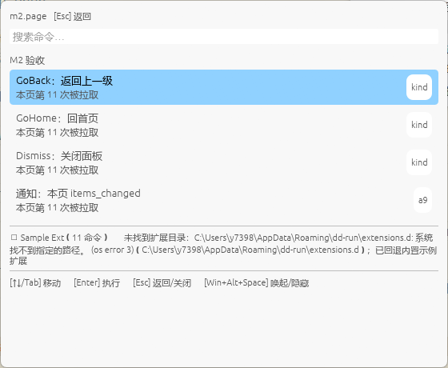

#1：按 Enter 毫无反应，未弹出提示条；日志：```[dd-gui] invoke 发起：ext=dev.sample-ext cmd=m2.kind.show_toast
[dd-gui] invoke 成功：ShowToast { message: "ShowToast：3 秒后自动消失", duration_ms: Some(3000) } → 动作 ShowToast { message: "ShowToast：3 秒后自动消失", duration_ms: Some(3000) }```

#2：通过
#3：通过
#4：通过
#5：不出现；日志：```[dd-gui] invoke 发起：ext=dev.sample-ext cmd=m2.kind.show_toast
[dd-gui] invoke 成功：ShowToast { message: "ShowToast：3 秒后自动消失", duration_ms: Some(3000) } → 动作 ShowToast { message: "ShowToast：3 秒后自动消失", duration_ms: Some(3000) }
[dd-gui] invoke 发起：ext=dev.sample-ext cmd=sample.hello
[dd-gui] invoke 成功：ShowToast { message: "Hello from dd-ext-sample！", duration_ms: None } → 动作 ShowToast { message: "Hello from dd-ext-sample！", duration_ms: None }```

#6： 没有Toast显示，日志：```[dd-gui] invoke 发起：ext=dev.sample-ext cmd=m2.kind.confirm
[dd-gui] invoke 成功：Confirm { title: "二次确认", description: "这是一条 Confirm 结果。确认后宿主应带 confirmed=true 重新 invoke 本命令。", confirm_label: "确认执行", is_critical: false } → 动作 Confirm { title: "二次确认", description: "这是一条 Confirm 结果。确认后宿主应带 confirmed=true 重新 invoke 本命令。", confirm_label: "确认执行", is_critical: false }
[dd-gui] invoke 发起：ext=dev.sample-ext cmd=m2.kind.confirm
[dd-gui] invoke 成功：Confirm { title: "二次确认", description: "这是一条 Confirm 结果。确认后宿主应带 confirmed=true 重新 invoke 本命令。", confirm_label: "确认执行", is_critical: false } → 动作 Confirm { title: "二次确认", description: "这是一条 Confirm 结果。确认后宿主应带 confirmed=true 重新 invoke 本命令。", confirm_label: "确认执行", is_critical: false }
[dd-gui] invoke 发起：ext=dev.sample-ext cmd=m2.kind.confirm
[dd-gui] invoke 成功：ShowToast { message: "确认流程闭环：已收到 confirmed=true 重发", duration_ms: None } → 动作 ShowToast { message: "确认流程闭环：已收到 confirmed=true 重发", duration_ms: None }```


#7：通过

日志：```[dd-gui] invoke 发起：ext=dev.sample-ext cmd=m2.kind.dismiss
[dd-gui] invoke 成功：Dismiss → 动作 Dismiss
[dd-gui] Dismiss：清空页面栈回 Root 后隐藏
[dd-gui] invoke 发起：ext=dev.sample-ext cmd=m2.kind.hide
[dd-gui] invoke 成功：Hide → 动作 Hide
[dd-gui] Hide：保留状态隐藏（下次唤起不复位）
[dd-gui] invoke 发起：ext=dev.sample-ext cmd=m2.kind.go_home
[dd-gui] invoke 成功：GoHome → 动作 GoHome
[dd-gui] get_items 成功：page=m2.page items=4
[dd-gui] invoke 发起：ext=dev.sample-ext cmd=m2.page.back
[dd-gui] invoke 成功：GoBack → 动作 GoBack
[dd-gui] invoke 发起：ext=dev.sample-ext cmd=m2.kind.keep_open
[dd-gui] invoke 成功：KeepOpen → 动作 KeepOpen
[dd-gui] invoke 发起：ext=dev.sample-ext cmd=m2.kind.go_to_page
[dd-gui] invoke 成功：GoToPage { page_id: "m2.page" } → 动作 GoToPage { page_id: "m2.page" }
[dd-gui] get_items 成功：page=m2.page items=4
[dd-gui] invoke 发起：ext=dev.sample-ext cmd=m2.page.back
[dd-gui] invoke 成功：GoBack → 动作 GoBack
[dd-gui] invoke 发起：ext=dev.sample-ext cmd=m2.kind.show_toast
[dd-gui] invoke 成功：ShowToast { message: "ShowToast：3 秒后自动消失", duration_ms: Some(3000) } → 动作 ShowToast { message: "ShowToast：3 秒后自动消失", duration_ms: Some(3000) }
[dd-gui] invoke 发起：ext=dev.sample-ext cmd=m2.kind.confirm
[dd-gui] invoke 成功：Confirm { title: "二次确认", description: "这是一条 Confirm 结果。确认后宿主应带 confirmed=true 重新 invoke 本命令。", confirm_label: "确认执行", is_critical: false } → 动作 Confirm { title: "二次确认", description: "这是一条 Confirm 结果。确认后宿主应带 confirmed=true 重新 invoke 本命令。", confirm_label: "确认执行", is_critical: false }
[dd-gui] invoke 发起：ext=dev.sample-ext cmd=m2.kind.confirm
[dd-gui] invoke 成功：ShowToast { message: "确认流程闭环：已收到 confirmed=true 重发", duration_ms: None } → 动作 ShowToast { message: "确认流程闭环：已收到 confirmed=true 重发", duration_ms: None }```

#8：Toast不显示，标题刷新了，日志：```[dd-gui] get_items 成功：page=m2.page items=4
[dd-gui] invoke 发起：ext=dev.sample-ext cmd=m2.page.notify
[dd-gui] invoke 成功：ShowToast { message: "已发送本页 items_changed，观察副标题计数 +1", duration_ms: Some(3000) } → 动作 ShowToast { message: "已发送本页 items_changed，观察副标题计数 +1", duration_ms: Some(3000) }
[dd-gui] 收到 items_changed page=m2.page → 100ms 后全量重拉
[dd-gui] get_items 成功：page=m2.page items=4
[dd-gui] invoke 发起：ext=dev.sample-ext cmd=m2.page.notify
[dd-gui] invoke 成功：ShowToast { message: "已发送本页 items_changed，观察副标题计数 +1", duration_ms: Some(3000) } → 动作 ShowToast { message: "已发送本页 items_changed，观察副标题计数 +1", duration_ms: Some(3000) }
[dd-gui] 收到 items_changed page=m2.page → 100ms 后全量重拉
[dd-gui] get_items 成功：page=m2.page items=4
[dd-gui] invoke 发起：ext=dev.sample-ext cmd=m2.page.back
[dd-gui] invoke 成功：GoBack → 动作 GoBack
[dd-gui] get_items 成功：page=m2.page items=4```


#9：不清楚是否成功

#10: 通过