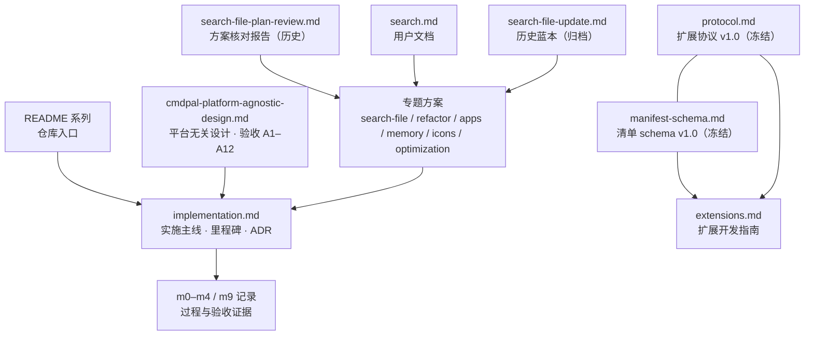

# dd-run 文档索引

> **状态**：生效中 ｜ **版本**：v1.16 ｜ **最后更新**：2026-09-19
> **用途**：全部文档的**唯一导航入口**——按模块分组、标注状态与读者，并定义文档格式规约。

---

## 1. 怎么用这份索引

| 你的目的 | 阅读路径 |
|---|---|
| **写一个扩展** | [`extensions.md`](./extensions.md)（路径）→ [`protocol.md`](./protocol.md)（规范）→ [`manifest-schema.md`](./manifest-schema.md)（清单） |
| **了解项目现状** | [`README.zh-CN.md`](../README.zh-CN.md) → [`implementation.md`](./implementation.md) §里程碑状态总表 |
| **接手维护代码** | [`cmdpal-platform-agnostic-design.md`](../cmdpal-platform-agnostic-design.md)（抽象模型与验收 A1–A12）→ [`implementation.md`](./implementation.md)（ADR 与遗留台账）→ 各 [`mX-record.md`](./m0-record.md)（过程与踩坑） |
| **排查文件搜索问题** | [`search.md`](./search.md)（用户视角）→ [`search-file.md`](./search-file.md)（权威技术口径）→ [`search-file-p2-acceptance-2026-09-15.md`](./search-file-p2-acceptance-2026-09-15.md)（真机验收结论） |
| **理解某个设计为什么这样做** | 先查 [`implementation.md`](./implementation.md) §4 ADR-1~ADR-4，再查设计文档对应章节 |
| **改协议 / 改清单格式** | [`protocol.md`](./protocol.md) §13（演进规则）→ [`manifest-schema.md`](./manifest-schema.md) §9，**两者均为冻结契约，改动须走版本协商** |

---

## 2. 文档地图



---

## 3. 全量文档清单

### A. 规范契约（冻结，硬契约）

改动须走版本协商；**不得为一处方便而破坏既有语义**。

| 文档 | 状态 | 版本 | 行数 | 读者 | 职责 |
|---|---|---|---|---|---|
| [`protocol.md`](./protocol.md) | 已冻结 | v1.0 | 785 | 宿主与扩展作者 | 进程间通信：JSON-RPC over NDJSON、生命周期、8 种执行结果、错误码、超时 |
| [`manifest-schema.md`](./manifest-schema.md) | 已冻结 | v1.0 | 159 | 扩展作者 | 扩展发现：清单字段、扫描目录、路径展开、9 条校验规则、内置注册 |

### B. 设计与实施（主线）

| 文档 | 状态 | 版本 | 行数 | 读者 | 职责 |
|---|---|---|---|---|---|
| [`../cmdpal-platform-agnostic-design.md`](../cmdpal-platform-agnostic-design.md) | 生效中 | v1.0 | 547 | 设计者与维护者 | 平台无关抽象模型、页面/扩展/宿主模型、上下游对照、**验收项 A1–A12 的定义源** |
| [`implementation.md`](./implementation.md) | 生效中 | v0.1.1 | 797 | 维护者 | 实施主线：里程碑状态总表、目标与范围、ADR-1~4、验收映射（含 §3.1 测试基线台账）、遗留台账、实施沿革 |

### C. 开发指南与用户文档

| 文档 | 状态 | 版本 | 行数 | 读者 | 职责 |
|---|---|---|---|---|---|
| [`extensions.md`](./extensions.md) | 生效中 | v1.0 | 489 | 扩展作者 | 从零写一个扩展：快速上手、三条铁律、三个 Windows 陷阱、方法实现顺序、自检表 |
| [`search.md`](./search.md) | 生效中 | v1.3 | 123 | 最终用户 | 文件搜索的准备事项（**Everything 必需、`es.exe` 可选回落**）、**三种进入方式（含 `Ctrl+F`）**、动作、真实图标与回落说明、常见问题与排障 |

### D. 专题方案

均为**已落地**的实施记录。方案细节保留作决策留痕；正文中的"计划时"表述已按实现校正。

| 文档 | 状态 | 行数 | 职责 |
|---|---|---|---|
| [`search-file.md`](./search-file.md) | 生效中（v3.9） | 1034 | **文件搜索的权威技术口径**：双通道传输层、依赖、落地范围、两轮真机验收结论、A-33-05 阈值修订（v3.4）、回落失败不静默（v3.5）、`Ctrl+F` 直达与 Shell 真实图标（v3.6）、移除 `f ` 前缀直达（v3.7）、解除 `es.exe` 前置表述（v3.8）、**图标分层异步 + 自动刷新（v3.9，E1 已达标 / E2 待决策）**、版本演进 |
| [`refactor-layering-plan.md`](./refactor-layering-plan.md) | 已落地 | 498 | `dd-gui` 业务代码 / UI 代码分层方案与切割表 |
| [`apps-filtering-plan.md`](./apps-filtering-plan.md) | 已落地 | 130 | Apps 扩展垃圾项过滤（黑/白名单、UWP 豁免、去重键） |
| [`memory-optimization-plan.md`](./memory-optimization-plan.md) | 已落地 | 128 | 运行时内存占用优化 M1–M4 与实测数据 |
| [`icons-typography-plan.md`](./icons-typography-plan.md) | 已落地（I3 未做；G1 已落地） | 191 | 图标与字体展示优化：列表密度三档、占位 glyph、token 化；**G1 = 文件结果改用 Shell 真实图标（§4.5）** |
| [`optimization-plan.md`](./optimization-plan.md) | 规划中（Phase 1 关闭 · Phase 2 首轮完成） | 308 | **项目可优化方案总览（增量）**：体积/协议健壮性/方法名常量/可观测性/依赖治理/跨平台，含已证伪项与落地记录 |
| [`search-file-ctrl-f-icons-plan.md`](./search-file-ctrl-f-icons-plan.md) | 已落地（**E1 已处置达标 / E2 待决策**；v1.3 增补 A-IC-08/09/10） | 288 | **文件搜索开启方式与图标方案**：`Ctrl+F` 直达（决策 D1-x）与 Shell 真实文件图标（决策 D2-x）的决策留痕；§11 = 落地记录与 A-CF/A-IC 实测（首抽 703.8 ms **已由分层异步修复为 0.32 ms**；sidecar 体积仍待 E2） |

### E. 核查与评审报告

| 文档 | 状态 | 行数 | 职责 |
|---|---|---|---|
| [`doc-audit-2026-09-13.md`](./doc-audit-2026-09-13.md) | 生效中 | 266 | **全量文档内容核对说明**：逐条列出与实现不符的错误、遗漏、矛盾，含依据与处置；并汇总待人工决策项 |
| [`doc-code-diff-2026-09-13.md`](./doc-code-diff-2026-09-13.md) | 生效中 | 349 | **文档 ↔ 代码差异清单与修复记录**（71 条差异，三路独立复核验真后按「文档对齐代码」逐条落实修复，含每条修复落点）；§10–§13 记代码侧闭环 **9 项**（P-01/P-02/P-03/P-04/P-06/P-13/P-14/P-15/P-18）与两项协议口径定稿，§14 记 §7 一致性取样项因 `f ` 前缀直达移除而失效，遗留待人工确认项见其 §5 |
| [`optimization-plan-review-2026-09-14.md`](./optimization-plan-review-2026-09-14.md) | 生效中 | 152 | **`optimization-plan.md` 二轮核对报告**：4 处事实错误 / 6 处不严谨 / 2 处规范不符 / 3 处存疑，逐条附依据与修改建议；对应修订已落实（该方案升至 v1.1） |
| [`search-file-plan-review.md`](./search-file-plan-review.md) | 历史归档 | 149 | 文件搜索 v3.3 方案的编码前核对报告；每项结论已附**最终处置**（已解决 / 已规避 / 仍存在 / 已被取代） |
| [`search-file-p2-acceptance-2026-09-15.md`](./search-file-p2-acceptance-2026-09-15.md) | 生效中 | 268 | **文件搜索 P2 真机验收报告（两轮）**：A-33-05/06/07/08/10 逐项实测（环境矩阵、耗时分解、1000 次基准、故障注入与通道级恢复判据），含未闭环项与复现命令；v1.1 依扩展内**分阶段计时日志**更正耗时分解，v1.2 记 **A-33-05 阈值修订决策**（§4.1.1），**v1.3 补 `es.exe` 基线与回落分支并把 A-33-05/06 改判通过**（§4.2.1 记录回落失败静默缺陷的修复） |

### F. 里程碑记录（历史证据，内容保持原样）

**刻意不做格式重排**——这些是已通过验收的历史证据，重写会破坏可追溯性。各记录的"最后更新"即其关闭时点。

| 文档 | 行数 | 里程碑 | 关闭 |
|---|---|---|---|
| [`m0-record.md`](./m0-record.md) | 145 | M0 地基与协议冻结 | 2026-09-01 |
| [`m0-verification-report.md`](./m0-verification-report.md) | 110 | M0 验证报告 | 2026-09-01 |
| [`m1-record.md`](./m1-record.md) | 169 | M1 最小可用面板 | 2026-09-02 |
| [`m2-record.md`](./m2-record.md) | 292 | M2 命令执行与结果状态机 | 2026-09-02 |
| [`m2-verification-report.md`](./m2-verification-report.md) | 96 | M2 验证报告 | 2026-09-02 |
| [`m3-record.md`](./m3-record.md) | 154 | M3 缓存与懒加载 | 2026-09-02 |
| [`m4-record.md`](./m4-record.md) | 339 | M4 内置扩展与健壮性 | 2026-09-04 |
| [`m9-inprocess-builtins.md`](./m9-inprocess-builtins.md) | 146 | M9 内置扩展进程内化 | 2026-09-11 |

> M5–M8 的结论直接记于 [`implementation.md`](./implementation.md) §2，未单独建记录文件。

### G. 归档

| 文档 | 状态 | 行数 | 说明 |
|---|---|---|---|
| [`search-file-update.md`](./search-file-update.md) | 历史归档 | 106 | 文件搜索 v2 升级设计的评审蓝本。**内容仅代表撰写时点**，权威口径见 [`search-file.md`](./search-file.md) |

### H. 仓库入口

| 文档 | 状态 | 行数 | 说明 |
|---|---|---|---|
| [`../README.md`](../README.md) | 生效中 | 115 | 英文 README |
| [`../README.zh-CN.md`](../README.zh-CN.md) | 生效中 | 115 | 中文 README（与英文版逐节对应） |
| [`../CHANGELOG.md`](../CHANGELOG.md) | 生效中 | 285 | 版本变更日志（`[0.1.0]`/`[0.1.1]` 条目均带日期；`[Unreleased]` 含 2026-09-19 七批变更——**移除 `f ` 前缀直达** / `Ctrl+F` 直达 + Shell 真实图标 / 模糊排序字段分层 / 应用列表调试工具过滤 / **解除 `es.exe` 前置表述**等） |

> 设计稿与交互演示（HTML）不在本索引收录范围内：`cmdpal-ui-mockups.html`、`cmdpal-ui-optimization-v5.html`、`cmdpal-window-material-effects.html`（窗口材质与边框方案效果页）。设计稿的**版本权威**在文件自身标题，最新决策见 [`implementation.md`](./implementation.md) §2 对应批次。

---

## 4. 文档格式规约

新增或修改文档时遵循以下约定，以维持全局一致。

### 4.1 元信息块（必需）

H1 之后**必须**紧跟此块（上下各留一个空行）：

```markdown
# 文档标题

> **状态**：生效中 ｜ **版本**：v1.0 ｜ **最后更新**：YYYY-MM-DD
> **关联**：[protocol.md](./protocol.md) · [manifest-schema.md](./manifest-schema.md)

---
```

**状态取值仅限五种**，含义如下：

| 取值 | 含义 |
|---|---|
| `生效中` | 描述当前实现，是最新口径 |
| `已冻结` | 契约类，改动须走版本协商 |
| `已落地` | 方案已实施完毕，保留作决策留痕 |
| `历史归档` | 内容仅代表撰写时点，**权威口径在别处** |
| `规划中` | 尚未实施 |

### 4.2 结构与表达

| 项 | 规约 |
|---|---|
| 标题层级 | 一级 `## 1. 标题`、二级 `### 1.1 标题`，**连续编号** |
| 结论先行 | 文档开头（元信息块之后）先给结论/状态总表，历史沿革下沉到文末 |
| 事实唯一 | 同一事实**只在一处详述**，其余位置用链接引用，禁止重复叙述 |
| 追注处理 | **不得叠加追注**。新结论直接改写正文，旧结论收进文末"版本演进"表 |
| 代码块 | 一律标注语言（`json` / `rust` / `bash` / `toml` / `text` / `mermaid` / `python`） |
| 表格 | 统一 `\|---\|---\|`，表前给一句说明 |
| 任务 | 未完成 `- [ ]`、已完成 `- [x]` |
| 状态标记 | 只用 `✅` / `⚠️` / `❌` / `🟨`，**不使用装饰性 emoji** |
| 行号 | 写成「约 :NNN」，避免硬编码行号随代码漂移 |
| 数字 | 版本号、字节数、测试数、测试阈值**必须实测取证**，不得沿用历史快照 |

### 4.3 新增文档流程

1. 判断归类——规范契约 / 设计实施 / 开发指南 / 专题方案 / 核查报告 / 里程碑记录 / 归档；
2. 套用 §4.1 元信息块与 §4.2 格式规约；
3. 在本文 §2 地图与 §3 清单中登记，并更新受影响的关联文档链接；
4. 若新增的是契约类文档，须同步 [`protocol.md`](./protocol.md) §13 与 [`implementation.md`](./implementation.md) 的验收映射。

---

## 5. 当前已知的未闭环项

整理过程中核对出的、**需要人工跟进**的开放项：

| 项 | 位置 | 状态 |
|---|---|---|
| 消息超上限「回 `-32600` + 关闭连接」两侧均未实现 | [`protocol.md`](./protocol.md) §2.3 现状注 | ✅ 已解决（2026-09-15）：两侧均已回 `-32600`（`id: null`）并关闭连接；`-32600`/`-32700` 各类触发收口于 `dd-protocol::envelope` 共享校验层（差异清单 P-01，方案 O1） |
| §1.3 方法名无常量层（字符串字面量分发） | `dd-ext`/`dd-host`/`dd-gui` 分发点 | ✅ 已解决（2026-09-14）：新增 `dd-protocol::methods` 常量层（12 方法 + `HOST_METHODS`/`HOST_METHOD_PREFIX`/`ALL_METHODS`），全仓生产代码改用常量；一致性测试锁定常量 ↔ `protocol.md` §1.3（差异清单 P-18，方案 O2） |
| 文件搜索 P2 真机验收 A-33-05…A-33-10 | [`search-file-p2-acceptance-2026-09-15.md`](./search-file-p2-acceptance-2026-09-15.md) | ✅ 两轮完成（09-15 首轮 / **09-17 补 `es.exe`**，报告 v1.3）：**A-33-05 / A-33-06 / A-33-07 / A-33-10 通过**（基线 p95 324.21ms → 降幅 91.27%；回落分支 3/3 返回真实结果；恢复判据改为通道级）；**A-33-08 ⚠️ 部分**（跨环境矩阵）。**3 项未闭环**见报告 §5（A-33-08 矩阵、GUI 端到端 ≤200ms、A-33-03 的 `%`/`#` 打开）。**红线收窄为 A-33-08**；**`es.exe` 前置表述已于 2026-09-19 解除**（`search.md` v1.3 起改为「Everything 在运行即可用，`es.exe` 为可选回落」）。**同日：图标 E1（按真实路径档首抽 191–704 ms）已修复** —— 分层异步 + 后台补齐 + 自动刷新，`--cold` 实测同步 **0.32 ms**；E2（sidecar 体积）探针已证可省 −96,768 B，**实施待决策**（见 `search-file.md` §10.5） |
| `-32002 command_not_found` 已定义但无抛出点 | [`protocol.md`](./protocol.md) §9.2 | ✅ 已定稿（2026-09-17）：判为**扩展侧可用的标准错误码**——Python 示例即产出，宿主与内置运行时不产出（回 `ShowToast` 属合法实现选择）；§9.2 注记已由「保留码、待接线」改写为终态口径，不再是开放项 |
| `PageInfo` 类型已定义但运行时不传递 | [`protocol.md`](./protocol.md) §8.5 | ✅ 已定稿（2026-09-17）：**维持不传递**（v1.0 预留定义）；宿主页标题改由宿主侧信息提供（被点击项标题 / 本地化文案），§8.5 注记已改为终态口径 |
| 图标字体优化 I3（回退 32px） | [`icons-typography-plan.md`](./icons-typography-plan.md) | ⏸ 保留不做：设计文档已定「视真机效果再定，不阻塞交付」——属**真机依赖项**，非文档卫生缺陷（2026-09-15 复核确认） |
| macOS / Linux 实际构建与验收 | [`../cmdpal-platform-agnostic-design.md`](../cmdpal-platform-agnostic-design.md) §8/§9 | ⚠️ 仅设计层，无产物 |
| CHANGELOG 部分条目缺日期 | [`../CHANGELOG.md`](../CHANGELOG.md) | ✅ 已解决（2026-09-15）：`[0.1.0]` 补日期 **2026-09-06**（取自 tag creatordate 实测值） |
| 全仓文档行尾统一 CRLF（原 7 份偏离：[`protocol.md`](./protocol.md) 与 `examples/python-minimal/README.md` 全 LF；`extensions.md` 5 处、`manifest-schema.md` 3 处、`README.md`/`README.zh-CN.md` 各 2 处、`search-file.md` 1 处裸 LF） | 全仓 30 份 md | ✅ 已解决（2026-09-14）：7 份全部归一化，复检 bare-LF=0；`core.autocrlf=true` 下为工作区行为、不影响提交内容 |
| 文件搜索 `Ctrl+F` 直达与真实图标（A-CF / A-IC） | [`search-file.md`](./search-file.md) §10.4 | ✅ 已落地（2026-09-19）：**两项 ⚠️ 未达标**——① 按真实路径档首次抽取 **191–704 ms**（30 新键，冷缓存口径；预算 ≤40 ms；扩展名档冷启首档 40.29 ms 亦压线）；② sidecar 体积 **+104.5 KB**（预算 ≤64 KB）。处置选项 O1–O4 待决策；验收工具 `tools/icon_acceptance.py --cold`（六项自动判定 + JSON 证据） |
| 文件搜索 `f ` 前缀直达（已被 `Ctrl+F` 取代） | [`search-file.md`](./search-file.md) §6.1 | ✅ 已移除（2026-09-19）：`f ` 回归**普通搜索词**；前缀常量 / `file_search_drill_target()` / `maybe_drill_file_search()` / `file_drill` + `file_drill_armed` 状态 / `page.rs` 落地回填分支**整条删除**（无死代码残留），`Ctrl+F` 查询带入不再剥离前缀；面板内直达入口收敛为 `Ctrl+F` 一条（进入方式三条） |
