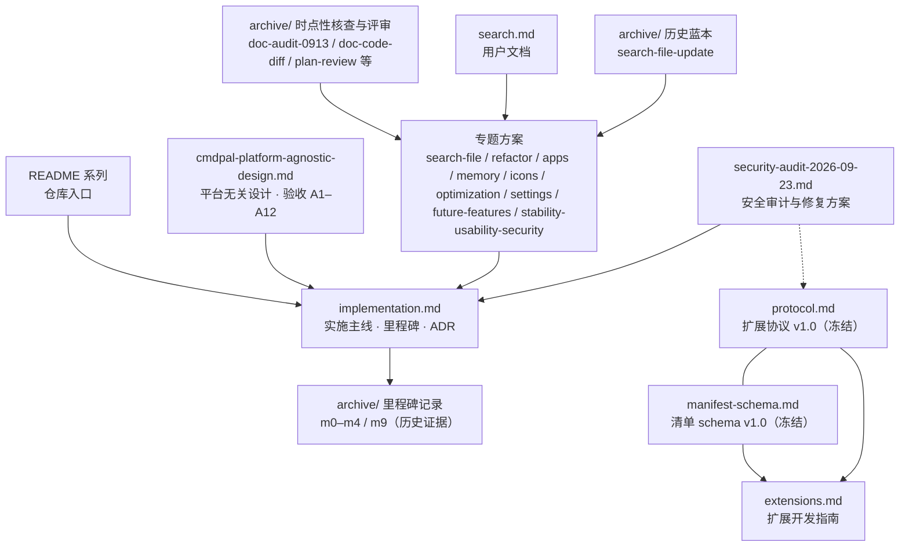

# dd-run 文档索引

> **状态**：生效中 ｜ **版本**：v1.38 ｜ **最后更新**：2026-10-07
> **用途**：全部文档的**唯一导航入口**——按模块分组、标注状态与读者，并定义文档格式规约。
> **关联**：（本文即导航入口——全部文档见 §3 清单并回链本文）

---

## 1. 怎么用这份索引

| 你的目的 | 阅读路径 |
|---|---|
| **写一个扩展** | [`extensions.md`](./extensions.md)（路径）→ [`protocol.md`](./protocol.md)（规范）→ [`manifest-schema.md`](./manifest-schema.md)（清单） |
| **了解项目现状** | [`README.zh-CN.md`](../README.zh-CN.md) → [`implementation.md`](./implementation.md) §里程碑状态总表 |
| **接手维护代码** | [`cmdpal-platform-agnostic-design.md`](../cmdpal-platform-agnostic-design.md)（抽象模型与验收 A1–A12）→ [`implementation.md`](./implementation.md)（ADR 与遗留台账）→ 各 [`mX-record.md`](./archive/m0-record.md)（过程与踩坑） |
| **排查文件搜索问题** | [`search.md`](./search.md)（用户视角）→ [`search-file.md`](./search-file.md)（权威技术口径）→ [`search-file-p2-acceptance-2026-09-15.md`](./search-file-p2-acceptance-2026-09-15.md)（真机验收结论） |
| **理解某个设计为什么这样做** | 先查 [`implementation.md`](./implementation.md) §4 ADR-1~ADR-4，再查设计文档对应章节 |
| **改协议 / 改清单格式** | [`protocol.md`](./protocol.md) §13（演进规则）→ [`manifest-schema.md`](./manifest-schema.md) §9，**两者均为冻结契约，改动须走版本协商** |
| **做安全加固 / 排查注入类缺陷** | [`security-audit-2026-09-23.md`](./security-audit-2026-09-23.md)（§1 结论总表 → §2.3 信任边界 → §3–§5 逐项修复 → §7 批次与验收） |

---

## 2. 文档地图


```mermaid
flowchart TD
    README["README 系列<br/>仓库入口"] --> IMPL
    IMPL["implementation.md<br/>实施主线 · 里程碑 · ADR"]
    DESIGN["cmdpal-platform-agnostic-design.md<br/>平台无关设计 · 验收 A1–A12"] --> IMPL
    IMPL --> REC["archive/ 里程碑记录<br/>m0–m4 / m9（历史证据）"]

    PROTO["protocol.md<br/>扩展协议 v1.0（冻结）"] --- MANIFEST["manifest-schema.md<br/>清单 schema v1.0（冻结）"]
    MANIFEST --> EXT["extensions.md<br/>扩展开发指南"]
    PROTO --> EXT

    PLAN["专题方案<br/>search-file / refactor / apps / memory / icons / optimization / settings / future-features / stability-usability-security"] --> IMPL
    REVIEW["archive/ 时点性核查与评审<br/>doc-audit-0913 / doc-code-diff / plan-review 等"] --> PLAN
    AUDIT["security-audit-2026-09-23.md<br/>安全审计与修复方案"] --> IMPL
    AUDIT -.-> PROTO
    USERDOC["search.md<br/>用户文档"] --> PLAN
    ARCHIVE["archive/ 历史蓝本<br/>search-file-update"] --> PLAN
```

---

## 3. 全量文档清单

### A. 规范契约（冻结，硬契约）

改动须走版本协商；**不得为一处方便而破坏既有语义**。

| 文档 | 状态 | 版本 | 行数 | 读者 | 职责 |
|---|---|---|---|---|---|
| [`protocol.md`](./protocol.md) | 已冻结 | v1.0 | 788 | 宿主与扩展作者 | 进程间通信：JSON-RPC over NDJSON、生命周期、8 种执行结果、错误码、超时；**§7.4 含宿主对 `host/open_url` 的执行策略注（实现侧，非契约）** |
| [`manifest-schema.md`](./manifest-schema.md) | 已冻结（v1.0 清单字节不动；§9 分发签名为扫描层契约） | v1.0 | 175 | 扩展作者 | 扩展发现：清单字段、扫描目录、路径展开、9 条校验规则、内置注册、**§9 分发签名（O14）** |

### B. 设计与实施（主线）

| 文档 | 状态 | 版本 | 行数 | 读者 | 职责 |
|---|---|---|---|---|---|
| [`../cmdpal-platform-agnostic-design.md`](../cmdpal-platform-agnostic-design.md) | 生效中 | v1.0 | 547 | 设计者与维护者 | 平台无关抽象模型、页面/扩展/宿主模型、上下游对照、**验收项 A1–A12 的定义源** |
| [`implementation.md`](./implementation.md) | 生效中 | v0.1.18 | 1073 | 维护者 | 实施主线：里程碑状态总表、目标与范围、ADR-1~4、验收映射（含 §3.1 测试基线台账 596 + §3.1.1 内存基线台账 V-13）、遗留台账（L11 审计 11/11 销项）、实施沿革 |

### C. 开发指南与用户文档

| 文档 | 状态 | 版本 | 行数 | 读者 | 职责 |
|---|---|---|---|---|---|
| [`extensions.md`](./extensions.md) | 生效中 | v1.1 | 513 | 扩展作者 | 从零写一个扩展：快速上手、三条铁律、三个 Windows 陷阱、方法实现顺序、`host/*` 与**宿主信任门禁（§6.1）**、自检表 |
| [`search.md`](./search.md) | 生效中 | v1.3 | 123 | 最终用户 | 文件搜索的准备事项（**Everything 必需、`es.exe` 可选回落**）、**三种进入方式（含 `Ctrl+F`）**、动作、真实图标与回落说明、常见问题与排障 |

### D. 专题方案

实施记录与在途规划并存。已落地者保留作决策留痕，正文中的"计划时"表述已按实现校正；规划中者以状态列标注。

| 文档 | 状态 | 行数 | 职责 |
|---|---|---|---|
| [`search-file.md`](./search-file.md) | 生效中（v3.13） | 1088 | **文件搜索的权威技术口径**：双通道传输层、依赖、落地范围、两轮真机验收结论、A-33-05 阈值修订（v3.4）、回落失败不静默（v3.5）、`Ctrl+F` 直达与 Shell 真实图标（v3.6）、移除 `f ` 前缀直达（v3.7）、解除 `es.exe` 前置表述（v3.8）、**图标分层异步 + 自动刷新（v3.9，E1）+ 零依赖 PNG 编码器（v3.10，E2 达标）+ 端到端首屏计时插桩（v3.11，采样后经 v3.13 收口）+ A-IC-02b 空闲复测销项（v3.12，图标验收 8/8 闭环）+ **§速度项真机采样收口与 E2E 埋点两处修正（v3.13，带词进页子集 p95 102 ms ≤ 200 PASS）**、版本演进 |
| [`refactor-layering-plan.md`](./refactor-layering-plan.md) | 已落地 | 498 | `dd-gui` 业务代码 / UI 代码分层方案与切割表 |
| [`apps-filtering-plan.md`](./apps-filtering-plan.md) | 已落地 | 130 | Apps 扩展垃圾项过滤（黑/白名单、UWP 豁免、去重键） |
| [`memory-optimization-plan.md`](./memory-optimization-plan.md) | 已落地 | 129 | 运行时内存占用优化 M1–M4 与实测数据 |
| [`icons-typography-plan.md`](./icons-typography-plan.md) | 已落地（I3 未做；G1 已落地；真机复验 2026-10-07 完成） | 191 | 图标与字体展示优化：列表密度三档、占位 glyph、token 化；**G1 = 文件结果改用 Shell 真实图标（§4.5）** |
| [`optimization-plan.md`](./optimization-plan.md) | 规划中（Phase 1/2 关闭 · **O5-a 已落地 2026-10-07**，余 O6 Phase 3） | 317 | **项目可优化方案总览（增量）**：体积/协议健壮性/方法名常量/可观测性/依赖治理/跨平台，含已证伪项与落地记录；**O4 崩溃链路真机复现完成（v1.9，2026-10-07）** |
| [`settings-personalization-plan.md`](./settings-personalization-plan.md) | **B1–B4 已落地**（T1–T8 ✅；**T9 已落地 2026-10-05**；**T11 已落地 2026-10-07：搜索 Steam 游戏开关**；**T9/T11 用户真机走查收口 2026-10-07 批量确认**；T10 另行立项；K 批 D42 已落地；v1.5） | 281 | **设置/个性化/材料样式优化方案（参照 PowerToys CmdPal）**：材料配置注册表化 + Mica Alt 档 + 着色模式三模式 + Esc/退格/单击/动效行为项 + 重置外观 + **T9 背景图通道一期**（互斥语义：图即背景、材质行置灰；Fill/Stretch UV 裁剪 + mtime 门控纹理缓存 + 解码失败负缓存；零文件对话框依赖）+ **T11 搜索 Steam 游戏开关**（`steam` 机器标签判据、默认关、与「搜索应用」AND 叠加）；含 CmdPal 取证、差距分析、T1–T11 任务清单与批次划分 |
| [`settings-keys-typography-plan.md`](./settings-keys-typography-plan.md) | 已落地（**真机走查 V-1~V-7 收口——2026-10-07 用户批量确认**；v1.2 含落地勘误） | 243 | **设置页「按键与交互」排版与控件字号统一方案（D42，v4.19 入稿）**：设置行块 36→40 / 行距 12 / 名-描 +2 全设置页统一（K1）、控件排印 compact 档 28·12 常量组收口（K2，部分修订 D34 ③④）、下拉宽度自适应 `clamp(180, 260)` 纯函数（K3）；含三关验证、V-1~V-7 校验标准与 v1.1 三处勘误 |
| [`search-file-ctrl-f-icons-plan.md`](./search-file-ctrl-f-icons-plan.md) | 已落地（**E1 / E2 均已处置达标**；v1.3 增补 A-IC-08/09/10，v1.4 E2 关账） | 290 | **文件搜索开启方式与图标方案**：`Ctrl+F` 直达（决策 D1-x）与 Shell 真实文件图标（决策 D2-x）的决策留痕；§11 = 落地记录与 A-CF/A-IC 实测（首抽 703.8 ms **已由分层异步修复为 0.32 ms**；sidecar 体积已由 E2 处置达标 → `search-file.md` §10.6） |
| [`future-features-plan.md`](./future-features-plan.md) | **N1–N5 全部落地**（N4 2026-10-03、N1/N2/N3/N5 2026-10-04；**2026-10-07 用户真机批量走查通过**；v1.9） | 220 | **v0.1.1 后功能向增量规划**：立项判据「可行 × 无冲突」（零冻结契约改动 / 惯例可复用 / 零新增依赖）+ 编号空间核查（取 N 系列）+ 现状底座五惯例取证；五项提案 = N1 自定义直达命令 / N2 内置扩展配置通道 / N3 浏览器书签搜索 / N4 LRU 容量可配置 / N5 设置导入导出（均零协议与清单改动）；附不做与缓办边界、实施顺序建议；v1.1 惯例锚点实测刷新（⑤ 改指 invoke.rs / navigation.rs）+ R-12 首跑钉扎时效注记；v1.2 **N4 落地**（`Settings.warm_capacity` 1–16 默认 8 + 设置页「常规」下拉 + 缩容即时驱逐，单测 3 条、576/576 全绿；真机走查待做）；v1.3 **N1 落地**（`Settings.custom_commands` → 聚合期宿主虚拟条目「直达」分组 → `dispatch_invoke` 宿主内部分发，url 复用 `open_url_execute`（S-03 白名单）/ path 走 ShellExecute；设置页「常规」管理卡 + 右键菜单删除，单测 2 条、578/578 全绿；真机走查待做）；v1.4 **N2 落地**（`Settings.ext_settings` 通道 → `inject_ext_settings` env 注入 `DD_EXT_CFG_<KEY>`（S-10 双保险）+ in-process apps 内存通道；试点 = apps 用户屏蔽名单（输出层过滤、id 稳定），设置页扩展卡行内「设置」编辑器；单测 5 条、583/583 全绿；真机走查待做）；v1.5 **N3 落地**（第 6 个内置扩展 `com.ddrun.bookmarks`：Chrome/Edge 书签 JSON 只读解析 + mtime 门控增量重建 + 2000 条截断 + `host/open_url` 打开；类别「书签」；单测 3 条、586/586 全绿；真机走查与冷启动无回归验证待做）；v1.6 **N5 落地**（`dd-settings-backup.json` 导出/导入——机器态 + 热键 + trust.json 永不随行，两步确认覆盖，单测 1 条、587/587 全绿；真机走查待做）；v1.8 N1 path 腿用户真机通过（stderr 日志实证零失败） |
| [`o9-o14-optimization-plan.md`](./o9-o14-optimization-plan.md) | **O9 / O10（=F4）/ O11 / O12 已收口**（2026-10-11 两批，611 tests + clippy `-D warnings` + fmt + docscan 全绿 + conformance/roundtrip 自检通过；O13 暂缓——拆分后最大文件 976 行、机检必要性下降；O14 战略独立立项；v1.5） | 179 | **第三轮严审后优化方向规划（O9–O14）**：O9 确认门覆盖嵌套 shell（严审 P4 绕过面闭合，六启动器词 + `^` 转义整体确认，零拦截语义增量）/ O10 = 修复实施方案 F4 落地跟踪（MSRV 声明 + 裸名不再补全 `.cmd`/`.bat`，声明值实测修正 1.95）/ O11 CI·仓库卫生三件套（SHA pin + timeout + HTML 归档）/ O12 巨型文件拆分（settings_view.rs 4104 行等）/ O13 文档一致性 CI 扫描（接 docscan 延伸）/ O14 扩展签名（战略级，承接 F12，与 O6 二选一下一里程碑）；含 30 秒结论总表、冲突面核查矩阵、逐项详设与验收总标准 |
| [`extension-signing-plan.md`](./extension-signing-plan.md) | **v1.3**（批次一 + 批次三可独立部分落地；**批次二工具链同日就绪**——gen/sign/verify 子命令 + package.sh 钩子 + release.yml secret env，E2E 实测过；仅余人工密钥仪式） | 141 | **扩展签名立项与选型（O14 / F12 立项载体）**：关闭 trust 台账「非防篡改」定性与非 Windows fail-open（D2 缺口）两处已声明边界——内置发行方 ed25519 公钥 + 清单旁挂 `.sig` detached 签名（签名对象 = 清单字节 + 清单/exe 双 SHA256 捆绑锚，闭合 R-12 升级重钉静默窗口）+ 三态降级（通过免同意 / 失败 fail-closed / 无签名现行同意流）；清单 schema v1.0 零字段改动，`.sig` 发现规则走 v1.1 候选登记；决策点 D1–D5（算法/载体/签名对象/信任模型/降级）各含选项与推荐，待评审拍板后按三批次实施；不含第三方作者签名/商店/证书链（README 非目标） |
| [`user-session-walkthrough-checklist.md`](./user-session-walkthrough-checklist.md) | **本机腿已收口**（2026-10-07 用户批量确认 + E2E 采样同日闭环；残留 = R-21 他机腿 / V-14 多屏腿 / O5-a tofu 全页走查，全部销项后归档） | 75 | **用户会话真机走查清单**：合成输入被本机安全软件过滤 → 物理键盘为唯一通路，无法自动化的腿集中于此——N1–N5 用户腿（执行/拼音/Chrome/调高/导出导入）、T9 设置页按钮与滑杆、安全回归（S-05/S-06/S-07/S-08）、R-21/R-22/R-23、E2E 采样（`tools/gui_e2e_parse.mjs` 判读）、V-14 余腿、O5-a 全页面 tofu 与 emoji 确认腿（§5）、T11 Steam 游戏搜索开关五腿（§6）；每腿含操作步骤 / 预期结果 / 记录位置 |
| [`stability-usability-security-plan.md`](./stability-usability-security-plan.md) | **实施中**（R1–R26，四批；v1.25——R 系列 26 项代码与真机收口，仅余 R-21 他机腿 / V-14 多屏腿；§7 捕获期解注册缓办占位） | 481 | **S 审计闭环后新一轮加固规划（稳定性/可用性/安全性）**：三路只读代码审查 + 全量 file:line 回读核对取证；26 项 = 稳定 R1–R9 + R25/R26（screen_rect 崩溃 / 非原子写盘 / 无界队列 / 内置超时 / panic 取证落盘 / 单实例互斥）/ 安全 R10–R14（S-06 确认门多段绕过 / `.url` 限幅 / sidecar 钉扎 / calc 深度）/ 可用 R15–R24（热键失败可见 / 静默失败 toast 化 / IME Enter 守卫）；v1.3 补可诊断性与门禁（兼容矩阵、内存基线走查、§7 缓办占位）；v1.4 **验收标准细化**：26 项「验收」统一单测（`r<编号>_` 命名 + 断言）/ 真机 / 回归三口径 + §6.5 通用口径（回归门操作化定义、记录与阈值纪律），V-1~V-16 判据量化；v1.5–v1.9 批三收尾（R-24 + 568/568 全量补跑确认）与批一真机走查推进（V-1/V-2/V-3/V-12/V-16 完成 → R-25 三口径收口、R-05/R-06 冒烟收口、R-08 注记）；v1.10–v1.12 批四代码项收口（R-03 入站队列定容 / R-04 in-process 超时 + 负缓存 / R-26 单实例互斥 + V-15 完成）；v1.13–v1.18 走查推进（**V-11 → R-04 收口**，死 UNC 超时降级；**V-10 → R-03 收口**，16,000 帧注入 RSS 收敛队列上界 + 恰一次告警；**V-4/V-5/V-9 完成 + V-8 注记收口**，file:// 失败 toast / 托盘标签动态化 / sidecar 三态 + open_url 判据口径修正 + egui 设置页点击受限环境发现；**R-18 en 复跑**（lang 值口径修正）+ **V-13 腿 A**（500 循环 +12.2 MB 门限内，**V-13 收口**——首轮内存基线建立（稳态 PRIV 104.4 MB 恒定，门限 +50 MB/+30%，台账 §3.1.1；批四全部三口径收口，v1.18）；**V-6 完成 + V-9 卡片行视觉实证 + dist 交付重建**（v1.19——发版要点：同版本重发 sidecar 变更须 bump 版本）；**V-7 定性收口**——SendInput 受理不达（安全软件过滤注入输入，v1.20 修正 UIPI 表述））；V-14 分辨率变更腿完成（三拓扑切换面板自适应居中，v1.21）；余 V-7（真实 IME 键盘）/V-14 余腿（热拔插/DPI/RDP）——posted 鼠标全局不达 egui（v1.17）；零冻结契约改动、零新增依赖，附四批实施顺序与不做清单 |

> ⚠️ **V 编号空间提示**：`settings-keys-typography-plan.md` 的 V-1~V-7（其真机走查待做）与 `stability-usability-security-plan.md` 的 V-1~V-16（V-6/V-7 已完成或定性收口）是**两套独立编号空间**，同名编号互不指代，交叉阅读时以所属文档为准。

### E. 核查与评审报告

| 文档 | 状态 | 行数 | 职责 |
|---|---|---|---|
| [`doc-audit-2026-09-29.md`](./doc-audit-2026-09-29.md) | 生效中 | 89 | **全仓文档格式规约审计（INDEX §4）**：状态取值归一（2 处非法 + 里程碑 8 份历史格式）/ 元信息块补全（14 份）/ 规约外 emoji → 纯文字（12 文件 62 处，图例连动）/ INDEX 行数实测回填（17 行）/ 裸代码围栏补 text 标注（7 处）/ 链接 368 全可达；豁免与建议项（历史文档版本演进补建等）见其 §4 |
| [`search-file-plan-review.md`](./archive/search-file-plan-review.md) | 历史归档 | 149 | 文件搜索 v3.3 方案的编码前核对报告；每项结论已附**最终处置**（已解决 / 已规避 / 仍存在 / 已被取代） |
| [`search-file-p2-acceptance-2026-09-15.md`](./search-file-p2-acceptance-2026-09-15.md) | 生效中（v1.5） | 270 | **文件搜索 P2 真机验收报告（两轮）**：A-33-05/06/07/08/10 逐项实测（环境矩阵、耗时分解、1000 次基准、故障注入与通道级恢复判据），含未闭环项与复现命令；v1.1 依扩展内**分阶段计时日志**更正耗时分解，v1.2 记 **A-33-05 阈值修订决策**（§4.1.1），**v1.3 补 `es.exe` 基线与回落分支并把 A-33-05/06 改判通过**（§4.2.1 记录回落失败静默缺陷的修复），**v1.5 记 §5 #4 首屏感知指标采样收口（带词进页子集 p95 102 ms ≤ 200 PASS，含埋点两处修正）+ §5 #5 A-33-03 随用户批量走查收口**（开放项清零，余 A-33-08 环境矩阵红线） |
| [`security-audit-2026-09-23.md`](./security-audit-2026-09-23.md) | 生效中（v1.9，**S-12 扩展签名入账**） | 822 | **全量代码安全审计与修复方案 + 修复记录（11/11 闭环）**：79 个源文件（35,975 行）按攻击面分组走查，确认 11 项缺陷（**1 高 / 5 中 / 5 低**）+ **14 项已核验安全项**；**全部修复** —— S-01（命令注入，§3.1.1）、S-02（NDJSON 无界缓冲，§4.1.1）、S-03（`open_url` scheme 白名单，§4.2.1）、S-04（图标读盘+解码双上限，§4.3.1）、S-05（扩展信任门禁，§4.4.1–§4.4.3）、S-06（危险命令二次确认，§4.5.1）、S-07（剪贴板上限+溯源+toast，§5.2）、S-08（reveal 路径四条收紧，§5.3）、S-09（缓存名 FNV-1a 指纹，§5.4）、S-10（`entry.env` 关键变量保护，§5.1）、S-11（序列化 panic 面归零，§5.5）；含威胁模型与信任边界（§2.3）、逐项修复代码与验收判据、取证脚本（§8）、**「批量 spawn 用例失败（`error 231`）」的排查留档（§7.2，已定性为环境瞬时限制并复跑销项）** |

### F. 归档（`docs/archive/`）

**2026-09-29 起历史文档物理归档至 [`docs/archive/`](./archive/)**——里程碑记录（历史证据）与时点性核查 / 评审 / 旧蓝本不再平铺在 `docs/` 根目录，日常导航只看 A–E 节。归档文档**内容保持原样，刻意不做格式重排**（重写会破坏可追溯性），正文内的相对链接已按新位置修正。

**里程碑记录（历史证据）**

| 文档 | 行数 | 里程碑 | 关闭 |
|---|---|---|---|
| [`m0-record.md`](./archive/m0-record.md) | 145 | M0 地基与协议冻结 | 2026-09-01 |
| [`m0-verification-report.md`](./archive/m0-verification-report.md) | 110 | M0 验证报告 | 2026-09-01 |
| [`m1-record.md`](./archive/m1-record.md) | 169 | M1 最小可用面板 | 2026-09-02 |
| [`m2-record.md`](./archive/m2-record.md) | 292 | M2 命令执行与结果状态机 | 2026-09-02 |
| [`m2-verification-report.md`](./archive/m2-verification-report.md) | 96 | M2 验证报告 | 2026-09-02 |
| [`m3-record.md`](./archive/m3-record.md) | 154 | M3 缓存与懒加载 | 2026-09-02 |
| [`m4-record.md`](./archive/m4-record.md) | 339 | M4 内置扩展与健壮性 | 2026-09-04 |
| [`m9-inprocess-builtins.md`](./archive/m9-inprocess-builtins.md) | 146 | M9 内置扩展进程内化 | 2026-09-11 |

> M5–M8 的结论直接记于 [`implementation.md`](./implementation.md) §2，未单独建记录文件。

**时点性核查 / 评审 / 旧蓝本（内容仅代表撰写时点，权威口径在现行文档）**

| 文档 | 状态 | 行数 | 说明 |
|---|---|---|---|
| [`doc-audit-2026-09-13.md`](./archive/doc-audit-2026-09-13.md) | 历史归档 | 266 | 全量文档内容核对说明：所列错误、遗漏、矛盾均已处置（落实记录见 [`doc-code-diff-2026-09-13.md`](./archive/doc-code-diff-2026-09-13.md)） |
| [`doc-code-diff-2026-09-13.md`](./archive/doc-code-diff-2026-09-13.md) | 历史归档 | 350 | 文档 ↔ 代码差异清单与修复记录（71 条差异全部落实；代码侧闭环 9 项 + 两项协议口径定稿） |
| [`optimization-plan-review-2026-09-14.md`](./archive/optimization-plan-review-2026-09-14.md) | 历史归档 | 153 | `optimization-plan.md` 二轮核对报告：对应修订已落实（该方案已升至 v1.1+） |
| [`search-file-plan-review.md`](./archive/search-file-plan-review.md) | 历史归档 | 149 | 文件搜索 v3.3 方案的编码前核对报告；每项结论已附**最终处置**（已解决 / 已规避 / 仍存在 / 已被取代） |
| [`search-file-update.md`](./archive/search-file-update.md) | 历史归档 | 106 | 文件搜索 v2 升级设计的评审蓝本。权威口径见 [`search-file.md`](./search-file.md) |

### G. 仓库入口

| 文档 | 状态 | 行数 | 说明 |
|---|---|---|---|
| [`../README.md`](../README.md) | 生效中 | 115 | 英文 README |
| [`../README.zh-CN.md`](../README.zh-CN.md) | 生效中 | 115 | 中文 README（与英文版逐节对应） |
| [`../CHANGELOG.md`](../CHANGELOG.md) | 生效中 | 917 | 版本变更日志（`[0.1.0]`/`[0.1.1]`/`[0.2.0]` 条目均带日期；**`[0.2.0] - 2026-10-07` = 自 0.1.1 起累计变更的发版段**（含 7 条发布摘要与行为变更提示），其下按批分节——`Ctrl+F` 直达 + Shell 真实图标 / 零依赖 PNG 编码器（E2）/ 设置·个性化·材料（B1–B4）/ 安全审计 11 项闭环 / 设置页排版与控件字号统一（K1–K3，D42）/ **后续功能规划（N1–N5）** / **O5-a default_fonts 移除（-1.35 MiB）** / **A-IC-02b 空闲复测销项（图标验收 8/8 闭环）** / **T11 Steam 游戏搜索开关（默认不参与搜索）** / **自动化真机走查批次（R-08 / O4 / F2 复验 / 体积复核）** / **用户真机走查批量收口** / **§速度项真机采样收口**等） |

> 设计稿与交互演示（HTML）不在本索引收录范围内，已归档至 `docs/archive/`（O11，2026-10-11）：`archive/cmdpal-ui-mockups.html`、`archive/cmdpal-ui-optimization-v5.html`、`archive/cmdpal-window-material-effects.html`（窗口材质与边框方案效果页）。设计稿的**版本权威**在文件自身标题，最新决策见 [`implementation.md`](./implementation.md) §2 对应批次。

---

## 4. 文档格式规约

新增或修改文档时遵循以下约定，以维持全局一致。

### 4.1 元信息块（必需）

H1 之后**必须**紧跟此块（上下各留一个空行）：

```markdown
# 文档标题

> **状态**：生效中 ｜ **版本**：v1.0 ｜ **最后更新**：YYYY-MM-DD
> **关联**：[protocol.md](./protocol.md) · [manifest-schema.md](./manifest-schema.md)

---
```

**状态取值仅限五种**，含义如下：

| 取值 | 含义 |
|---|---|
| `生效中` | 描述当前实现，是最新口径 |
| `已冻结` | 契约类，改动须走版本协商 |
| `已落地` | 方案已实施完毕，保留作决策留痕 |
| `历史归档` | 内容仅代表撰写时点，**权威口径在别处** |
| `规划中` | 尚未实施 |

### 4.2 结构与表达

| 项 | 规约 |
|---|---|
| 标题层级 | 一级 `## 1. 标题`、二级 `### 1.1 标题`，**连续编号** |
| 结论先行 | 文档开头（元信息块之后）先给结论/状态总表，历史沿革下沉到文末 |
| 事实唯一 | 同一事实**只在一处详述**，其余位置用链接引用，禁止重复叙述 |
| 追注处理 | **不得叠加追注**。新结论直接改写正文，旧结论收进文末"版本演进"表 |
| 代码块 | 一律标注语言（`json` / `rust` / `bash` / `toml` / `text` / `mermaid` / `python`） |
| 表格 | 统一 `\|---\|---\|`，表前给一句说明 |
| 任务 | 未完成 `- [ ]`、已完成 `- [x]` |
| 状态标记 | 只用 `✅` / `⚠️` / `❌` / `🟨`，**不使用装饰性 emoji** |
| 行号 | 写成「约 :NNN」，避免硬编码行号随代码漂移 |
| 行数 | §3 清单里的「行数」口径 = **换行符数**（`wc -l` 口径，含尾换行但不额外 +1）；新增文档后须实测回填，不得估算 |
| 表格内竖线 | 单元格内容里的 `\|`（正则交替、代码 span）**必须写成 `\|`**，否则 GFM 会把该行切错列 |
| 数字 | 版本号、字节数、测试数、测试阈值**必须实测取证**，不得沿用历史快照 |

### 4.3 新增文档流程

1. 判断归类——规范契约 / 设计实施 / 开发指南 / 专题方案 / 核查报告 / 里程碑记录 / 归档；
2. 套用 §4.1 元信息块与 §4.2 格式规约；
3. 在本文 §2 地图与 §3 清单中登记，并更新受影响的关联文档链接；
4. 若新增的是契约类文档，须同步 [`protocol.md`](./protocol.md) §13 与 [`implementation.md`](./implementation.md) 的验收映射。

---

## 5. 当前已知的未闭环项

整理过程中核对出的、**需要人工跟进**的开放项：

| 项 | 位置 | 状态 |
|---|---|---|
| 消息超上限「回 `-32600` + 关闭连接」两侧均未实现 | [`protocol.md`](./protocol.md) §2.3 现状注 | ✅ 已解决（2026-09-15）：两侧均已回 `-32600`（`id: null`）并关闭连接；`-32600`/`-32700` 各类触发收口于 `dd-protocol::envelope` 共享校验层（差异清单 P-01，方案 O1） |
| §1.3 方法名无常量层（字符串字面量分发） | `dd-ext`/`dd-host`/`dd-gui` 分发点 | ✅ 已解决（2026-09-14）：新增 `dd-protocol::methods` 常量层（12 方法 + `HOST_METHODS`/`HOST_METHOD_PREFIX`/`ALL_METHODS`），全仓生产代码改用常量；一致性测试锁定常量 ↔ `protocol.md` §1.3（差异清单 P-18，方案 O2） |
| 文件搜索 P2 真机验收 A-33-05…A-33-10 | [`search-file-p2-acceptance-2026-09-15.md`](./search-file-p2-acceptance-2026-09-15.md) | ✅ 两轮完成（09-15 首轮 / **09-17 补 `es.exe`**，报告 v1.3）：**A-33-05 / A-33-06 / A-33-07 / A-33-10 通过**（基线 p95 324.21ms → 降幅 91.27%；回落分支 3/3 返回真实结果；恢复判据改为通道级）；**A-33-08 ⚠️ 部分**（跨环境矩阵）。**报告 §5 未闭环项三项**（A-33-08 矩阵、GUI 端到端 ≤200ms、A-33-03 的 `%`/`#` 打开）**已收口两项**（2026-10-07：GUI 端到端采样 **p95 102 ms ≤ 200 PASS**、A-33-03 随用户批量走查通过 → 报告 v1.5），余 **A-33-08 跨环境矩阵**（红线）。**红线收窄为 A-33-08**；**`es.exe` 前置表述已于 2026-09-19 解除**（`search.md` v1.3 起改为「Everything 在运行即可用，`es.exe` 为可选回落」）。**同日：图标 E1（按真实路径档首抽 191–704 ms）已修复** —— 分层异步 + 后台补齐 + 自动刷新，`--cold` 实测同步 **0.32 ms**；E2（sidecar 体积）**已于同日处置达标**：零依赖 PNG 编码器（`image` 转 dev-dependency），sidecar 912,384 → **831,488 B**、相对基线增量 **61,952 B ≤ 64 KB**（A-IC-06 转 PASS → `search-file.md` §10.6）；**§5 #4 感知指标已收口（2026-10-07，报告 v1.5：带词进页子集 p95 102 ms ≤ 200 PASS；判读 `tools/gui_e2e_parse.mjs` Node 版）**（报告 v1.4 插桩 → `search-file.md` §10.7） |
| `-32002 command_not_found` 已定义但无抛出点 | [`protocol.md`](./protocol.md) §9.2 | ✅ 已定稿（2026-09-17）：判为**扩展侧可用的标准错误码**——Python 示例即产出，宿主与内置运行时不产出（回 `ShowToast` 属合法实现选择）；§9.2 注记已由「保留码、待接线」改写为终态口径，不再是开放项 |
| `PageInfo` 类型已定义但运行时不传递 | [`protocol.md`](./protocol.md) §8.5 | ✅ 已定稿（2026-09-17）：**维持不传递**（v1.0 预留定义）；宿主页标题改由宿主侧信息提供（被点击项标题 / 本地化文案），§8.5 注记已改为终态口径 |
| 图标字体优化 I3（回退 32px） | [`icons-typography-plan.md`](./icons-typography-plan.md) | 保留不做：设计文档已定「视真机效果再定，不阻塞交付」——属**真机依赖项**，非文档卫生缺陷（2026-09-15 复核确认） |
| macOS / Linux 实际构建与验收 | [`../cmdpal-platform-agnostic-design.md`](../cmdpal-platform-agnostic-design.md) §8/§9 | ⚠️ 仅设计层，无产物 |
| CHANGELOG 部分条目缺日期 | [`../CHANGELOG.md`](../CHANGELOG.md) | ✅ 已解决（2026-09-15）：`[0.1.0]` 补日期 **2026-09-06**（取自 tag creatordate 实测值） |
| 全仓文档行尾统一 CRLF（原 7 份偏离：[`protocol.md`](./protocol.md) 与 `examples/python-minimal/README.md` 全 LF；`extensions.md` 5 处、`manifest-schema.md` 3 处、`README.md`/`README.zh-CN.md` 各 2 处、`search-file.md` 1 处裸 LF） | 全仓 30 份 md | ✅ 已解决（2026-09-14）：7 份全部归一化，复检 bare-LF=0；`core.autocrlf=true` 下为工作区行为、不影响提交内容 |
| 文件搜索 `Ctrl+F` 直达与真实图标（A-CF / A-IC） | [`search-file.md`](./search-file.md) §10.4 | ✅ 已落地（2026-09-19）：两项未达标**均已处置达标**——① E1 分层异步：按真实路径档**同步** 0.32 ms（原 191–704 ms）；② E2 零依赖 PNG 编码器：sidecar **831,488 B**、增量 **61,952 B ≤ 64 KB**。**A-IC-02b 已销项（2026-10-07，v3.12）**：空闲复测首档 36.47 ms ≤ 40、八项 8/8 PASS，此前压线定性为机器负载；**图标验收全部闭环**，且**感知指标「输入→首屏 ≤200ms」已收口**（2026-10-07，v3.13：带词进页子集 **p95 102 ms ≤ 200 PASS**；判读 `tools/gui_e2e_parse.mjs` Node 版）——A-CF / A-IC 两项至此无残留；验收工具 `tools/icon_acceptance.py --cold`（八项自动判定 + JSON 证据） |
| 文件搜索 `f ` 前缀直达（已被 `Ctrl+F` 取代） | [`search-file.md`](./search-file.md) §6.1 | ✅ 已移除（2026-09-19）：`f ` 回归**普通搜索词**；前缀常量 / `file_search_drill_target()` / `maybe_drill_file_search()` / `file_drill` + `file_drill_armed` 状态 / `page.rs` 落地回填分支**整条删除**（无死代码残留），`Ctrl+F` 查询带入不再剥离前缀；面板内直达入口收敛为 `Ctrl+F` 一条（进入方式三条） |
| 代码安全审计 11 项发现 | [`security-audit-2026-09-23.md`](./security-audit-2026-09-23.md) §1、§7 | ✅ **全部销项（11/11，2026-09-24 闭环）**：S-01（高，命令注入）、S-02（中，NDJSON 无界缓冲 —— PoC 已反转为 bounded）、S-03（中，`open_url` 三 scheme 白名单）、S-04（中，图标读盘/解码双上限）、S-05（中，扩展信任门禁 —— `dd-host/src/trust.rs` + spawn 唯一入口门禁 + 设置页行内审批；A11 哈希开销实测 0.874 ms @836,608 B）、S-06（中，危险命令二次确认）、**S-07（低，剪贴板 1 MiB 上限 + info 溯源 + 来源 toast）**、**S-08（低，reveal 路径拒控制字符/%/^）**、**S-09（低，缓存名 FNV-1a 指纹 + 旧名兼容 + `ext_id` 归属校验）**、S-10（低，`entry.env` 关键变量保护）、**S-11（低，序列化 `.expect` 归零 → `-32603`）** = **共 +40 单测**（低危收尾 +5：S-07 ×2 / S-09 ×2 / S-11 ×1；S-08 扩展既有断言）。余待办：**真机走查**（S-03 打开 / S-07 剪贴板提示 / S-08 显示所在目录 / S-05 审批流）与**重打包体积实测**；低危收尾轮 dd-gui 6 条失败为已知 `Os error 231` 环境批（名单无新测试）；进度同步登记于 [`implementation.md`](./implementation.md) §6.1 台账 L11 |
