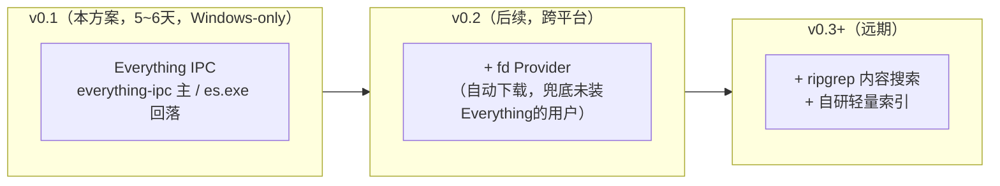
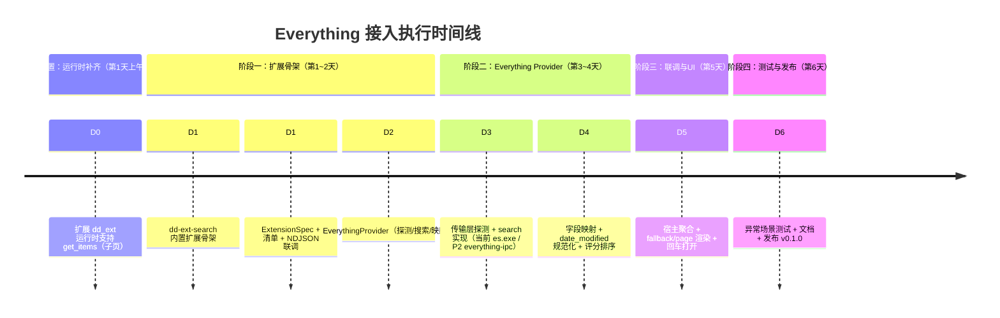

# 📋 dd-run 文件搜索执行方案（v3.3：Everything IPC 直连 + more_commands）

> **文档状态（2026-09-10 更新）**：本文上半部分记录 v0.1 已落地基线；本文末尾的
> **§九 v3.3 变更方案**是基于 [`search-file-update.md`](./search-file-update.md) 的评审后实施计划。
> **实施进度（2026-09-10）**：**P0/P1 已实施**（P0 文案基线 + P1 `more_commands` 三动作随 v3.3 落地）；
> **P2 代码已实施**（`everything-ipc` 主通道 + `es.exe` 回落，见 §9.2 与 [`CHANGELOG.md`](../CHANGELOG.md)）——
> L2 冒烟已验证 IPC 主通道真机返回真实结果；**P2 真机验收（A-33-05…A-33-10）待做**。
> 在 P2 真机验收通过并发布前，仍不得把"无需 `es.exe`"写入当前版本的用户承诺（已发布版本的用户仍依赖 es.exe）；
> "显示/复制路径"已随 P1 落地并发布，该约束对 P1 部分不再适用。
>
> **核对修订（2026-09-10）**：以仓库代码 + `docs/protocol.md`（v1.0 冻结）+ 上游 `everything-ipc`
> docs.rs 逐条核对本文 §九，结果见 [`search-file-plan-review.md`](./search-file-plan-review.md)。
> 核对结论：**方案可行、零协议冲突**；但 P2 存在 4 项编码前硬冲突（超时预算倒挂 / client 失效无重建 /
> `windows 0.62` 与 `windows-sys 0.61` 并存 + `FILETIME` 类型来源 / 默认 feature 可能引入 tokio），
> 已分别并入 §9.2 P2.1–P2.3、§9.3 L0、§9.4（新增 A-33-10）与 §9.5。执行口径以本文 §九 为唯一来源，
> [`search-file-update.md`](./search-file-update.md) 收敛为 v2 评审蓝本（历史记录）。

> **🚦 传输层权威定义（2026-09-10，全文档唯一口径）**：本扩展与 Everything 的通信**以
> `everything-ipc` crate（纯 Rust，WM_COPYDATA / `pipe` 通道，无外部进程、无 DLL 随包）为
> **主通道**；**`es.exe` 仅作为主通道不可用时的「回落通道」**，不是设计目标、不向用户暴露为前置依赖。
> - **当前已实现（P0/P1）**：仅含 `es.exe` 单一通道（`run_es()` 调 `es.exe -json ...`）；`everything-ipc`
>   主通道**尚未实施（P2 待办）**。
> - **P2 目标**：主通道切到 `everything-ipc`，`es.exe` 降级为回落；届时用户**不再需要安装 `es.exe`**。
> - **结论**：凡涉及「传输层」的新增 / 修改 / 重构，**一律以 §九 v3.3（everything-ipc 为中心）为准**；
>   下文 §1–§8 为 v0.1 已落地基线记录（传输层为 `es.exe`），其传输相关描述为「历史现状」，**不得据此新建传输层代码**。

> **现状（核对至 2026-09-08）**：本文档的「便捷 + 速度优化」（§7）与 v0.1 文件搜索核心已随 M6/M7 落地——`crates/dd-ext/src/bin/search.rs`（bin 名 `dd-ext-search`）、宿主 `f ` 前缀自动进页（`crates/dd-gui/src/app/mod.rs`）、免安装 sidecar 分发（`tools/package.sh` → `dist/extensions.d/`，见 [`implementation.md`](./implementation.md) §5 M6/M7 行）。下文 §二 时间线、§三 任务分解、§六 D0–D6 验收清单为 **v3.1 计划期口径**，保留作 v0.1 完整规划与 Release 验收门的原始记录；与落地实现不符处已在文内标注「已落地 / 差异见 §7.x」。v3.3 计划以本文 §九 为准。
> **v3.1 修订说明（对齐 2026-09-07 同步后的仓库架构）**：原 v3 基于"自创 `search`/`search_status` 方法 + 异步 Provider trait + 独立 Ctrl+F 面板"假设撰写，与当前仓库实际严重冲突。本次修订已逐条核对 [`docs/protocol.md`](./protocol.md)（v1.0 **冻结**）、[`docs/manifest-schema.md`](./manifest-schema.md)（v1.0）、`crates/dd-ext`（同步运行时）、`crates/dd-gui`（宿主）后重写技术章节。核心修正：
> 1. **不新增协议方法**：v1.0 协议已冻结且无 `search`/`search_status`。本方案完全复用 provider 模型（`initialize`/`top_level_commands`/`fallback_commands`/`invoke`）+ 协议已定义但**运行时尚未实现**的 `get_items`（§6.3）。实现 `get_items` 属于"补齐协议合规"，**不是**协议变更（无需走 §13 演进）。
> 2. **运行时是同步的**：`dd_ext::run` + `ExtensionSpec`，所有处理器为纯函数 `fn`。原方案的 `async_trait`/`reqwest` 异步/`tokio`/`.await` 无法编译 → 改用标准库 `TcpStream`（HTTP/1.1 `Connection: close`）。**⚠️ 此 v3.1 决策已被顶部「v3.3 追注」推翻：v0.1 实际落地未采用 HTTP，改为经 `es.exe` 进程调用；P2 进一步切到 `everything-ipc`。**
> 3. **扩展落位修正**：作为第 6 个**内置扩展**放入 `crates/dd-ext/src/bin/search.rs`（沿用 apps/calc/websearch 模式），经清单 `com.ddrun.filesearch.json` 注册。M7 批次 7.4/7.5 定案**免安装 sidecar**：清单源码在 `examples/extensions.d/`，由 `tools/package.sh` 归集进 `dist/extensions.d/`，宿主扫描可执行文件同目录的 `extensions.d/`；开发期指向本地构建产物。原 `extensions/dd-ext-search/` + 仓库根 `extensions.d/search.json` 与实际不符。
> 4. **结果列表改为 `get_items(search_text)`**：当前运行时 `get_items` 返回 `-32005`，故"扩展 `dd_ext` 运行时支持子页"是必备前置（小改动）。文件结果对外一律是 `CommandItem[]`，删除虚构的 `results: SearchResult[]` 协议响应。
> 5. **打开文件走 `host/open_url`（`file://`）**：协议无 `host/open_file`；删除原 `open::that(path)` 直开假设，改为经宿主打开，并标注需实测 `webbrowser::open` 对 `file://` 的行为。
> 6. **删除独立 Ctrl+F 面板**：真实宿主是单一聚合面板，文件结果随主搜索框经 `fallback_commands`+`get_items` 自然呈现；防抖由宿主侧控制，扩展内不做。
> 7. **跨平台矛盾修正**：Everything 仅 Windows 可用，故 v0.1 **仅 Windows**；原"三平台产物"与"v0.1 依赖 Everything"自相矛盾 → 改为 v0.2（fd Provider）再谈跨平台。
> 8. **评分/类型 bug 修复**：`SkimMatcherV2::fuzzy_match` 返回 `Option<i64>`，原 `name_score + path_score*0.3` 存在 i64/f64 混算编译错误且 `score` 量级不对 → 归一化到 0~1；`date_modified` 必须规范化为 Unix 秒后再与 `now_7days()` 比较（原文直接比较会错）。
> 9. **依赖修正**：相对 dd-ext 基线，**本功能新增的第三方依赖仅 `fuzzy-matcher` + `chrono`**（`anyhow`/`serde`/`serde_json` 为既有基线依赖，search.rs 复用）；HTTP 用标准库 `TcpStream`、URL 编码用扩展内手写 `pct_encode`；**不引入** `tokio`、`async-trait`、`reqwest`、`urlencoding`（同步模型 + 最小依赖）。
> **v3.2 追注**：上列第 2、9 条中「`reqwest::blocking` / `urlencoding`」表述已被 §7.2 落地实现取代（实际 dd-ext 依赖仅 `fuzzy-matcher` / `chrono`，URL 编码用扩展内手写 `pct_encode`）；**第 2、9 条的「HTTP 用标准库 TcpStream」亦已被下方 v3.3 追注推翻——v0.1 传输层实际为 `es.exe` 进程调用，P2 进一步切到 `everything-ipc`**。第 3 条「由安装器写入」已被 M7 批次 7.4/7.5 的**免安装 sidecar** 定案取代（清单源码在 `examples/extensions.d/`，由 `tools/package.sh` 归集进 `dist/extensions.d/`）。其余各条为 v3.1 相对原 v3 的修正记录，保留。

> **v3.3 追注（2026-09-08 传输层落地切换）**：v0.1 实际实现**未采用 HTTP**，改为经 Everything 官方命令行工具 **`es.exe`（IPC 通道）** 检索——`run_es()` 启动 `es.exe -json -size -dm -attributes <q>` 并解析其 JSON；`everything_available()` 用 `es.exe -get-everything-version` 探活。**好处**：用户**无需开启 Everything HTTP 服务器**（此前"搜不到文件"的根因正是 HTTP 未开启 + es 输出 GBK 未解码）；仅需 Everything 在运行 + `es.exe` 已安装（`winget install --id=voidtools.Everything.Cli`）。**改动范围**：仅 `search.rs` 内部传输层（HTTP/TCP → 进程调用），协议 / 运行时 `get_items` / 宿主 `f ` 进页**零改动**。es.exe 经管道输出为系统 OEM 代码页（中文 Windows = 936/GBK）而非 UTF-8，已在读取后用 `decode_output()`（`MultiByteToWideChar` + `GetConsoleOutputCP`，复用 `shell.rs` 惯例）按代码页转 UTF-8，单测 `decode_with_codepage_converts_gbk_filename` 覆盖。用户文档 [`search.md`](./search.md) 已同步为 es.exe 方案。

> **调整原因**：本地已安装 Everything，先接入 Everything 可以**用最小代价最快跑通全链路**（运行时 → Provider → UI），且 Everything 的搜索性能天花板最高，适合作为架构的第一个验证者。
> **架构不变**：provider 抽象已在 `dd_ext` 运行时固化（`ExtensionSpec`），fd 作为 v0.2 的第二个 Provider 接入（届时只是"加一个命令分支 / 新 bin"，不动运行时与协议）。
> **总工期**：**约 5~6 个工作日**（含运行时 `get_items` 补齐这一必备前置）。

---

## 一、调整后的 Provider 优先级与演进路线



**v0.1 的 Provider 选择逻辑（极简）**：

```
扩展启动 → initialize 返回 provider（has_fallback=true）
用户在主面板输入 → 宿主对该 Provider 调 fallback_commands（得"在文件中搜索 {query}"入口）
  ├─ 选中该入口 → 宿主进 page（files.results），调 get_items(search_text=query)
  │     ├─ Everything 在线 → 返回前 N 条文件 CommandItem（可↑↓导航、回车打开）
  │     └─ Everything 不在线 → 返回单条引导项（点击显示开启方法 Toast）
  └─ 不选中 → 无动作
```

> ⚠️ **明确取舍（现状）**：v0.1 已发布版本（P0/P1）要求 Everything 在运行且 `es.exe` 可定位——这是
> **当前 es.exe 单一通道的临时前置**；P2 切到 `everything-ipc` 主通道后，`es.exe` 降级为回落，
> 用户**不再需要安装 `es.exe`**。两种情形都不要求开启 HTTP 服务。Everything 仅 Windows，故 v0.1 仅 Windows 构建与发布。

---

## 二、时间线（5~6 天）



---

## 三、详细任务分解

### ✅ 前置：运行时补齐 `get_items`（第 1 天上午，必备）

当前 `crates/dd-ext/src/lib.rs` 的 `get_items` 分支**硬编码返回 `-32005 Page not found`**（5 个内置扩展均无子页）。文件搜索需要"可浏览结果列表"，协议 §6.3 已定义 `get_items(page_id, search_text)`，因此只需**在运行时补一个子页注册点**，不改变协议。

```rust
// crates/dd-ext/src/lib.rs（v3.2 已落地，签名与实现一致）
pub type PageHandler = fn(&GetItemsParams) -> GetItemsResult;

// ExtensionSpec 增加字段：
//   pub pages: Option<PageHandler>,
// serve_line 的 "get_items" 分支：
//   声明了 pages → 调 handler 返回 GetItemsResult（整页 CommandItem[]，含 has_more_items / is_loading）
//   未声明（pages: None，如 5 个内置扩展）→ -32005 Page not found
```

- 验收：新增 `PageHandler` 后，原 5 个内置扩展 `pages: None` → 行为不变（仍 `-32005`）；文件搜索扩展 `pages: Some(get_file_items)` → 返回 `GetItemsResult`（已落地，单测见 `crates/dd-ext/src/lib.rs`）。
- 该变更为协议兼容（方法已存在），**不修改 `docs/protocol.md`**。

### ✅ 阶段一：扩展骨架（第 1~2 天）

#### 任务 1.1：项目结构与注册位置（第 1 天）

```
dd-run/
├── crates/
│   └── dd-ext/                      # 复用既有内置扩展 crate
│       ├── Cargo.toml               # 依赖见下；[[bin]] 追加 dd-ext-search
│       └── src/
│           ├── bin/
│           │   ├── apps.rs          # 既有
│           │   ├── calc.rs          # 既有
│           │   ├── shell.rs         # 既有
│           │   ├── system.rs        # 既有
│           │   ├── websearch.rs     # 既有（最接近的类比，照此写）
│           │   └── search.rs        # ⭐ 文件搜索内置扩展（bin 名 dd-ext-search）
│           ├── lib.rs               # 运行时（含前述 get_items 补齐）
│           └── i18n.rs              # 既有
├── examples/extensions.d/
│   └── com.ddrun.filesearch.json    # 清单（源码版，${EXT_DIR} 相对定位 exe）
└── （发布归集，M7 批次 7.4/7.5 定案：免安装 sidecar）
    dist/extensions.d/               # dd-ext-search.exe + 清单（tools/package.sh 产出）
```

> 💡 开发期可用一份指向本地构建产物的清单（`entry.command` 指向 `target\release\dd-ext-search.exe`）放到扩展目录做联调；发布由 `tools/package.sh` 归集进 `dist/extensions.d/`（M7 批次 7.4/7.5：免安装 sidecar，宿主扫描**可执行文件同目录**的 `extensions.d/`，清单 `${EXT_DIR}` 自动定位 exe，解压即用）。清单 schema 见 [`docs/manifest-schema.md`](./manifest-schema.md)。

**`Cargo.toml`（dd-ext）依赖**（同步方案，已修正）：

```toml
[dependencies]
dd-protocol = { path = "../dd-protocol" }
serde = { version = "1", features = ["derive"] }
serde_json = "1"
anyhow = "1"
fuzzy-matcher = "0.3"          # 提供 skim::SkimMatcherV2（评分归一化，任务 2.3）
chrono = "0.4"                 # date_modified 规范化（任务 2.2）
# 注：传输层当前用 es.exe 进程调用（std::process），P2 切 everything-ipc（纯 Rust，新增 windows 0.62 依赖）；
#     URL 编码用扩展内手写 pct_encode（§7.2 依赖最小）；不使用 reqwest / urlencoding / tokio / async-trait（同步模型 + 最小依赖）
```

#### 任务 1.2：协议对齐（第 1 天，不新增协议方法）

**复用 v1.0 已定义的方法**，不向 `docs/protocol.md` 追加方法：

| 协议方法（已实现/将实现） | 文件搜索中的用途 |
| :--- | :--- |
| `initialize` | 返回 `provider.id=com.ddrun.filesearch`、`has_fallback=true`、`capabilities=[host/open_url, host/show_status]` |
| `top_level_commands` | 首屏（query 为空）：可返回一条"文件搜索"说明项；或留空由 fallback 承担 |
| `fallback_commands` | **每个非空 query** 返回一条入口项 `"在文件中搜索 {query}"`，`command=Page{files.results}`（宿主渲染时替换 `{query}`） |
| `get_items` | 进入 `files.results` 页后，宿主带 `search_text` 调用 → 返回前 N 条文件 `CommandItem`（**前置任务已补齐**） |
| `invoke` | `files.open.<u64>` → 经 `host/open_url`（`file://`）打开文件，`Dismiss` |
| `host/open_url` | 扩展反向请求，打开 `file://` 文件；`host/show_status` 已声明（清单合规）但**当前扩展未实际发起**——Everything 不可用时的引导经 `get_items` 返回列表项 `files.guide`，点击落回通用「未知命令」Toast（见 §7.4） |

> ❌ **删除原 v3 的 `search` / `search_status` 两张表**：它们不在 v1.0 协议里，且会触发协议冻结约束。Everything 可用性与结果列表改由 `fallback_commands` + `get_items` 表达。

**统一结果条目（扩展内部 `FileEntry`，对外映射为 `CommandItem`）**：

> v3.2 起 `id` 为 `files.open.<u64>`：路径经进程内 `register_path` 索引、`invoke` 时 `lookup_path` 取回——不再把路径字符内嵌 id（避免转义/超长）。

```json
{
  "id": "files.open.17",
  "title": "main.rs",
  "subtitle": "C:\\proj\\src\\main.rs",
  "icon": { "type": "glyph", "value": "\uE7C3" },
  "section": "文件",
  "command": { "kind": "invoke" },
  "details": { "title": "main.rs", "body": "大小 1.0 KB · 修改 2024-05-30 12:34" }
}
```

#### 任务 1.3：ExtensionSpec 与子页处理器（第 2 天，替代原 Provider trait）

原 v3 的 `SearchProvider` trait + `async_trait` 与运行时不符。本方案直接声明 `ExtensionSpec`（与 websearch 同构），并新增 `pages` 处理器：

```rust
// crates/dd-ext/src/bin/search.rs（骨架，与实际实现同构）
use dd_ext::{i18n::tr, run, Effect, ExtensionSpec};
use dd_protocol::messages::{GetItemsParams, GetItemsResult, InvokeParams};
use dd_protocol::model::{CommandItem, CommandRef, CommandResult, Icon, IconKind};

fn spec() -> ExtensionSpec {
    ExtensionSpec {
        id: "com.ddrun.filesearch",
        display_name: tr("文件搜索", "File Search"),
        description: tr(
            "基于 Everything 的本地文件搜索（输入 f 后空格直接进入）",
            "Local file search powered by Everything (type 'f ' to jump in)",
        ),
        frozen: false,                 // 结果随 query 变化，不可冻结缓存
        has_fallback: true,
        capabilities: &["host/open_url", "host/show_status"],
        log_tag: "dd-ext-filesearch",
        top_level: top_level_commands,
        fallback: Some(fallback_commands),
        invoke: handle_invoke,
        pages: Some(get_file_items),   // 前置任务新增的字段
    }
}

fn fallback_commands() -> Vec<CommandItem> {
    vec![CommandItem {
        id: "files.search.query".into(),
        title: tr("在文件中搜索 {query}", "Search files for {query}").into(),
        subtitle: Some(tr("用 Everything 搜索本地文件", "Search local files with Everything").into()),
        icon: Some(Icon { kind: IconKind::Glyph, value: file_glyph(false).to_string() }), // 文件字形
        section: Some(tr("文件", "Files").into()),
        tags: Some(vec!["files".into()]),
        details: None,
        text_to_suggest: None,
        more_commands: None,
        command: CommandRef::Page { page_id: "files.results".into() },
    }]
}

fn get_file_items(params: &GetItemsParams) -> GetItemsResult {
    let query = params.search_text.as_deref().unwrap_or("").trim();
    if query.is_empty() {
        return GetItemsResult { items: vec![hint_item()], has_more_items: false, is_loading: false };
    }
    if !everything_available() {
        // Everything 未启动：返回单条引导项（title/subtitle 写明开启方法；点击文案见 §7.4）
        return GetItemsResult { items: vec![guide_item()], has_more_items: false, is_loading: false };
    }
    match search(query, RESULT_LIMIT) {          // 传输层见 §3.2 任务 2.1：当前 es.exe run_es / P2 everything-ipc（§9.2）
        Ok(entries) => {
            let items: Vec<CommandItem> = score_and_sort(entries, query)
                .into_iter().map(to_command_item).collect();
            GetItemsResult { items, has_more_items: false, is_loading: false }
        }
        Err(e) => GetItemsResult { items: vec![error_item(&e.to_string())], has_more_items: false, is_loading: false },
    }
}

fn handle_invoke(params: &InvokeParams) -> (CommandResult, Vec<Effect>) {
    if let Some(n_str) = params.id.strip_prefix("files.open.") {
        if let Ok(n) = n_str.parse::<u64>() {
            if let Some(path) = lookup_path(n) {   // 进程内路径索引；id 不内嵌路径
                let url = format!("file:///{}", path.replace('\\', "/"));
                return (CommandResult::Dismiss, vec![Effect::HostRequest {
                    method: "host/open_url",
                    params: serde_json::json!({ "url": url }),
                }]);
            }
        }
    }
    (CommandResult::ShowToast { message: tr("未知命令", "Unknown command").to_string(), duration_ms: Some(2000) }, Vec::new())
}

fn main() { run(&spec()); }
```

> 💡 **架构验证点**：v0.2 接 fd 时，只需在 `get_file_items` 内增加"Everything 不可用 → 调 fd 兜底"的分支（或新增 `files.search.fd` 入口），运行时、协议、清单结构**零改动**。这就是先定 provider 模型的价值。

### ✅ 阶段二：Everything Provider（第 3~4 天）

#### 任务 2.1：传输层探测与搜索请求契约（第 3 天）

> **⚠️ 传输层权威口径（2026-09-10）**：本任务只定义「拿到 `Vec<FileEntry>`」的**结果与字段契约**，
> 传输载体按顶部「传输层权威定义」——**当前（P0/P1）实际用 `es.exe` 进程调用**（`run_es()` 启动
> `es.exe -json -size -dm -attributes <q>` 并解析其 JSON）；**P2 将换成 `everything-ipc` crate 的
> `EverythingClient::shared()`（WM_COPYDATA / `pipe`）**。下方 `search()` 不绑定具体传输；下游
> `score_and_sort` / `to_command_item` 对两种传输透明。探测 `everything_available()` 当前走
> `es.exe -get-everything-version`，P2 走 `EverythingClient::is_ipc_available()` / `is_db_loaded()`。

```rust
/// Everything 是否在线（availability TTL 3s 缓存：窗口内跳过重复探测）。
/// 当前实现：调 `es.exe -get-everything-version`；P2：EverythingClient::is_ipc_available() && is_db_loaded()。
fn everything_available() -> bool { /* 见 §9.2 P2 适配层：run_es 与 ipc 双实现，主通道优先 IPC */ }

/// 仅编码 URL / CLI 不安全字节（RFC 3986 非保留字符保留），供 Everything 查询拼参数。
fn pct_encode(input: &str) -> String {
    // 与 urlencoding crate 语义等价：保留 -_.~ 与字母数字，其余 %XX 大写十六进制。
}

/// 执行搜索，返回归一化的文件条目（不绑定传输层：当前 es.exe JSON，P2 everything-ipc QueryItem）。
fn search(q: &str, limit: usize) -> anyhow::Result<Vec<FileEntry>> {
    // 当前：run_es(&format!("es.exe -json -n {limit} -size -dm -attributes {q}")) → 解析 JSON
    // P2  ：EverythingClient::shared().query_wait(q).max(limit)
    //         .request_flags(NAME|PATH|SIZE|DATE_MODIFIED|ATTRIBUTES).timeout(1000~1200ms).call()
    //       → 取 QueryItem 的 name/path/size/date_modified/attributes（见 §9.2 P2.2）
    // 两者都产出 Vec<FileEntry>，下游 score_and_sort / to_command_item 不变
    todo!()
}
```

**Everything 字段映射（→ FileEntry，传输无关）**：

| Everything 字段（es.exe JSON `results[]` 或 IPC `QueryItem`） | `FileEntry` 字段 | 说明 |
| :--- | :--- | :--- |
| `name` | `name` | 文件名 |
| `path`（es.exe）/ `QueryItem::get_str(Path)`（IPC） | `dir` | 所在目录，需与 `name` 拼接为完整路径 |
| `size` | `size` | 单位字节（es.exe 需 `-size`；IPC 需 `RequestFlags::Size`） |
| `date_modified` | `modified` | 见任务 2.2 **必须规范化为 Unix 秒**（es.exe 为日期串 / FILETIME；IPC 为 `QueryValue::Time(FILETIME)`，复用 `filetime_to_unix`） |
| `type`（`"folder"`）/ `attributes`（es.exe `-attributes` / IPC `RequestFlags::Attributes & 0x10`） | `is_dir` | 目录判定首选；缺失时退回「无扩展名且 size==0」启发式（见 2.2） |

> ⚠️ **超时与阻塞**：运行时主循环是同步的，`available()`/`search()` 同步阻塞。Everything 本地响应通常 <50ms，远低于协议 `get_items` 默认 2000ms，可接受。若担心阻塞面板，宿主侧对 `get_items` 已有串行化与超时保护（协议 §10）。

#### 任务 2.2：字段映射 + `date_modified` 规范化（第 4 天）

> ⚠️ **已知坑（保留并修正）**：Everything 的 `date_modified` 返回格式随版本/设置而异（常见为本地时间字符串 `2024-05-30 12:34:56.789` 或 FILETIME）。**D4 当天务必用你本机实际响应锁定解析逻辑**，写一个针对真实响应样例的解析单元测试；解析失败则 `modified = 0`（不报错、不 panic）。

```rust
/// 把 Everything 的 date_modified 规范化为 Unix 秒；任一步失败返回 0（不 panic）。
/// 实现：按空格切分日期/时间 → 按 `-`/`/` 切年月日 → 按 `:` 切时分秒
/// （秒可带 `.fff` 子秒，截断即可）→ chrono NaiveDate/NaiveDateTime 构造 → UTC 秒。
/// 配套单测 date_parse_known_formats / date_parse_invalid_returns_zero。
fn parse_everything_date(s: &str) -> i64 { ... }

/// is_dir 启发式（best-effort，v0.1）：`type=="folder"` 优先；否则无扩展名且 size==0 粗判。
fn guess_is_dir(name: &str, size: u64, type_field: &str) -> bool {
    if type_field.eq_ignore_ascii_case("folder") {
        return true;
    }
    !name.contains('.') && size == 0
}
```

> 💡 `chrono` 已在 dd-ext 依赖（任务 1.1）：`date_modified` 规范化统一用它，避免手搓 civil→days 日期算法易错。

#### 任务 2.3：评分排序（第 4 天，**修复类型与归一化**）

原 v3 的 `score()` 有两处硬伤：`SkimMatcherV2::fuzzy_match` 返回 `Option<i64>`，与 `f64` 混算会编译失败；且 skim 分数量级大（非 0~1），与示例 `score: 0.92` 不一致。`date_modified` 也须为 Unix 秒才能比较。修正如下：

```rust
use fuzzy_matcher::skim::SkimMatcherV2;
use fuzzy_matcher::FuzzyMatcher;

/// 把 skim 原始分（i64，量级数百~数千）归一化到 0~1。
fn norm(skim: i64) -> f64 {
    if skim <= 0 { 0.0 } else { (skim as f64 / 1000.0).min(1.0) }
}

fn score(entry: &FileEntry, query: &str) -> f64 {
    let matcher = SkimMatcherV2::default();
    let name_score = norm(matcher.fuzzy_match(&entry.name, query).unwrap_or(0));
    let path_score = norm(matcher.fuzzy_match(&entry.full_path(), query).unwrap_or(0)) * 0.3;
    // entry.modified 必须是 Unix 秒（任务 2.2 已规范化）；full_path = dir + "\\" + name
    let recency = if entry.modified > now_7days_unix() { 0.1 } else { 0.0 };
    (name_score + path_score + recency).clamp(0.0, 1.0)
}

fn now_7days_unix() -> i64 {
    let seven_days = 7 * 24 * 3600;
    chrono::Utc::now().timestamp() - seven_days
}
```

Everything 查询本身毫秒级返回，30 条评分开销可忽略。归一化阈值（`/1000.0`）为启发式，应在 D4 用真实样例标定。

#### 任务 2.4：Everything 侧的适配工作（第 4 天，**用户操作清单**）

> **现状 vs P2**：以下步骤是 **v0.1 已发布版（P0/P1，es.exe 单一通道）** 的前置——用户**必须**装 `es.exe`。
> **P2 切到 `everything-ipc` 主通道后，`es.exe` 降级为回落，普通用户不再需要安装它**；仅当 IPC 不可用时
> 回落才需要 `es.exe`（用户文档届时更新）。实际步骤以用户文档 [`search.md`](./search.md) 为准。

1. 安装并运行 Everything（1.4+）；dd-run 仅要求 Everything 在运行，不要求开任何服务 / HTTP。
2. 安装 `es.exe`（Everything 命令行工具，不随 Everything 安装包附带）：`winget install --id=voidtools.Everything.Cli`；或手动放到 Everything 目录（`C:\Program Files\Everything\`）。
3. 验证：终端执行 `es.exe -get-everything-version`，应返回版本号（确认 IPC 可用）。
4. 无需任何网络/端口/防火墙配置——`es.exe` 走本机 IPC，无局域网暴露风险。

### ✅ 阶段三：宿主联调与 UI（第 5 天）

在 dd-run 宿主（`crates/dd-gui`）中**无需新增面板或热键**——文件搜索结果随主搜索框自然呈现：

1. **入口**：用户在主面板输入任意词 → 宿主对该 Provider 调 `fallback_commands` → 出现"在文件中搜索 {query}"项（来自 `files.search.query`）。
2. **进入结果页**：选中该项（或输入后直接展开）→ 宿主进 `files.results` 页，调 `get_items(search_text=query)` → 渲染前 30 条文件项。
3. **结果渲染**（egui，沿用既有 `CommandItem` 渲染）：
   - 列表项：`title` = 文件名，`subtitle` = 灰色完整路径，`details` = 大小/修改时间。
   - 键盘：↑↓ 导航，Enter 打开（`invoke` → `host/open_url` `file://`），Esc 返回/关闭面板。
   - 加载态：Everything 响应快（通常 <50ms），感知不明显；`is_loading` 由 `GetItemsResult` 控制。
4. **Everything 不可用**：`get_items` 返回单条引导项（title/subtitle 直接写明开启方法）→ 点击触发 Toast；**不卡死不 panic**。（实现注：v3.2 落地后 `handle_invoke` 对 `files.guide` 尚无专属文案，点击显示通用「未知命令」Toast——见 §7.4 已知边界。）
5. **防抖**：由宿主侧决定何时调 `fallback_commands`/`get_items`（宿主已有聚合与串行化），扩展内不做防抖。

> ✅ **与原 v3 的差异**：原"Ctrl+F 打开独立搜索面板"在当前单一聚合面板宿主模型中不成立，已删除。若未来需要"专注文件搜索"的快捷键，属宿主侧增强（新增热键聚焦文件 Provider），不在 v0.1 扩展范围内。

### ✅ 阶段四：测试与发布（第 6 天）

#### 测试清单（基于本机 Everything）

| 测试项 | 方法 | 预期 |
| :--- | :--- | :--- |
| 基础搜索 | 搜 `readme` | 返回全盘匹配，<100ms |
| 中文搜索 | 搜 `文档`、`项目` | UTF-8 正常，无乱码 |
| 特殊字符 | 搜 `dd-run`、`v0.1` | `pct_encode`（RFC 3986）正确处理，结果准确 |
| Everything 语法透传 | 搜 `ext:rs dm:today` | query 直接透传给 Everything（免费获得高级搜索）✨ |
| Everything 未启动 | 退出 Everything 进程 | `get_items` 返回引导项；点击弹 Toast（当前为通用「未知命令」文案，见 §7.4）；不卡死不 panic |
| es.exe 路径变更 | 放到非 PATH 位置 | 通过环境变量 `DDRUN_ES_PATH=...` 显式指定 |
| 空结果 | 搜不存在关键词 | 返回空数组，UI 显示"无结果" |
| limit 截断 | 搜 `e`（海量结果） | 只返回 30 条，评分排序稳定 |
| `file://` 打开 | 回车打开某文件 | 宿主 `host/open_url` 用系统默认程序打开（实现：`crates/dd-gui/src/app/host_actions.rs` 经 `webbrowser::open`；`file://` 真机实测属 D6 / §7.3 验收，若不支持则宿主/扩展侧 `cmd /c start` 兜底） |
| 长时间运行 | 扩展连续响应 100 次请求 | 无内存泄漏、无句柄泄漏 |
| `date_modified` 解析 | 用本机真实响应样例 | 单测覆盖；异常格式不 panic，置 0 |

> 💡 **意外收获**：由于 query 直接透传给 Everything，**Everything 的全部搜索语法（`ext:`、`dm:`、`size:`、`path:`、通配符、正则）在 v0.1 就自动可用**——建议在用户文档中列出常用语法速查表。

#### 单元测试重点（随扩展代码提交）

- `parse_everything_date`：本机真实响应样例（多格式）+ 异常格式返回 0（`date_parse_known_formats` / `date_parse_invalid_returns_zero`）。
- `score`：归一化后落在 0~1；`搜 dd` 时 `dd-run` 排前；`name` 权重高于 `path`；近因加分（`score_normalizes_and_ranks_name_over_path` / `score_recency_bonus_for_recent`）。
- `guess_is_dir`：`type=="folder"` 优先；无扩展名且 size==0 的启发式边界。
- `to_command_item`：`files.open.<u64>` id 经 `register_path`/`lookup_path` **round-trip**（`path_index_roundtrip`）；v3.2 起 id 不内嵌路径，已无 `parse_open_id`。
- `pct_encode`：保留 URL 安全字节、编码特殊字符与中文（`pct_encode_keeps_unreserved_and_encodes_rest`）。
- `get_file_items`：空查询→`files.hint`、Everything 不可用→`files.guide`（`get_file_items_empty_query_returns_hint` / `everything_unavailable_returns_guide`）。

#### 发布 v0.1.0（Windows-only）

1. `bash tools/package.sh`（gnu 工具链）产出 `dist/dd-run-<版本>.exe`（5 内置扩展内嵌）+ 归集 `dist/extensions.d/`（file-search **sidecar**）——免安装绿色包布局。
2. `docs/search.md`（用户文档）：
   - 前置条件：Everything 安装 + **`es.exe` 可定位（IPC 通道）**——⚠️ 此处"开启 HTTP 服务"为
     **v3.1 计划期旧口径（HTTP/TcpStream 传输层），已被 v3.3 追注（行 21）推翻为 es.exe IPC 方案，
     实际用户文档 [`search.md`](./search.md) 已同步为 es.exe 方案，无需开启 HTTP**；保留原文仅作规划期记录
   - 常用搜索语法速查表（`ext:rs`、`dm:today`、`path:dd-run` 等）
   - 配置项说明（环境变量 `DDRUN_ES_PATH` / `DDRUN_EVERYTHING_DIR`，默认自动定位，无需 HTTP）
   - 明确标注：**v0.1 仅支持 Windows（依赖 Everything）**；跨平台需等 v0.2 fd Provider
3. CHANGELOG 注明："v0.1 文件搜索依赖 Everything（Windows）；fd 兜底 Provider 计划于 v0.2 提供"
4. 真机走查（M7 批次 7.5 收尾）：解压绿色 zip 直接运行 → `f ` 前缀可进文件搜索、升级覆盖 → tag → GitHub Release。

---

## 四、v0.1 → v0.2 的衔接（fd 兜底，跨平台）

本期为 fd 预留的接口，v0.2 接入时只需：

1. 在 `get_file_items` 内增加分支：`Everything 不可用 → 调 fd`（新增 `src/fetcher.rs` 自动下载 fd，约 150~200 行）；或新增 `files.search.fd` 入口项。
2. 清单 `platforms` 由 `["windows"]` 扩展为 `["windows","macos","linux"]`；fd 为对应平台二进制。
3. `capabilities` 不变（`host/open_url` 同样适用于 fd 结果的本地文件路径）。
4. 协议/运行时**零改动**——这是先定 provider 模型的价值。

**预计 v0.2 增量工期：2~3 天**。v0.2 起再谈"三平台产物"。

---

## 五、风险与预案（Everything 优先版，已更新）

| 风险 | 概率 | 预案 |
| :--- | :--- | :--- |
| Everything 未运行 / `everything-ipc` 主通道不可用（当前版还需 `es.exe`） | 中 | `get_items` 返回引导项；当前版文档指引装 `es.exe` + 启动 Everything；**P2 后主通道为 IPC，普通用户不再需 `es.exe`**；v0.2 用 fd 彻底解决 |
| `date_modified` 格式随 Everything 版本变化 | 中 | D4 用本机真实响应锁定解析；异常置 0 不报错（单测覆盖） |
| `es.exe` 启动失败 / 不在 PATH（仅当前版 es.exe 单一通道相关） | 低 | 引导项提示安装 es.exe；`DDRUN_ES_PATH` 可显式指定路径；**P2 后此风险随主通道切 IPC 而消失** |
| 网络暴露面 | 无 | 传输层走本机 IPC（es.exe 进程 / everything-ipc WM_COPYDATA / `pipe`），不监听端口，无局域网暴露风险 |
| Everything 查询语法特殊字符与 URL 编码冲突 | 低 | `pct_encode`（扩展内手写 RFC 3986）统一处理 + 特殊字符用例测试（单测已含 `a+b=c`、中文） |
| **`host/open_url` 对 `file://` 行为不确定** | 中 | **v0.1 实测 `webbrowser::open("file:///...")`**（宿主 `crates/dd-gui/src/app/host_actions.rs`）；若宿主侧不支持，预案为宿主侧改用 `cmd /c start` 相对可执行打开（或扩展侧兜底），仍经现有 `invoke` 链路 |
| **同步传输阻塞主循环** | 低 | Everything 本地 <50ms，远低于 `get_items` 2000ms 超时；宿主侧已串行化保护 |

---
> **口径说明**：D0–D6 为 v3.1 计划期验收清单（v0.1 Release 验收门）；v3.2 落地后核心行为由 §7.3 验收清单承接（部分已 [x]）。D 清单中与代码已实现不一致处（引导项点击文案、超时 3s vs 2s）已在 §7.4 已知边界记档，不重复标注。

## 六、每日验收清单（命令已对齐真实协议信封）

- [ ] **D0 结束**（前置）：`dd_ext` 运行时 `get_items` 支持 `PageHandler`；既有 5 扩展 `pages: None` 行为不变（仍 `-32005`），单测覆盖。
- [ ] **D2 结束**：`echo '{"jsonrpc":"2.0","id":1,"method":"initialize","params":{}}' | cargo run -p dd-ext --bin dd-ext-search` 返回正确 `provider`（id=com.ddrun.filesearch, has_fallback=true, capabilities 含 host/open_url）。
- [ ] **D3 结束**：扩展 `get_items`（`pages`）能从本机 Everything 拿到 JSON 结果并映射为 `CommandItem`。
- [ ] **D4 结束**：`date_modified` 等字段解析正确（单测）；搜 `dd` 时 `dd-run` 排前；退出 Everything 后 `get_items` 返回引导项不挂起；`score` 归一化单测通过。
- [ ] **D5 结束**：主面板输入即出"在文件中搜索 {query}" → 回车进结果页 → ↑↓ 导航 → 回车用系统程序打开文件 → Esc 返回。
- [ ] **D6 结束**：测试清单全过（含 `file://` 打开实测）；用户文档发布；GitHub Release v0.1.0（Windows）。

---

## 七、便捷 + 速度优化（v3.2：f 前缀自动进页 · 已落地）

> **用户诉求**（2026-09-07）：文件搜索是高频操作，要"更便捷、更快速"。
> **决策（grill-me 收敛）**：采用**直达前缀 + 自动进页**方案——根视图输入以 `f ` 开头即由宿主自动进文件结果页并回填剩余查询，省去"fallback 模板 → 选中 → 进页"的第二次 Enter；扩展侧再做速度打磨。

### 7.1 便捷：根视图 `f ` 前缀自动进页（宿主侧，零协议改动）

- **触发**：根查询以 `f `（`FILE_SEARCH_PREFIX`）开头，且 `com.ddrun.filesearch` 已加载且未禁用 → 每帧 `ui()` 经 `maybe_drill_file_search()` 自动 `open_page` 到 `files.results`，并把 `f ` 之后的文本作为 `search_text` 回填到结果页搜索框。
- **防抖/防重**：仅栈顶为 Root 时触发；同一查询已进页（`file_drill` 命中）不再重复进页；查询不再以 `f ` 开头（如清空）即清除 `file_drill`。Esc 返回 Root 时**不**重置 `file_drill`（否则会立即重进页、抵消 Esc），由上述 else 分支在"前缀消失"时自然复位。
- **协议零改动**：完全复用 `get_items(files.results, search_text)`；新增的只是宿主一处纯函数 `file_search_drill_target` + `PaletteApp` 两个方法（`maybe_drill_file_search` / `file_search_present`）。
- **既有入口保留**：顶层「文件搜索」入口 + `fallback_commands` 模板「在文件中搜索 {query}」仍可用（发现性与非前缀路径）。

### 7.2 速度：扩展侧打磨（零宿主改动即可生效）

| 打磨点 | 做法 | 预期 |
| --- | --- | --- |
| availability 探测缓存 | `AVAIL` TTL 缓存（默认 3s），窗口内跳过重复探测（当前为 es.exe 进程探活；P2 为 IPC 探活） | 连续按键不每次探测 Everything |
| 超时收紧 | 探测 800ms；搜索 3s（Everything 本地通常 <50ms）；⚠️ 宿主 `get_items` 超时仅 2000ms，见 §7.4 | 异常时快速失败，不挂起 UI |
| 结果数自适应 | 默认取前 30 条，skim 评分排序稳定 | 海量结果只取前 N，列表瞬时填充 |
| 查询直透 | Everything 全部语法（`ext:`/`dm:`/`path:`/通配符/正则）原样透传 | 扩展侧零解析、零损耗 |
| 依赖最小（当前现状） | 传输走 es.exe 进程调用（标准库 `std::process`，无 HTTP/TCP 依赖）；评分用 `fuzzy-matcher`；时间用 `chrono`（FILETIME 换算比日期串更可靠）。**P2 切 `everything-ipc` 后，传输改为纯 Rust（新增 `windows 0.62` 依赖，无 DLL 随包），`std::process` 调用随之减少** | 相对 dd-ext 基线**仅新增** fuzzy-matcher/chrono（P2 再加 everything-ipc 及其 `windows 0.62` 传递依赖），不引入 reqwest/urlencoding/tokio 等重依赖 |

### 7.3 验收（acceptance）

- [x] **便捷**：根视图输入 `f report` → 无需选中、无需第二次 Enter，即进入文件结果页并展示 Everything 对 `report` 的前 30 条结果；搜索框保留显示 `report`（`poll_page` 落地时回填 `file_drill_armed` 标记的查询，已落地消除"结果回来后框被清空"的边角，dev 构建通过）。真机核对显示与二次输入行为。
- [ ] **防重**：对 `f report` 连续多帧 `ui()` 不重复 `open_page`（仅一次进页）；按 Esc 返回 Root 后框内仍含 `f report` 不会立即重进页；清空查询后 `file_drill` 复位，再次输入 `f x` 可正常进页。
- [ ] **速度**：Everything 在线时，从输入完成到结果填充主观 <200ms（本地回环）；`everything_available()` 在 TTL 内对同一状态不再发起新探测。
- [ ] **健壮**：退出 Everything / `es.exe` 不可用 → `f x` 进页后返回「未检测到 Everything」引导项，不挂起、不 panic；扩展进程不崩溃（运行时熔断不误触发）。
- [x] **回归**：既有 5 扩展 `pages: None` 行为不变（仍 `-32005`）；`cargo test -p dd-ext` 全过（含 `get_items` PageHandler、日期解析、评分归一化、路径索引 round-trip）。**2026-09-08 实证**：`cargo test --workspace` **274 passed / 0 failed**。
- [x] **单测新增**：`search.rs` 覆盖 `pct_encode` / 日期多格式解析 / `score` 归一化与近因加分 / 路径索引 round-trip / `get_file_items` 空查询→hint、Everything 不可用→guide。**2026-09-08 补齐**：另增 `guess_is_dir` 边界、`handle_invoke` 分发与 Toast、`to_command_item` 与三个占位项 shape、`parse_response`（fixture 离线）、路径索引容量淘汰、`spec`/commands 契约——`dd-ext-search` 单测由 9 → **21**。

### 7.4 已知边界（v3.2 记录，部分已在本轮解决）

- **初始进页搜索框回填（已解决）**：`maybe_drill_file_search` 进页后标记 `file_drill_armed`，`poll_page` 结果落地时把 `f ` 之后的查询写回搜索框（`dd-gui/src/app/page.rs` + `mod.rs`）。仅文件结果页、且 `file_drill` 命中时生效，落地即消耗；用户先 Esc 离开再手动进页不会误回填旧查询（else 分支也清 `file_drill_armed`）。
- **结果页不随页内二次输入实时重拉（✅ 已解决，2026-09-09）**：宿主嵌套页 query 变化 → 200ms 去抖（`PAGE_QUERY_DEBOUNCE`）重发 `get_items`（`page_query_debounce` 调度 + `PageOutcome.search` 过期补偿：请求期间用户又输入则落地时重新武装去抖，直至「query 稳定 ∧ 结果与 query 对应」收敛）；落地保留页内 query（旧实现整表重建会清空 loading 期间的输入）。同时嵌套页 `PanelState::set_passthrough()`——扩展 `get_items` 已过滤/排序，宿主不再本地二次模糊过滤；进嵌套页自动聚焦搜索框。
- **`f ` 前缀会劫持根视图字面查询**：用户若想在主面板搜字面 `f report` 文本，会被自动进文件页。属设计取舍（便捷前缀），如需可改为可配置前缀或仅在空 Root 时触发。
- **扩展搜索超时（3s）被宿主 `get_items` 超时（2000ms）截断（✅ 已解决，v3.3 实况）**：`search.rs` 的查询超时已收紧为 `ES_TIMEOUT = 1200ms`（≤ 宿主 2000ms，留余量），不再出现「扩展 3s 兜底永远到不了」的矛盾。
- **引导项/占位项点击文案未打磨（✅ 已解决，2026-09-09）**：`handle_invoke` 对 `files.hint` / `files.guide` / `files.error` 给出**专属文案** Toast（不再落回通用「未知命令」）；`files.guide` 的 subtitle 同步改为 es.exe 通道文案。`files.search`（Page 命令）无需 invoke 文案。

---

## 八、AI Agent 可执行最小任务分解（按依赖优先级排序）

> **目的**：把 §二/§三/§六 的"人读计划"重写为**原子、可独立提交、可机器验收**的任务序列，供 AI agent 顺序（或同层并行）执行。每个任务都是「打开这些文件 → 做这些确定性改动 → 跑这条命令验收」的最小单元，不夹带歧义。
> **落地基线**：§7.3 已 `[x]` 的项（便捷进页、f 前缀回填、`file://` 打开实测）视为已完成。AI agent 执行时将其作为**回归验收基线**——跳过实现、仅做核对；其余任务从零落地。
> **优先级规则**：优先级 = 依赖拓扑层（**P0 最底层前置 → P7 最高层收尾**）。同层任务互不依赖、可由不同 agent 并行；跨层必须**先完成低层全部任务**再开始高层。任务 ID 全局唯一（`T-01`…`T-25`），`依赖` 列列出前置任务 ID。每个任务完成后跑对应单测再提交，不符合验收不进入下一层。

### 8.1 依赖拓扑图（优先级即层号）

```mermaid
graph TD
    T01[T01 运行时PageHandler] --> T02[T02 运行时单测]
    T01 --> T04[T04 search.rs骨架]
    T03[T03 Cargo bin+依赖] --> T04
    T03 --> T05[T05 清单json]
    T04 --> T06[T06 探测]
    T04 --> T07[T07 传输层调用（everything-ipc 主 / run_es 回落）]
    T04 --> T08[T08 pct_encode]
    T04 --> T13[T13 路径索引]
    T04 --> T26[T26 契约冒烟]
    T07 --> T09[T09 FileEntry/search解析]
    T08 --> T09
    T09 --> T10[T10 日期解析]
    T09 --> T11[T11 guess_is_dir]
    T09 --> T12[T12 评分]
    T10 --> T12
    T09 --> T16[T16 to_command_item]
    T06 --> T14[T14 get_file_items]
    T09 --> T14
    T10 --> T14
    T11 --> T14
    T12 --> T14
    T13 --> T14
    T13 --> T15[T15 handle_invoke]
    T14 --> T17[T17 编译+测试]
    T15 --> T17
    T16 --> T17
    T04 --> T18[T18 宿主f前缀进页]
    T01 --> T18
    T18 --> T19[T19 poll_page回填]
    T19 --> T27[T27 防重与Esc语义]
    T15 --> T20[T20 host/open_url file://]
    T17 --> T21[T21 package.sh归集]
    T05 --> T21
    T17 --> T22[T22 docs/search.md]
    T17 --> T23[T23 CHANGELOG]
    T21 --> T24[T24 发布构建+走查]
    T20 --> T24
    T22 --> T24
    T23 --> T24
    T17 --> T28[T28 性能与健壮回归]
    T06 --> T28
    T19 --> T28
    T27 --> T24
    T28 --> T24
    T24 --> T25[T25 GitHub Release]
```



### 8.2 任务清单（按优先级层 P0 → P7）

#### P0 · 前置（运行时补齐 `get_items`）— 第 1 天上午

| ID | 任务 | 目标文件 | 具体动作（AI 可执行） | 验收 | 依赖 |
| :--- | :--- | :--- | :--- | :--- | :--- |
| **T-01** | 运行时支持 `PageHandler` | `crates/dd-ext/src/lib.rs` | 新增 `pub type PageHandler = fn(&GetItemsParams) -> GetItemsResult;`；为 `ExtensionSpec` 增加字段 `pub pages: Option<PageHandler>`；在 `serve_line` 的 `"get_items"` 分支：若 `pages: Some(h)` 调 `h(params)` 返回 `GetItemsResult`（含 `has_more_items`/`is_loading`），否则维持原 `-32005 Page not found`。**不修改 `docs/protocol.md`**。 | 既有 5 扩展 `pages: None` 行为不变（仍 `-32005`）。 | — |
| **T-02** | 运行时 `PageHandler` 单测 | `crates/dd-ext/src/lib.rs`（`#[cfg(test)]`） | 新增 `page_handler_none_still_32005`（5 扩展之一构造 spec 调 `get_items` 期望 `-32005`）；`page_handler_returns_items`（注册临时 `PageHandler` 返回非空 `GetItemsResult`）。 | `cargo test -p dd-ext` 新增测试通过。 | T-01 |

#### P1 · 扩展骨架（bin + 清单）— 第 1~2 天

| ID | 任务 | 目标文件 | 具体动作（AI 可执行） | 验收 | 依赖 |
| :--- | :--- | :--- | :--- | :--- | :--- |
| **T-03** | 注册 bin 与依赖 | `crates/dd-ext/Cargo.toml` | `[[bin]]` 区追加 `name = "dd-ext-search"` / `path = "src/bin/search.rs"`；`[dependencies]` 确保含 `fuzzy-matcher = "0.3"` 与 `chrono = "0.4"`（不重复添加已存在的 `anyhow`/`serde`/`serde_json`）。 | `cargo metadata` 解析无误；与 §三 1.1 清单一致。 | — |
| **T-04** | `search.rs` 骨架 | `crates/dd-ext/src/bin/search.rs`（新建） | 照 §三 1.3 写 `spec()`（`id=com.ddrun.filesearch`、`frozen=false`、`has_fallback=true`、`capabilities=[host/open_url, host/show_status]`、`pages=Some(get_file_items)`、`log_tag=dd-ext-filesearch`）；`fallback_commands()` 返回 `CommandRef::Page { page_id: "files.results" }` 入口项（`id=files.search.query`）；`top_level_commands()` 返回顶层文件搜索说明项（`§7.1` 保留的发现性入口，不得省略）；`main(){ run(&spec()) }`；`get_file_items`/`handle_invoke` 先放可编译占位（如返回 hint 项）。**所有用户可见文案必须走 `dd_ext::i18n::tr(中文, English)` 双语**，禁止硬编码单语字符串。 | `cargo build -p dd-ext --bin dd-ext-search` 编译通过；`spec()` 字段与 §三 1.3 逐字段一致。 | T-01, T-03 |
| **T-05** | 扩展清单 | `examples/extensions.d/com.ddrun.filesearch.json`（新建） | 照 `docs/manifest-schema.md` 写：`id=com.ddrun.filesearch`、`display_name`、`entry.command` 指向 `dd-ext-search.exe`（`${EXT_DIR}` 相对定位）、`platforms=["windows"]`、`capabilities=["host/open_url","host/show_status"]`。 | `python -m json.tool` 合法；字段与 manifest-schema 一致。 | T-03 |
| **T-26** | NDJSON 契约冒烟 | `crates/dd-ext/src/bin/search.rs`、`examples/extensions.d/` | 以 stdin/stdout 管道驱动扩展，逐个校验协议 v1.0 契约（**不新增字段**）：`initialize` 返回 `provider.id=com.ddrun.filesearch` / `has_fallback=true` / `capabilities` 含 `host/open_url`；`fallback_commands` 返回含 `Page{files.results}` 的入口项；`get_items` 返回 `GetItemsResult`（空 query→hint、异常→guide）。命令形如 `echo '{"jsonrpc":"2.0","id":1,"method":"initialize","params":{}}' \| cargo run -p dd-ext --bin dd-ext-search`。 | 三条契约响应字段与 §三 1.2 表逐项一致；`initialize` 的 `id`/`has_fallback` 断言存在（对应 §六 **D2** 验收）。 | T-04, T-05 |

#### P2 · 传输层（探测 / 编码 / 解析，everything-ipc 主 / es.exe 回落）— 第 3 天

> **⚠️ 传输层说明**：本层任务描述的是 v0.1 实际落地的传输（经 `run_es` 调 `es.exe`，非 v3.1 计划期的
> HTTP/TcpStream）。**凡新建传输层代码一律以 §九 v3.3 的 `everything-ipc` 设计为准**；下方 T-06/T-07 的
> 验收口径与解耦要求（解析纯函数、可注入探测）在 P2 的 IPC 实现中同样适用。

| ID | 任务 | 目标文件 | 具体动作（AI 可执行） | 验收 | 依赖 |
| :--- | :--- | :--- | :--- | :--- | :--- |
| **T-06** | Everything 可用探测 | `crates/dd-ext/src/bin/search.rs` | 实现 `everything_available()`：当前（P0/P1）经 `es.exe -get-everything-version` 探测（3s TTL 缓存跳过重复探测，读/写超时 800ms）；**P2 改为 `EverythingClient::shared().is_ipc_available() && is_db_loaded()`**。探测逻辑须可注入（env 或参数），单测用假响应 / 临时状态模拟 up/down，不依赖真实 Everything / 真实 es.exe。 | 单测 `everything_available_true_when_up` / `_false_when_down`：**用注入式探测**，不依赖真实 Everything（规则见 §8.4.2）。 | T-04 |
| **T-07** | 搜索传输（es.exe 现状 / everything-ipc 目标） | `crates/dd-ext/src/bin/search.rs` | 实现 `run_es(args)`：启动 `es.exe -json -n <limit> -size -dm -attributes <q>` 读 stdout、超时 `ES_TIMEOUT=1200ms` 后 kill（不挂起）；解析 JSON → `Vec<FileEntry>`。**P2 新增 `ipc_search(q, limit)`**：经 `EverythingClient::shared().query_wait(q).max(limit).request_flags(NAME|PATH|SIZE|DATE_MODIFIED|ATTRIBUTES).timeout(1000~1200ms).call()` 取 `QueryItem` → `Vec<FileEntry>`（见 §9.2 P2.2）；主通道优先 IPC、回落 `run_es`。传输与解析解耦（见 T-09）。 | 单测 `run_es_parses_json`（`es.exe` JSON fixture，离线）/ `ipc_search_maps_queryitem`（L3 标记，需真实 Everything）；`run_es` 超时返回 Err 不 panic。 | T-04 |
| **T-08** | `pct_encode` | `crates/dd-ext/src/bin/search.rs` | 实现 `pct_encode(input)`：保留 `-_.~` 与字母数字，其余按 RFC 3986 大写 `%XX` 编码（含 UTF-8 字节）。 | 单测 `pct_encode_keeps_unreserved_and_encodes_rest`（覆盖中文、`a+b=c`、空格）。 | T-04 |
| **T-09** | `FileEntry` + `search` 解析 | `crates/dd-ext/src/bin/search.rs` | 定义 `RawEntry`/`FileEntry`（`name,dir,size,is_dir,modified`）；实现 `search(q, limit)`：当前拼 `es.exe -json -n {limit} -size -dm -attributes {q}` 经 `run_es` 取 JSON → 解析 → 映射 `Vec<FileEntry>`；P2 经 `ipc_search` 取 `QueryItem`（§9.2 P2.2）。**必须把解析抽为纯函数 `parse_response(&str) -> anyhow::Result<Vec<FileEntry>>`**，与传输解耦以保证可离线单测（§8.4.2 第 2 条）。 | 单测 `search_parses_everything_response` / `parse_response_malformed_returns_err`：以**本机真实响应样例字符串作 fixture**（存入 `#[cfg(test)]` 常量），断言字段映射与 `full_path` 拼接；畸形 JSON 返回 Err 不 panic。 | T-07, T-08 |

#### P3 · 字段映射 / 评分 / 路径索引 — 第 4 天

| ID | 任务 | 目标文件 | 具体动作（AI 可执行） | 验收 | 依赖 |
| :--- | :--- | :--- | :--- | :--- | :--- |
| **T-10** | `date_modified` 规范化 | `crates/dd-ext/src/bin/search.rs` | 实现 `parse_everything_date(s)`：按空格切日期/时间 → 按 `-`/`/` 切年月日 → 按 `:` 切时分秒（截断 `.fff`）→ `chrono` 构造 UTC 秒；失败返回 `0` 不 panic。 | 单测 `date_parse_known_formats`（多格式）/ `date_parse_invalid_returns_zero`。 | T-09 |
| **T-11** | `guess_is_dir` | `crates/dd-ext/src/bin/search.rs` | 实现 `guess_is_dir(name, size, type_field)`：`type=="folder"` 优先；否则无扩展名且 `size==0`。 | 单测 `guess_is_dir_folder_priority` / `_heuristic_boundary`。 | T-09 |
| **T-12** | 评分排序 | `crates/dd-ext/src/bin/search.rs` | 实现 `norm(skim)`（`/1000.0` 收敛 0~1）、`score(entry, query)`（`name` + `path*0.3` + 近因 `0.1`）、`now_7days_unix()`（`chrono` UTC - 7d）、`score_and_sort()`。 | 单测 `score_normalizes_and_ranks_name_over_path` / `score_recency_bonus_for_recent`。 | T-09, T-10 |
| **T-13** | 进程内路径索引 | `crates/dd-ext/src/bin/search.rs` | 实现 `register_path(path)->u64` / `lookup_path(u64)->Option<PathBuf>`（线程安全）；`id` 用 `files.open.<u64>`，**不内嵌路径**。**必须带容量上限与淘汰**（如环形/LRU，或每次 `get_items` 重建本页索引），否则扩展长驻进程内索引会随调用次数无限增长，与「连续 100 次请求无内存泄漏」（§三测试清单）直接冲突。 | 单测 `path_index_roundtrip`（register → lookup 一致）；`path_index_evicts_beyond_capacity`（超容量后旧项被淘汰、不无限增长）。 | T-04 |

#### P4 · 组装 `get_items` / `invoke` / 映射 — 第 4~5 天

| ID | 任务 | 目标文件 | 具体动作（AI 可执行） | 验收 | 依赖 |
| :--- | :--- | :--- | :--- | :--- | :--- |
| **T-14** | `get_file_items` | `crates/dd-ext/src/bin/search.rs` | 实现 `get_file_items(params)`：空 query → `hint_item()`；`!everything_available()` → `guide_item()`；否则 `search` → `score_and_sort` → `to_command_item`；错误 → `error_item`。 | 单测 `get_file_items_empty_query_returns_hint` / `everything_unavailable_returns_guide`。 | T-06, T-09, T-10, T-11, T-12, T-13 |
| **T-15** | `handle_invoke` | `crates/dd-ext/src/bin/search.rs` | 实现 `handle_invoke(params)`：`files.open.<u64>` → `lookup_path` → `file:///` + 路径（`\`→`/`）→ `Effect::HostRequest { method:"host/open_url", params: json!({"url":url}) }` + `CommandResult::Dismiss`；其余 → `ShowToast` 未知命令。 | 单测 `handle_invoke_opens_file_via_host_request` / `_unknown_command_toast`。 | T-13 |
| **T-16** | `to_command_item` + 静态项 | `crates/dd-ext/src/bin/search.rs` | 实现 `to_command_item(entry)`：输出 `CommandItem { id:"files.open.<n>", title:name, subtitle:full_path, section:"文件", icon glyph \uE7C3, command: invoke, details: 大小/修改 }`；`hint_item()`/`guide_item()`/`error_item()` 三个静态项（§7.4 所列 `files.search.query` 属 fallback 入口项，非本任务的页内占位项）。 | 单测 `to_command_item_maps_fields`（含 `id` 形如 `files.open.<n>`、`details` 含大小与修改时间）；`hint_guide_error_items_shape`（三项 `command` 均为 `Invoke`、文案双语走 `tr()`）。 | T-09, T-10, T-11 |

#### P5 · 编译 + 全量测试 — 第 5 天

| ID | 任务 | 目标文件 | 具体动作（AI 可执行） | 验收 | 依赖 |
| :--- | :--- | :--- | :--- | :--- | :--- |
| **T-17** | 编译 + 全量门禁 | 仓库根 | 运行完整门禁（§8.4.3 命令集）：`cargo fmt --all --check` → `cargo clippy --workspace --all-targets` → `export APPDATA=...` 后 `cargo test --workspace` → `cargo +stable-x86_64-pc-windows-gnu build -p dd-ext --bin dd-ext-search`；修复全部错误与警告至全绿。 | **三项基线全绿**：fmt exit 0、clippy **零 warning**、`cargo test --workspace` **0 failed**（含 PageHandler、日期、评分、路径 round-trip、`get_file_items`）；扩展 build exit 0。任一不达标均视为 T-17 未完成。 | T-14, T-15, T-16 |

#### P6 · 宿主联调（f 前缀 / 打开）— 第 5 天

| ID | 任务 | 目标文件 | 具体动作（AI 可执行） | 验收 | 依赖 |
| :--- | :--- | :--- | :--- | :--- | :--- |
| **T-18** | 宿主 `f ` 前缀自动进页 | `crates/dd-gui/src/app/mod.rs`、`page.rs` | 新增常量 `FILE_SEARCH_PREFIX="f "`、`file_search_drill_target()`（返回 provider id + `files.results`）、`PaletteApp` 方法 `maybe_drill_file_search()`（栈顶 Root 且查询以前缀开头且 provider 已加载未禁用 → `open_page` 并标记 `file_drill`）、`file_search_present()`；状态字段 `file_drill`/`file_drill_armed`。 | §7.3 便捷项已 `[x]`；以该验收为回归基线核对（输入 `f report` 自动进页、回填 query）。 | T-04, T-01 |
| **T-19** | `poll_page` 回填查询 | `crates/dd-gui/src/app/page.rs`、`mod.rs` | 在 `poll_page` 结果落地时，若 `file_drill_armed` 命中则将 `f ` 之后的查询写回搜索框并消耗标记；Esc 返回 Root 的 else 分支清 `file_drill_armed`。 | §7.3「结果回来后框被清空」边角已落地；回归核对。 | T-18 |
| **T-20** | `host/open_url` 开 `file://` | `crates/dd-gui/src/app/host_actions.rs` | 确认 `host/open_url` 经 `webbrowser::open` 处理 `file://`；若实测不支持，改为 `cmd /c start` 兜底；保持经现有 `invoke` 链路。 | §7.3「`file://` 打开实测」；真机回车打开文件。 | T-15 |
| **T-27** | 防重与 Esc 语义 | `crates/dd-gui/src/app/mod.rs`、`page.rs` | 落地并验证 §7.3「防重」项：`f report` 连续多帧 `ui()` 仅 `open_page` **一次**；Esc 返回 Root 后框内仍含 `f report` 时**不**立即重进页；清空查询后 `file_drill` 复位，再次输入 `f x` 可正常进页。 | 单测覆盖 `file_search_drill_target` 前缀判定与复位；真机按 §8.4.5 第 11 项勾选。 | T-18, T-19 |
| **T-28** | 性能与健壮回归 | `crates/dd-ext/src/bin/search.rs`、宿主 | 落地并验证 §7.3「速度 / 健壮 / 回归」三项：① 速度——Everything 在线时输入完成到结果填充主观 <200ms，且 `everything_available()` 在 TTL 内不重复发起探测；② 健壮——关闭 Everything HTTP 后 `f x` 进页返回引导项，不挂起、不 panic、扩展进程不崩溃（运行时熔断不误触发）；③ 回归——既有 5 扩展 `pages: None` 仍返回 `-32005`，`cargo test -p dd-ext` 全过。 | §8.4.5 第 5/10/12 项真机勾选；`cargo test --workspace` 0 failed。 | T-17, T-19, T-06 |

#### P7 · 打包 / 文档 / 发布 — 第 6 天

| ID | 任务 | 目标文件 | 具体动作（AI 可执行） | 验收 | 依赖 |
| :--- | :--- | :--- | :--- | :--- | :--- |
| **T-21** | `package.sh` 归集 | `tools/package.sh`、`dist/` | 确认 `package.sh` 把 `dd-ext-search.exe` 与 `examples/extensions.d/com.ddrun.filesearch.json` 归集进 `dist/extensions.d/`；跑 `bash tools/package.sh` 验证产出。 | `dist/extensions.d/` 含 `dd-ext-search.exe` + `com.ddrun.filesearch.json`；宿主扫描同目录 `extensions.d` 能加载。 | T-17, T-05 |
| **T-22** | 用户文档 | `docs/search.md`（新建） | 写用户文档：Everything 安装 + 装 `es.exe`（winget）、常用语法速查（`ext:`/`dm:`/`path:`）、配置项 `DDRUN_ES_PATH`/`DDRUN_EVERYTHING_DIR`（默认自动定位，无 HTTP）、明确 v0.1 仅 Windows。 | 文档可被用户照做完成 Everything 配置并搜到结果。 | T-17 |
| **T-23** | CHANGELOG | `CHANGELOG.md` | 追加 v0.1 条目："文件搜索依赖 Everything（Windows）；fd 兜底 Provider 计划 v0.2"。 | CHANGELOG 含该条目。 | T-17 |
| **T-24** | 发布构建 + 走查 | `dist/`、仓库 | `bash tools/package.sh` 产出 `dist/dd-run-<ver>.exe` + `dist/extensions.d/`；真机走查：解压直接运行 → `f ` 进文件搜索、`file://` 打开、Esc 返回、升级覆盖。 | **§8.4.5 真机验收清单 12 项逐项勾选全过**（无一项未勾即不得进入 T-25）。 | T-21, T-20, T-22, T-23, T-27, T-28 |
| **T-25** | GitHub Release | GitHub | tag + 推送 + 创建 Release v0.1.0（Windows 绿色包）。 | Release 资产含 dist 产物，下载解压可用。 | T-24 |

### 8.3 执行纪律

1. **同层并行、跨层串行**：P0→P1→…→P7 严格递进；P2 内 T-06/T-07/T-08 互不依赖可并行，但都需先完成 P1 的 T-04；T-09 必须等 T-07+T-08。
2. **三层门禁**：每个任务落地的同时提交对应单测；`cargo fmt --all --check` + `cargo clippy --workspace --all-targets`（零 warning）+ `cargo test --workspace`（0 failed）三项未全绿，不得进入 P5/P6（命令见 §8.4.3）。
3. **零协议改动**：T-01 仅补齐运行时 `get_items`，不得向 `docs/protocol.md` 追加方法或字段（协议 v1.0 冻结）；契约测试断言的必须是 v1.0 已定义字段。
4. **最小依赖**：仅新增 `fuzzy-matcher`/`chrono`；不引入 `reqwest`/`urlencoding`/`tokio`/`async-trait`（同步模型）。红线见 §8.4.2 第 8 条。
5. **回归基线**：§7.3 已 `[x]` 的 P6 任务（T-18/T-19/T-20）以现有实现为基线，AI 执行时优先核对而非重写。
6. **边界不越界**：§7.4 记录的 v3.3 遗留项（搜索超时 3s 与宿主 2000ms 对齐、引导项点击文案打磨、结果页二次输入实时重拉）**不在本分解范围**，除非任务显式要求，否则不得顺手实现——避免与 v3.3 规划冲突。
7. **验收唯一口径**：所有任务的「验收」列以 §8.4 为准；出现分歧时以 §8.4.4 量化红线与 §8.4.6 DoD 判定。

### 8.4 验证标准与测试规则（§八 判定基准）

> 本节是 §八 的**唯一判定基准**：所有任务的「验收」列均引用至此。AI agent 在判定任一任务完成前，必须能通过本节对应层级的门禁。

#### 8.4.1 测试分层（L1–L4）

| 层 | 类型 | 覆盖范围 | 依赖 Everything | 运行方式 |
| :--- | :--- | :--- | :--- | :--- |
| **L1** | 纯函数单测 | `pct_encode` / `parse_everything_date` / `guess_is_dir` / `norm` / `score` / `register_path`+`lookup_path` / `parse_response` / `to_command_item` / `handle_invoke` / `file_search_drill_target` | ❌ 否（**必须可离线运行**） | `cargo test --workspace` |
| **L2** | 契约测试（NDJSON） | 以 stdin/stdout 管道驱动扩展进程，校验 `initialize` / `top_level_commands` / `fallback_commands` / `get_items` / `invoke` 的请求-响应 | ❌ 否（可注入假响应） | `echo '<json>' \| cargo run -p dd-ext --bin dd-ext-search` |
| **L3** | 集成测试（真实 Everything） | 端到端：真实 Everything 探测（es.exe / everything-ipc）→ 搜索 → 评分 → 映射 | ✅ 是 | `#[ignore]` + `cargo test -- --ignored` |
| **L4** | 真机验收 | GUI 行为：`f ` 进页、↑↓/Enter/Esc、文件打开、长跑、防重 | ✅ 是 | 真机走查（§8.4.5 清单） |

**硬规则**：L1/L2 必须在**无 Everything、无 GUI** 的干净 CI 上全绿；L3/L4 允许被跳过，但被跳过的用例必须在 §8.4.5 清单中被人工执行并勾选，否则不得进入 T-24/T-25。

#### 8.4.2 测试规则（硬性，违反即视为任务未完成）

1. **可离线性**：L1 单测**禁止**发起真实传输连接（TCP / `es.exe` 进程 / IPC 探活）、禁止依赖 Everything 进程、禁止依赖真实文件系统结果。需要传输语义时用**注入 fixture 字符串**模拟 `run_es` / `ipc_search` 的响应。
2. **解析与传输解耦**：`search()` 的传输层（`run_es` / `ipc_search`）须与 `parse_response(&str)`（纯解析）解耦；解析以 `&str` 入参单测，fixture 取自本机 Everything 真实响应样例（存 `#[cfg(test)]` 常量或 `tests/fixtures/`）。
3. **命名规范**：`<被测函数>_<场景>_<预期>`，如 `date_parse_invalid_returns_zero`、`pct_encode_keeps_unreserved_and_encodes_rest`。§三「单元测试重点」已列出的名字**保持不变，不得重命名**。
4. **L3 标记**：依赖真实 Everything 的测试一律 `#[ignore]`，注释写明 `// L3: requires local Everything running (es.exe / everything-ipc); run with --ignored`。
5. **禁 panic**：`parse_everything_date` 对异常输入必须返回 `0`，不得 `unwrap()`/`expect()`/`panic!`；单测须覆盖空串、缺字段、FILETIME 数值串、超长输入四类。
6. **确定性**：评分/排序单测须给出确定输入与确定期望顺序；recency 场景用**固定 `modified` 时间戳**构造，不得依赖"当前真实文件"的修改时间。
7. **不改协议**：L2 契约测试断言的是**协议 v1.0 已定义字段**；出现新增字段一律视为失败。
8. **依赖红线**：测试中出现 `reqwest` / `tokio` / `async-trait` / `urlencoding` 即视为违规（同步模型 + 最小依赖）。

#### 8.4.3 门禁命令（提交前必跑，顺序执行）

```bash
# 1) 格式（必须 exit 0）
cargo fmt --all --check

# 2) 静态检查（workspace 全 target，必须零 warning）
cargo clippy --workspace --all-targets

# 3) 测试：Git Bash 下 APPDATA 为空会导致 dd-gui 图标缓存测试假阳性失败，必须显式导出
export APPDATA='C:\Users\y7398\AppData\Roaming'
cargo test --workspace

# 4) 扩展构建（self-contained 目录必须前置到 PATH，否则 dlltool not found）
export PATH="/c/Users/y7398/.rustup/toolchains/stable-x86_64-pc-windows-gnu/lib/rustlib/x86_64-pc-windows-gnu/bin/self-contained:$PATH"
cargo +stable-x86_64-pc-windows-gnu build -p dd-ext --bin dd-ext-search

# 5) 可选：L3 端到端（需本机 Everything 运行：当前 es.exe / P2 everything-ipc）
cargo test --workspace -- --ignored
```

> ⚠️ **incremental 缓存 ICE**：若 clippy/test 报 `rustc_metadata rmeta encoder panic`（`os error 5 ... metadata.rmeta`），属 incremental 缓存目录权限损坏而非代码问题，统一加 **`CARGO_INCREMENTAL=0`** 重跑即可，不要改代码。

#### 8.4.4 量化验收基准（数值红线）

| 指标 | 基准值 | 来源 |
| :--- | :--- | :--- |
| 可用性探测超时 | 读 / 写均 **800ms** | §7.2 |
| 可用性 TTL 缓存 | **3s**（窗口内不重复探测） | §7.2 |
| 搜索读超时 | **3s**（⚠️ 实际被宿主 2000ms 截断，见 §7.4） | §7.2 / §7.4 |
| 宿主 `get_items` 超时 | **2000ms**（固定，不改） | §7.4 / 协议 §10 |
| 结果条数上限 | **30 条** | §7.2 |
| 评分区间 | **0.0 ~ 1.0**（`norm = skim/1000.0`，`clamp`） | §三 2.3 |
| 路径权重 | `path_score × 0.3` | §三 2.3 |
| 近因加分 | `modified > now − 7d` → **+0.1** | §三 2.3 |
| 本地搜索响应 | **<100ms** | §三 测试清单 |
| 端到端（输入完成 → 结果填充） | 主观 **<200ms**（本地回环） | §7.3 |
| 长跑 | 连续 **100 次**请求无内存 / 句柄泄漏 | §三 测试清单 |

#### 8.4.5 真机验收清单（L4，T-24 发布前逐项勾选）

| # | 场景 | 操作 | 判定标准 |
| :--- | :--- | :--- | :--- |
| 1 | 基础搜索 | 输入 `f readme` | 结果页展示匹配文件，响应 **<100ms** |
| 2 | 中文搜索 | 输入 `f 文档` | UTF-8 正常，无乱码 |
| 3 | 特殊字符 | 输入 `f dd-run`、`f v0.1` | `pct_encode` 正确，结果准确 |
| 4 | 语法透传 | 输入 `f ext:rs dm:today` | Everything 语法原样透传并生效 |
| 5 | Everything 未启动 | 退出 Everything 后进页 | 返回「未检测到 Everything」引导项；**不挂起、不 panic** |
| 6 | es.exe 路径 | 非默认位置 + `DDRUN_ES_PATH=...` | 能正常搜索 |
| 7 | 空结果 | 搜不存在关键词 | 返回空数组，UI 显示「无结果」 |
| 8 | limit 截断 | 输入 `f e` | 仅返回 **30 条**，排序稳定 |
| 9 | `file://` 打开 | 回车打开某文件 | 系统默认程序打开成功（否则走 `cmd /c start` 兜底） |
| 10 | 长跑 | 连续 **100 次**请求 | 无内存 / 句柄泄漏 |
| 11 | 防重 | 停留 `f report` 多帧 → Esc 返回 → 清空 → 重输 `f x` | 仅进页 **一次**；Esc 后不立即重进；清空复位后可再进 |
| 12 | 回归 | 5 个既有扩展 | `pages: None` 行为不变（仍 **-32005**） |

#### 8.4.6 完成判定（Definition of Done）

一个任务**只有全部满足**以下各项才算完成：

- [ ] 代码改动落在任务声明的「目标文件」范围内，未越界修改无关文件；
- [ ] 对应的 L1/L2 测试已写且通过（必测点见 §8.4.2 第 3 条命名规范）；
- [ ] §8.4.3 三项基线全绿：fmt exit 0、clippy 零 warning、`cargo test --workspace` 0 failed；
- [ ] 涉及量化指标的任务满足 §8.4.4 对应红线；
- [ ] 未修改 `docs/protocol.md`（协议 v1.0 冻结）；
- [ ] 未新增 `fuzzy-matcher` / `chrono` 之外的第三方依赖。

---

## 九、v3.3 变更方案：IPC 直连与三项高频操作（P0/P1/P2 代码已实施；P2 真机验收待做）

> **实施状态（2026-09-09，2026-09-10 更新 P2 前置）**：**P0 ✅**（占位项专属文案 + guide subtitle/模块注释对齐 es.exe 通道）；**P1 ✅**（more_commands 三动作 + 宿主 `PanelItem.more_commands` 透传与 `sender=context_menu` 调用链 + spec/manifest `host/set_clipboard` 一致性断言 + L2 NDJSON 冒烟通过）；**P2 ✅ 代码已实施**（everything-ipc 直连主通道 + es.exe 回落，见 §9.2 与 `CHANGELOG.md`；L2 冒烟已验证 IPC 主通道真机生效，**真机验收 A-33-05…A-33-10 待做**）。原「硬前置 = 先核 docs.rs 的 `RequestFlags`/`DateModified`」**已于 2026-09-10 结案**（见 §9.0：两者均存在，分别为 `Attributes` 与 FILETIME）；现硬前置转为 §9.0 的 4 条硬约束（超时 / client 重建 / 依赖形态 / 默认 feature）。`Sender::ContextMenu` / `InvokeContext.selected_item_id` 为协议 v1.0 既有定义，零协议改动兑现。

### 9.0 核对修订（2026-09-10）：P2 的已核实事实与硬约束

> 本节记录本次核对**已落地的事实结论**（来源：上游 `everything-ipc` docs.rs / crates.io、
> `crates/dd-host/src/process.rs`、`crates/dd-gui/src/app/pool.rs`）。§9.2 起的条目按本节执行。

**已核实（此前标注为"待核实"的项，现予结案）**：

| 项 | 结论 | 证据 |
| :-- | :-- | :-- |
| `RequestFlags::Attributes` | **存在**（`RequestFlags` 共 16 个常量，含 `Attributes` / `DateModified` / `DateCreated` / `Size` / `Path` / `FileName`） | docs.rs `everything_ipc::wm::RequestFlags` |
| 目录判定 | `QueryItem::get_u32(RequestFlags::Attributes) & 0x10` 精确判定目录，IPC 通道**不再依赖** `guess_is_dir` 启发式（`es.exe` 回落通道保留） | `QueryValue::U32(u32)` |
| `DateModified` 单位 | **FILETIME**（`QueryValue::Time(FILETIME)`）→ 取 `dwHighDateTime/dwLowDateTime` 组合后复用既有 `filetime_to_unix`（`search.rs`） | docs.rs `QueryValue` |
| `EverythingClient` 线程安全 | **Send + Sync**（docs.rs auto impls）；官方提供 `EverythingClient::shared() -> Result<Arc<Self>, IpcError>` 全局共享实例 | docs.rs `EverythingClient` |
| 超时能力 | crate **提供** `.timeout(Duration)`（默认 **3000ms**）——推翻 §9.2 原"可能无超时机制"的假设 | `EverythingClientQueryWaitBuilder::timeout` |
| crate 现状 | `everything-ipc 0.1.4`（2026-07，MIT，Rust 2024 edition），支持 Everything 1.4 / 1.5（含 alpha）；提供 `wm`（WM_COPYDATA）与 `pipe`（1.5+ 命名管道）两套通道 | crates.io / lib.rs |

**硬约束（违反即 P2 阻断）**：

1. **超时预算倒挂**：宿主 `TIMEOUT_GET_ITEMS = 2000ms`（`dd-host/src/process.rs`），而 crate 默认
   timeout = 3000ms → 必须**显式**设置 1000–1200ms（与现有 `ES_TIMEOUT=1200ms` 同口径），
   并给探活/回落留余量，使单请求总耗时 ≤2000ms。
2. **client 必须可失效重建**：宿主 warm 进程池（`dd-gui/src/app/pool.rs`，LRU 8）使 `dd-ext-search`
   **长驻**，Everything 退出/重启/切换实例后静态持有的 client 会永久失效 → 必须用 `shared()` 的
   `Arc` 语义（全部引用释放后下次自动重建）+ 探活重建阈值，禁止用自建全局 `LazyLock` 永久持有。
3. **依赖形态**：crate 依赖 **`windows 0.62`**（非 `windows-sys`），与 dd-ext 现有 `windows-sys 0.61`
   并存 → 依赖必须写在 `[target.'cfg(windows)'.dependencies]`，且为读取 `FILETIME` 需引入同版本
   `windows`（仅 `Win32_Foundation` feature）。**正面事实**：`dd-ext-search` 不在 `EMBED_EXES`
   （`dd-gui/build.rs`，5 个内置扩展），故新增依赖**只增大 sidecar 体积，不影响单文件宿主**。
4. **默认 feature 须关闭**：`default-features = false`，否则可能拉入 `tokio` / `folder` / `pe`，
   与"禁止引入异步运行时"（§9.2 P2.1）直接冲突。

### 9.1 评审结论与范围

| 结论 | 评审结果 |
| :--- | :--- |
| 项目需要 | **需要**：当前每次查询启动 `es.exe`，且结果项只有默认打开，确实存在可感知的启动开销和常用操作缺口。 |
| 技术可实施性 | **有条件可实施**：P0/P1 可在现有扩展模型内完成；P2 依赖第三方 crate 的 API、Everything 版本兼容性和 Windows 真机验证，不能先假定可编译或可用。 |
| 协议兼容性 | 目标为协议 v1.0 零改动；`more_commands`、`CommandResult`、`Effect` 和 `host/set_clipboard` 必须使用仓库现有定义，禁止新增方法或字段。 |
| 发布风险 | P2 失败时必须保留当前 `es.exe` 回落通道；P1 失败时不得发布声明了却不可执行的命令。 |

纠正项：环境变量统一使用现有实现的 `DDRUN_ES_PATH` 和 `DDRUN_EVERYTHING_DIR`（不是
`DDRUN_ES_PAT` 或大小写混写）；当前用户文档中的 `es.exe` 依赖仍然有效，直到 P2 通过并发布。

### 9.2 分阶段实施步骤

#### P0：文案和契约基线（必须先完成）

1. 在 `search.rs`、`search.md`、manifest 和本方案中统一当前/目标状态、环境变量名称和错误提示。
2. 以 `cargo metadata`、锁文件和 crate 源码确认 `everything-ipc` 的版本、许可证、MSRV、
   Windows-only 条件、同步/线程安全约束和 `RequestFlags`、日期字段类型；确认失败则停止 P2，
   不写占位实现。不得把未验证的 crate API 写成编译步骤或验收承诺。
3. 先核对宿主是否已渲染 `CommandItem.more_commands`、生成上下文菜单并发送
   `sender=context_menu` 的 `invoke`。若宿主尚未支持，P1 必须先增加宿主 UI/调用链，不能只
   在扩展返回字段后宣称功能可用。
4. 建立回滚点：P0/P1/P2 各自独立提交，P2 只允许新增 IPC 适配层，不得删除 `run_es`。

#### P1：`more_commands` 与用户动作

1. 为每个文件结果注册同一 `PATH_INDEX` pid，并生成三个动作：默认打开、显示所在目录、复制路径。
2. 在 `spec().capabilities` 与 `examples/extensions.d/com.ddrun.filesearch.json` **同时**加入
   `host/set_clipboard`；增加启动时 capability/manifest 一致性测试。
3. `handle_invoke` 严格校验命令前缀、pid 数字格式、pid 是否仍在索引中和 `context`（若存在）的
   选中项；失效项返回明确 Toast，不执行副作用。
4. Windows 显示动作使用 `CommandExt::raw_arg` 构造
   `explorer.exe /select,"path"`；测试覆盖空格、Unicode、目录和不存在路径。Windows 路径
   不允许包含双引号，因此不得把“含引号的合法路径”列为测试输入；应另测非法输入被拒绝。
5. 复制动作返回 `ShowToast`，并通过 `host/set_clipboard` 发出路径；确认响应后 Effect 顺序符合运行时
   “响应后按序发送副作用”的语义。

#### P2：`everything-ipc` 主通道与 `es.exe` 回落

1. 仅在 P0 第 2 步通过后锁定依赖版本；依赖写在 `[target.'cfg(windows)'.dependencies]`，
   **禁止引入异步运行时**。形态（§9.0 硬约束 3/4）：
   ```toml
   everything-ipc = { version = "=0.1.4", default-features = false }  # 精确版本：0.1.x API 不稳定
   windows        = { version = "0.62", features = ["Win32_Foundation"] }  # 与 crate 同版本，用于 FILETIME
   ```
   - `default-features = false` 后逐项核对默认 feature 集，**确认未拉入 `tokio` / `folder` / `pe`**；
   - crate 传递依赖 `tracing`：无 subscriber 时为零开销，须实测**不向 stdout 输出任何内容**
     （stdout 是 NDJSON 协议通道，污染即致命）；
   - `dd-ext-search` 为 sidecar（不在 `EMBED_EXES`），依赖膨胀**只影响 sidecar 体积**，
     须记录 release 前后 `dist/extensions.d/dd-ext-search.exe` 大小差，单文件宿主体积不受影响。
2. **client 生命周期（可复用 + 可失效重建）**：使用 crate 自带的
   `EverythingClient::shared() -> Result<Arc<Self>, IpcError>`——全局 `Arc`，**全部引用释放后
   下次调用自动重建**；禁止自建全局 `LazyLock` 静态持有（长驻进程 + Everything 重启 = 永久失效）。
   - 每次查询前经 `is_ipc_available()` / `is_db_loaded()` 探活（`is_db_loaded=false` 表示索引未就绪，
     返回**引导项**而非空结果，避免"搜不到"误判）；
   - 连接失败、查询超时、版本不兼容、窗口不可用、完整性级别受限（见第 6 条）均须**可观测**
     （结构化日志：通道 / 耗时 / 结果数 / 错误码）并回落 `run_es`；
   - **重建阈值**：连续 N 次失败或超 TTL 即释放 `Arc` 触发重建，使通道能**从回落态恢复到 IPC**
     （验收见 A-33-10）。**不得**只实现"降级"而不实现"恢复"。
3. **超时与阻塞**：crate **提供** `.timeout(Duration)`，默认 3000ms > 宿主 `get_items` 2000ms
   （§9.0 硬约束 1）→ **必须显式**设置 1000–1200ms，且探活 + 查询 + 回落总耗时 ≤2000ms；
   "未显式设置 timeout"列为 L0 阻断项。超时和异常路径须验证线程、句柄、窗口资源不持续增长；
   crate 的回复窗口线程由其内部管理，仍须在连续 1000 次查询的时间序列中确认线程/句柄数不增长。
4. 保留 `es.exe` 的 GBK/代码页解码，仅对 IPC 的 UTF-16 响应走明确的 UTF-16 解码路径；不得
   根据“看起来像 UTF-8”静默猜测编码。
5. **字段接入（§9.0 已核实，不再是待核实项）**：
   - 目录：`get_u32(RequestFlags::Attributes) & 0x10` 精确判定；IPC 通道弃用 `guess_is_dir`
     启发式（`es.exe` 回落通道保留原启发式与其单测）；
   - 修改时间：`get_time(RequestFlags::DateModified)` 返回 **FILETIME** → 组合
     `dwHighDateTime/dwLowDateTime` 后复用既有 `filetime_to_unix` 得 Unix 秒，再进入近因加分；
     记录 FILETIME → Unix 秒的精度边界（100ns → 秒截断）。
6. **支持矩阵扩展（UIPI / 实例）**：`wm` 通道基于 `WM_COPYDATA`，受 Windows UIPI 限制——
   Everything 以提升权限或服务方式运行、或与扩展进程完整性级别不同时，消息会被**静默拒绝**。
   L3 矩阵因此必须覆盖「完整性级别 / 服务实例 / Everything 1.5 实例名（`with_instance`）」三个维度；
   Everything 1.5 场景可评估 crate 的 `pipe`（命名管道）通道作为备选。
   - **实例名默认值（对齐 ECP，见 §9.7）**：Everything 1.5a 的默认实例名为 `1.5a`；用户禁用
     `alpha_instance` 后须置空。1.4 无实例名概念 → 走默认（传 `None`）。
   - **版本差异**：过滤器（filters）在 1.4 由外部 `filters.toml` 提供、1.5 由 Everything 自身过滤器
     提供（ECP 同口径）→ 本扩展查询直透、不解析 filters，故不受影响，但需在矩阵中记录行为差异。
   P3 自动拉起 Everything 不属于本次范围。

> **边界注记（P1.5 与 P2 的区分）**：`file://` 打开走 `ShellExecuteW(verb="open")`（目录→Explorer、
> 文件→关联程序）属 **P1.5 已落地的宿主侧修复**（见 CHANGELOG v3.3 P1.5 条），与 P2 的
> everything-ipc 检索通道**互不依赖**：P2 只改"如何从 Everything 拿结果"，不改变"结果如何打开"。
> 若 P2 落地后打开行为出现回归，回退对象是 P1.5 的宿主分支，而非 IPC 适配层。

### 9.3 严格测试流程

#### L0：静态与依赖审查

1. `cargo metadata --locked`：确认依赖可解析、锁文件变化仅包含批准的 crate。
2. 核对 `cargo tree -i everything-ipc` 与 `cargo tree -e features -i everything-ipc`、许可证
   （MIT）、MSRV（Rust 2024 edition → rustc ≥ 1.85）、目标平台、默认 feature 集（**不得含
   `tokio` / `folder` / `pe`**）和 release 包体差异；任何未批准传递依赖、异步运行时或非 Windows
   编译回归均阻断合并。
3. 对协议 v1.0、manifest schema、`more_commands`、`Effect` 和 capability 前置规则做字段级审查。
4. **超时与生命周期静态审查（P2 硬前置，2026-09-10 新增）**：
   - 代码中**不存在**未带 `.timeout(...)` 的 `query_wait(...).call()`（默认 3000ms 视为缺陷）；
   - 不存在自建全局 `LazyLock`/`static` 持有 `EverythingClient`（须用 `shared()` 的 `Arc` 语义）；
   - 存在探活（`is_ipc_available` / `is_db_loaded`）与重建触发点；
   - `tracing` 无 subscriber，且无向 stdout 写日志的路径。

#### L1：离线单测（必须全绿）

覆盖命令 id/pid 构造与解析、三分支 invoke、失效 pid、路径含空格/Unicode、目录/文件、
`raw_arg` 参数、复制 Toast 与 Effect、PATH_INDEX 容量、IPC UTF-16 解码、es.exe 回落、
超时/错误映射、`RequestFlags`/日期单位适配，以及 `spec` 与 manifest capability 集合相等。
测试不得启动 Everything、`explorer.exe` 或真实剪贴板；Windows API 用可注入执行器或断言最终参数。

#### L2：协议、宿主调用链与进程契约

用 NDJSON stdin/stdout 驱动 `dd-ext-search`，断言 `initialize`、`get_items`、`invoke` 的 JSON
字段与协议 v1.0 完全一致；通过宿主 UI 真实打开每个 `more_commands`，验证上下文菜单到
`sender=context_menu` 的调用链，再逐项验证 open/reveal/copy 的 `CommandResult`、Effect 顺序和
未知命令错误。既有 `files.open.<pid>` 行为必须保持兼容。

#### L3：Windows 集成与回落

在 Windows 10/11、Everything 1.4 与 1.5（若支持矩阵可用）分别执行：Everything 运行/退出、
IPC 可用/不可用、es.exe 存在/缺失、中文和长路径、冷启动/热查询、连续 1000 次查询。记录每次
请求通道、耗时、结果数、错误和进程/句柄数量；不得以人工“看起来能搜到”替代日志证据。

#### L4：发布回归

执行 `cargo fmt --all --check`、`cargo clippy --workspace --all-targets -- -D warnings`、
`cargo test --workspace`、Windows release 构建和 `tools/package.sh`；检查 sidecar manifest、
可执行文件、依赖 DLL、能力声明均随包存在且可加载。P2 失败时验证回滚到 P1/现状仍可搜索。

### 9.4 可量化、可观测验收标准

| 编号 | 标准 | 通过证据 |
| :--- | :--- | :--- |
| A-33-01 | 当前实现、用户文档和 manifest/实现能力声明 100% 一致；当前用户路径不得残留 HTTP 配置要求（历史设计记录可保留并明确标注） | `rg` 审查 + manifest/`spec` 测试 |
| A-33-02 | 每个结果最多 3 个动作；30 条结果均可生成合法 pid；PATH_INDEX 始终 `<=1024` | 离线测试 + 1000 次压力报告 |
| A-33-03 | open/reveal/copy 三动作成功率 100%（各 100 次，含空格和 Unicode 路径）；失败均有 Toast 且无错误副作用 | L1/L2/L3 日志和操作录屏 |
| A-33-04 | manifest 与 `spec` 的能力集合完全相等；宿主拒绝未声明能力时返回可观测错误，扩展不伪造成功 | 契约测试 + 宿主集成测试 |
| A-33-05 | **扩展进程内 IPC 查询阶段** p50 <10ms、p95 <30ms；相对同口径 `run_es` 基线 p95 至少降低 50%。**口径澄清（2026-09-10）**：端到端含宿主 200ms 去抖与渲染，不适用该阈值；端到端另设“输入到首屏 ≤200ms”的感知指标，两者分别测量 | 1000 次同机基准（记录硬件/版本/测量点）+ 端到端计时日志 |
| A-33-06 | IPC 不可用时 100% 回落至 `es.exe`；两者均不可用时 100% 返回引导项；**单请求总耗时（探活 + 查询 + 回落）<=2000ms** | 故障注入报告（含耗时分解） |
| A-33-07 | 连续 1000 次查询无扩展崩溃、线程/句柄持续增长或 PATH_INDEX 超限；RSS 增长 <10% | 进程/线程/句柄/RSS 时间序列 |
| A-33-08 | Windows 10/11 × Everything 1.4/1.5 **× 完整性级别（普通/提升/服务实例）× 1.5 实例名** 支持矩阵全部有结果或明确“不支持”记录；UIPI 受限场景必须**可观测**地回落，不允许静默错误 | 真机矩阵报告 + 回落日志 |
| A-33-09 | 全量格式、clippy、workspace 测试、release 打包均 exit 0；协议测试无新增字段/方法 | CI 日志与产物检查 |
| A-33-10 | **IPC 恢复**：Everything 退出→重启（或切换实例）后，N 次查询内自动回到 IPC 通道；长驻进程不得永久停留在 `es.exe` 回落态 | 重启注入 + 通道切换日志时间戳 |

### 9.5 不通过时的处理

- 依赖 API、协议字段、Everything 版本兼容性或性能指标任一未验证：P2 标记 blocked，不合并。
- **未显式设置 `.timeout()`（落到 crate 默认 3000ms）、默认 feature 含 `tokio`、或采用不可重建的
  全局 client：P2 标记 blocked**（§9.0 硬约束 1/2/4），不合并。
- P1 任一动作失败：撤销对应 `more_commands` 和 capability 声明，保留打开文件和现有搜索。

### 9.6 核对中发现的既有缺陷（属 P1 已落地代码，独立修复，2026-09-10 记录）

> 以下不属于 P2 范围，但会命中 A-33-03 的用例覆盖，需单独立项修复。

| # | 缺陷 | 位置 | 后果 | 修法 |
| :-- | :--- | :--- | :--- | :--- |
| 1 | `file://` 路径**未 percent-encode**，而宿主对 `%XX` **无条件解码** | 扩展侧 `search.rs`（`files.open.{pid}` 的 `format!("file:///{}", …)`） + 宿主 `dd-gui/src/platform.rs::file_url_to_path` | 文件名形如 `report%20final.txt` → 被解成 `report final.txt` → 打开失败 | 二选一：扩展侧做最小 percent-encode（至少 `%` `#` `?`）；或宿主侧改为"先按原串校验存在性，失败再解码"。A-33-03 用例补 `%` / `#` |
| 2 | `#` / `?` 未做 fragment/query 截断 | 同上 | 含 `#` `?` 的路径被截断或解析错误 | 随第 1 项一并处理 |
| 3 | UNC 路径不支持 | `file_url_to_path` 对非空 host 返回 `None` | `\\server\share\x` 走不到 ShellExecute | 明确列为已知边界，或扩展侧识别 UNC 后改走 `file://host/...` 并由宿主支持 |

### 9.7 对标核实：lin-ycv/EverythingCommandPalette（ECP，2026-09-10）

> **结论：是，本方案确实参考 ECP，但参考面仅限两点**——① **命令丰富度**（`docs/search-file-update.md`
> §1/§3.2 明确"对标 ECP，缺口在命令丰富度"；`search.rs` 注释"对齐 ECP 高频三动作"）；
> ② **传输通道**（ECP 同样不经 HTTP，而是直接用 Everything SDK/IPC，与 P2 方向一致）。
> 下述 ECP 事实取自其 [README](https://github.com/lin-ycv/EverythingCommandPalette) 与
> [Features wiki](https://github.com/lin-ycv/EverythingCommandPalette/wiki/Features)。

**ECP 是什么**：PowerToys Command Palette（CmdPal）的扩展（C#/.NET，MSIX 分发），在 CmdPal 内用
Everything 搜文件；分 ECP（Everything 1.4）与 ECP3（1.5 + SDK3）两个版本。

**ECP 实际传输机制（2026-09-10 核实）**：ECP **不依赖 `es.exe`**。它通过 **Everything SDK
（`Everything64.dll`）以 C# P/Invoke** 直接与运行中的 Everything 进程通信——`Everything_SetSearchW` /
`Everything_QueryW` / `Everything_GetResultFullPathNameW` 等均为 `[DllImport("Everything64.dll")]`；
SDK 底层仍走 Everything 的 IPC（WM_COPYDATA / 1.5 命名管道）。ECP 的 wiki 明确要求"**非 lite 版** Everything，
lite 不支持 IPC"，正是此机制——`es.exe` 是独立命令行工具，与 SDK 无关。两个版本：ECP 用 1.4 SDK；ECP3（SDK3 标签）
用 1.5 SDK3，支持命名实例、无需禁用 alpha 实例。

**与 dd-run P2 的等价关系**：两者都是"**不 spawn `es.exe`、直接与 Everything IPC 通信**"的同类方案，仅为封装不同——
ECP 用原生 DLL + P/Invoke（MSIX 内随包分发 `Everything64.dll`），dd-run P2 用纯 Rust 的 `everything-ipc` crate
（`windows 0.62` 的 WM_COPYDATA / `pipe` 通道，**无需随包分发任何 C ABI DLL**）。后者对 dd-run 的**单文件分发目标
（M5 single-file distribution）更友好**：避免把一个原生 DLL 打进 exe sidecar。但 `everything-ipc` 与 ECP 的 SDK
走的是**同一套 Everything IPC 协议**，因此 §9.0 的 UIPI / 完整性级别 / 服务实例 / 1.5 实例名等边界**同样适用**——
"换 crate"并未绕开 es.exe 类方案共有的 IPC 限制，只是把"进程外 CLI 调用"换成了"进程内 IPC 调用"。

**ECP 命令集（12 项，含 1 项受宿主限制不可用）与 dd-run 对照**：

| # | ECP 命令 | 快捷键 | dd-run 现状 | 说明 |
| :-- | :--- | :--- | :--- | :--- |
| 1 | Open file | Enter | ✅ `files.open.{pid}` | 经 `host/open_url(file://)` + ShellExecuteW |
| 2 | Browse（页内进入所在目录） | Ctrl+Enter | ❌ | 可由 `get_items` + 路径前缀实现，成本低 |
| 3 | Open with（非默认程序） | Shift+Enter | ❌ | 需宿主新能力或 `ShellExecuteW(verb="openas")` |
| 4 | Send to specified | Ctrl+N | ❌ | 需设置项（目标 exe + 参数） |
| 5 | Run as admin | Ctrl+Shift+Enter | ❌（文件类） | 宿主已有 `run_as_admin`，但静态菜单仅对「应用」类渲染 |
| 6 | Run as user | Ctrl+Shift+U | ❌ | 低优先 |
| 7 | Open folder | Ctrl+Shift+E | ✅ `files.reveal.{pid}` | `explorer /select` + `raw_arg` |
| 8 | Copy（文件本身） | Ctrl+C | ❌ | ECP 侧因 CmdPal 限制**不可用**；dd-run 自建宿主无此限制 |
| 9 | Copy path | Ctrl+Alt+C | ✅ `files.copy.{pid}` | `host/set_clipboard` |
| 10 | Open in console（在此打开终端） | Ctrl+Shift+C | ❌ | 低成本，可复用 `shell` 扩展思路 |
| 11 | Delete（永久删除，带确认） | Ctrl+Del | ❌ | 高危，需 `CommandResult::Confirm` |
| 12 | Open properties | Alt+Enter | ❌ | 需 `ShellExecuteW(verb="properties")` |

**ECP 设置项**：Instance Name（1.5a 默认 `1.5a`）、Sort（默认 `DATE_MODIFIED_DESCENDING`，ECP3 为
`RUN_COUNT DESC` 再 `DATE_MODIFIED DESC`；支持 `sort:` 单次覆盖）、Max（默认 10）、Query Prefix、
Match Path、RegEx、Show More（启动 Everything 查看全部结果）、Everything exe 路径、Send to 目标、
filters.toml（仅 1.4）。

**覆盖度口径修正（文档错漏）**：`search-file-update.md` 写"ECP 覆盖度从 30% 提升至 70%"——
按**命令条目数**口径实为 **3/12 = 25%**（打开 / 显示所在目录 / 复制路径）。原文 70% 应理解为
"高频使用频次的加权覆盖"，**两个口径须同时写明，不得只用加权值**。已对齐的三项确实是 ECP 使用
频次最高的动作，故 P1 的性价比成立，但**不应据此宣称"ECP 覆盖 70%"**。

**可低成本借鉴（候选 v0.2 增强，不在 P2 范围）**：
1. **Show more / 在 Everything 中查看**（ECP 同名设置）：结果页尾部加一条 `files.more` 项 + Everything.exe
   路径设置（ECP 亦需该设置），解决"固定 30 条看不到全部"的边界（现记录于 `search.md` 已知边界）。
2. **Run as admin 对文件类开放**：宿主 `run_as_admin`（`platform.rs`）已实现，只需把静态菜单的
   「应用」门控扩展到"可执行文件"，或由扩展按需下发 `more_commands`。
3. **Open in console / Open properties**：均为单条 `ShellExecuteW`，成本低。
4. **实例名设置**：见 §9.2 P2.6（1.5a 默认 `1.5a`）。

**dd-run 相对 ECP 的结构性优势（可写入后续路线）**：自建宿主，不受 CmdPal 的两项限制——
ECP 的「Copy 文件本身」因宿主限制完全不可用、除 Enter/Ctrl+Enter 外的快捷键"已实现但不生效"。
dd-run 若补齐动作，可做到"有快捷键且真生效"。
- P2 任一故障：关闭 IPC 优先路径，使用 `es.exe` 回落；不得把“Everything 运行中即可用”
  写入用户文档，直到 A-33-06/A-33-08 通过。
