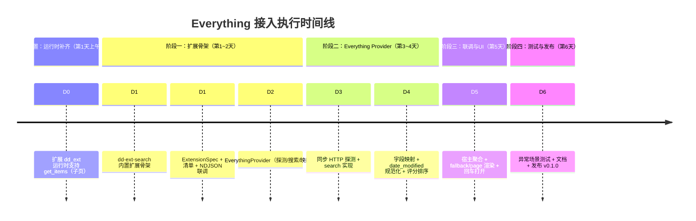

# 📋 dd-run 文件搜索执行方案（v3.2：Everything 优先版 · 架构对齐 + f 前缀自动进页 + 速度打磨）

> **v3.1 修订说明（对齐 2026-09-07 同步后的仓库架构）**：原 v3 基于"自创 `search`/`search_status` 方法 + 异步 Provider trait + 独立 Ctrl+F 面板"假设撰写，与当前仓库实际严重冲突。本次修订已逐条核对 [`docs/protocol.md`](./protocol.md)（v1.0 **冻结**）、[`docs/manifest-schema.md`](./manifest-schema.md)（v1.0）、`crates/dd-ext`（同步运行时）、`crates/dd-gui`（宿主）后重写技术章节。核心修正：
> 1. **不新增协议方法**：v1.0 协议已冻结且无 `search`/`search_status`。本方案完全复用 provider 模型（`initialize`/`top_level_commands`/`fallback_commands`/`invoke`）+ 协议已定义但**运行时尚未实现**的 `get_items`（§6.3）。实现 `get_items` 属于"补齐协议合规"，**不是**协议变更（无需走 §13 演进）。
> 2. **运行时是同步的**：`dd_ext::run` + `ExtensionSpec`，所有处理器为纯函数 `fn`。原方案的 `async_trait`/`reqwest` 异步/`tokio`/`.await` 无法编译 → 改用 `reqwest::blocking`。
> 3. **扩展落位修正**：作为第 6 个**内置扩展**放入 `crates/dd-ext/src/bin/search.rs`（沿用 apps/calc/websearch 模式），经清单 `com.ddrun.filesearch.json` 注册（位置在 `%APPDATA%\dd-run\extensions.d\`，由安装器写入；开发期指向本地构建产物）。原 `extensions/dd-ext-search/` + 仓库根 `extensions.d/search.json` 与实际不符。
> 4. **结果列表改为 `get_items(search_text)`**：当前运行时 `get_items` 返回 `-32005`，故"扩展 `dd_ext` 运行时支持子页"是必备前置（小改动）。文件结果对外一律是 `CommandItem[]`，删除虚构的 `results: SearchResult[]` 协议响应。
> 5. **打开文件走 `host/open_url`（`file://`）**：协议无 `host/open_file`；删除原 `open::that(path)` 直开假设，改为经宿主打开，并标注需实测 `webbrowser::open` 对 `file://` 的行为。
> 6. **删除独立 Ctrl+F 面板**：真实宿主是单一聚合面板，文件结果随主搜索框经 `fallback_commands`+`get_items` 自然呈现；防抖由宿主侧控制，扩展内不做。
> 7. **跨平台矛盾修正**：Everything 仅 Windows 可用，故 v0.1 **仅 Windows**；原"三平台产物"与"v0.1 依赖 Everything"自相矛盾 → 改为 v0.2（fd Provider）再谈跨平台。
> 8. **评分/类型 bug 修复**：`SkimMatcherV2::fuzzy_match` 返回 `Option<i64>`，原 `name_score + path_score*0.3` 存在 i64/f64 混算编译错误且 `score` 量级不对 → 归一化到 0~1；`date_modified` 必须规范化为 Unix 秒后再与 `now_7days()` 比较（原文直接比较会错）。
> 9. **依赖修正**：`Cargo.toml` 补 `urlencoding`、改用 `reqwest = { features = ["blocking","json"] }`；移除 `tokio`、`async-trait`（同步方案不需要）。

> **调整原因**：本地已安装 Everything，先接入 Everything 可以**用最小代价最快跑通全链路**（运行时 → Provider → UI），且 Everything 的搜索性能天花板最高，适合作为架构的第一个验证者。
> **架构不变**：provider 抽象已在 `dd_ext` 运行时固化（`ExtensionSpec`），fd 作为 v0.2 的第二个 Provider 接入（届时只是"加一个命令分支 / 新 bin"，不动运行时与协议）。
> **总工期**：**约 5~6 个工作日**（含运行时 `get_items` 补齐这一必备前置）。

---

## 一、调整后的 Provider 优先级与演进路线


**v0.1 的 Provider 选择逻辑（极简）**：

```
扩展启动 → initialize 返回 provider（has_fallback=true）
用户在主面板输入 → 宿主对该 Provider 调 fallback_commands（得"在文件中搜索 {query}"入口）
  ├─ 选中该入口 → 宿主进 page（files.results），调 get_items(search_text=query)
  │     ├─ Everything 在线 → 返回前 N 条文件 CommandItem（可↑↓导航、回车打开）
  │     └─ Everything 不在线 → 返回单条引导项（点击显示开启方法 Toast）
  └─ 不选中 → 无动作
```

> ⚠️ **明确取舍**：v0.1 阶段，没装 Everything 或未开启 HTTP 服务的用户无法使用文件搜索。这对**你自己使用**完全没问题，对公开发布而言 v0.2 补上 fd 即可闭环。Everything 仅 Windows，故 v0.1 仅 Windows 构建与发布。

---

## 二、时间线（5~6 天）



---

## 三、详细任务分解

### ✅ 前置：运行时补齐 `get_items`（第 1 天上午，必备）

当前 `crates/dd-ext/src/lib.rs` 的 `get_items` 分支**硬编码返回 `-32005 Page not found`**（5 个内置扩展均无子页）。文件搜索需要"可浏览结果列表"，协议 §6.3 已定义 `get_items(page_id, search_text)`，因此只需**在运行时补一个子页注册点**，不改变协议。

```rust
// crates/dd-ext/src/lib.rs 新增（示意）
pub type PageHandler = fn(&GetItemsParams) -> PageResult;

#[derive(Debug, Clone)]
pub struct PageResult {
    pub items: Vec<CommandItem>,
    pub has_more: bool,
    pub is_loading: bool,
}

// ExtensionSpec 增加字段：
//   pub pages: Option<PageHandler>,
// serve_line 的 "get_items" 分支：
//   let Some(h) = spec.pages { Ok(PageResult) } else { -32005 }
```

- 验收：新增 `PageHandler` 后，原 5 个内置扩展 `pages: None` → 行为不变（仍 `-32005`）；文件搜索扩展 `pages: Some(get_file_items)` → 返回 `PageResult`。
- 该变更为协议兼容（方法已存在），**不修改 `docs/protocol.md`**。

### ✅ 阶段一：扩展骨架（第 1~2 天）

#### 任务 1.1：项目结构与注册位置（第 1 天）

```
dd-run/
├── crates/
│   └── dd-ext/                      # 复用既有内置扩展 crate
│       ├── Cargo.toml               # 依赖见下；bin 列表追加 search
│       └── src/
│           ├── bin/
│           │   ├── apps.rs          # 既有
│           │   ├── calc.rs          # 既有
│           │   ├── shell.rs         # 既有
│           │   ├── system.rs        # 既有
│           │   ├── websearch.rs     # 既有（最接近的类比，照此写）
│           │   └── search.rs        # ⭐ 本期新增：文件搜索内置扩展
│           ├── lib.rs               # 运行时（含前述 get_items 补齐）
│           └── i18n.rs              # 既有
└── （安装器写入，非仓库源码）
    %APPDATA%\dd-run\extensions.d\com.ddrun.filesearch.json   # 清单
```

> 💡 开发期可用一份指向本地构建产物的清单（`entry.command` 指向 `target\release\dd-ext-search.exe`）放到扩展目录做联调；发布由安装器写入。清单 schema 见 [`docs/manifest-schema.md`](./manifest-schema.md)。

**`Cargo.toml`（dd-ext）依赖**（同步方案，已修正）：

```toml
[dependencies]
dd-protocol = { path = "../dd-protocol" }
serde = { version = "1", features = ["derive"] }
serde_json = "1"
anyhow = "1"
fuzzy-matcher = "0.3"          # 提供 skim::SkimMatcherV2
reqwest = { version = "0.12", features = ["blocking", "json"] }  # 同步 HTTP
urlencoding = "2"              # query 百分号编码（原方案遗漏）
chrono = "0.4"                 # date_modified 规范化（任务 2.2）
# 注：不使用 tokio / async-trait（运行时为同步模型）
```

#### 任务 1.2：协议对齐（第 1 天，不新增协议方法）

**复用 v1.0 已定义的方法**，不向 `docs/protocol.md` 追加方法：

| 协议方法（已实现/将实现） | 文件搜索中的用途 |
| :--- | :--- |
| `initialize` | 返回 `provider.id=com.ddrun.filesearch`、`has_fallback=true`、`capabilities=[host/open_url, host/show_status]` |
| `top_level_commands` | 首屏（query 为空）：可返回一条"文件搜索"说明项；或留空由 fallback 承担 |
| `fallback_commands` | **每个非空 query** 返回一条入口项 `"在文件中搜索 {query}"`，`command=Page{files.results}`（宿主渲染时替换 `{query}`） |
| `get_items` | 进入 `files.results` 页后，宿主带 `search_text` 调用 → 返回前 N 条文件 `CommandItem`（**前置任务已补齐**） |
| `invoke` | `files.open.<id>` → 经 `host/open_url`（`file://`）打开文件，`Dismiss` |
| `host/open_url` | 扩展反向请求，打开 `file://` 文件；`host/show_status` 用于 Everything 不可用时的引导 Toast |

> ❌ **删除原 v3 的 `search` / `search_status` 两张表**：它们不在 v1.0 协议里，且会触发协议冻结约束。Everything 可用性与结果列表改由 `fallback_commands` + `get_items` 表达。

**统一结果条目（扩展内部 `FileEntry`，对外映射为 `CommandItem`）**：

```json
{
  "id": "files.open.C__proj_src_main.rs",
  "title": "main.rs",
  "subtitle": "C:\\proj\\src\\main.rs",
  "icon": { "type": "glyph", "value": "🗋" },
  "section": "文件",
  "command": { "kind": "invoke" },
  "details": { "title": "main.rs", "body": "大小 1.0 KB · 修改 2024-05-30 12:34" }
}
```

#### 任务 1.3：ExtensionSpec 与子页处理器（第 2 天，替代原 Provider trait）

原 v3 的 `SearchProvider` trait + `async_trait` 与运行时不符。本方案直接声明 `ExtensionSpec`（与 websearch 同构），并新增 `pages` 处理器：

```rust
// crates/dd-ext/src/bin/search.rs（骨架，示意）
use dd_ext::{i18n::tr, run, Effect, ExtensionSpec};
use dd_ext::PageResult; // 前置任务新增
use dd_protocol::messages::GetItemsParams;
use dd_protocol::model::{CommandItem, CommandRef, CommandResult, Icon, IconKind};

fn spec() -> ExtensionSpec {
    ExtensionSpec {
        id: "com.ddrun.filesearch",
        display_name: tr("文件搜索", "File Search"),
        description: tr("基于 Everything 的本地文件搜索", "Local file search powered by Everything"),
        frozen: false,                 // 结果随 query 变化，不可冻结缓存
        has_fallback: true,
        capabilities: &["host/open_url", "host/show_status"],
        log_tag: "dd-ext-filesearch",
        top_level: top_level_commands,
        fallback: Some(fallback_commands),
        invoke: handle_invoke,
        pages: Some(get_file_items),   // 前置任务新增的字段
    }
}

fn fallback_commands() -> Vec<CommandItem> {
    vec![CommandItem {
        id: "files.search.query".into(),
        title: tr("在文件中搜索 {query}", "Search files for {query}"),
        subtitle: Some(tr("用 Everything 搜索本地文件", "Search local files with Everything")),
        icon: Some(Icon { kind: IconKind::Glyph, value: "\u{ED25}".into() }), // 文件夹/搜索字形
        section: Some(tr("文件", "Files").into()),
        tags: Some(vec!["files".into()]),
        details: None,
        text_to_suggest: None,
        more_commands: None,
        command: CommandRef::Page { page_id: "files.results".into() },
    }]
}

fn get_file_items(params: &GetItemsParams) -> PageResult {
    let query = params.search_text.as_deref().unwrap_or("").trim();
    let client = EverythingClient::from_env();           // base_url 来自配置/环境变量
    if query.is_empty() {
        return PageResult { items: vec![], has_more: false, is_loading: false };
    }
    if !client.available() {
        // Everything 未启动：返回单条引导项（点击 → Toast 显示开启方法）
        return PageResult { items: vec![guide_item()], has_more: false, is_loading: false };
    }
    match client.search(query, 30) {
        Ok(entries) => {
            let items: Vec<CommandItem> = score_and_sort(entries, query)
                .into_iter().map(to_command_item).collect();
            PageResult { items, has_more: false, is_loading: false }
        }
        Err(e) => PageResult { items: vec![error_item(&e)], has_more: false, is_loading: false },
    }
}

fn handle_invoke(params: &InvokeParams) -> (CommandResult, Vec<Effect>) {
    if let Some(path) = parse_open_id(&params.id) {       // "files.open.<encoded>"
        let url = format!("file:///{}", path.replace('\\', "/"));
        return (CommandResult::Dismiss, vec![Effect::HostRequest {
            method: "host/open_url",
            params: serde_json::json!({ "url": url }),
        }]);
    }
    (CommandResult::ShowToast { message: tr("未知命令", "Unknown command"), duration_ms: Some(2000) }, vec![])
}

fn main() { run(&spec()); }
```

> 💡 **架构验证点**：v0.2 接 fd 时，只需在 `get_file_items` 内增加"Everything 不可用 → 调 fd 兜底"的分支（或新增 `files.search.fd` 入口），运行时、协议、清单结构**零改动**。这就是先定 provider 模型的价值。

### ✅ 阶段二：Everything Provider（第 3~4 天）

#### 任务 2.1：同步 HTTP 探测与搜索请求（第 3 天）

```rust
// crates/dd-ext/src/bin/search.rs
use reqwest::blocking::Client;
use std::time::Duration;

pub struct EverythingClient {
    base_url: String,           // 默认 http://localhost:8080
    client: Client,
}

impl EverythingClient {
    pub fn available(&self) -> bool {
        self.client
            .get(format!("{}/?json=1&count=1", self.base_url))
            .timeout(Duration::from_millis(800))   // 快速失败
            .send()
            .map(|r| r.status().is_success())
            .unwrap_or(false)
    }

    pub fn search(&self, query: &str, limit: usize) -> anyhow::Result<Vec<RawEntry>> {
        let url = format!(
            "{}/?search={}&json=1&count={}&path_column=1&size_column=1&date_modified_column=1",
            self.base_url, urlencoding::encode(query), limit
        );
        let resp: EvResponse = self.client
            .get(&url)
            .timeout(Duration::from_secs(3))
            .send()?
            .json()?;
        Ok(resp.results)
    }
}
```

**Everything JSON 响应字段映射（RawEntry → FileEntry）**：

| Everything 字段 | FileEntry 字段 | 说明 |
| :--- | :--- | :--- |
| `results[].name` | `name` | 文件名 |
| `results[].path` | `dir` | 所在目录，需与 `name` 拼接为完整路径 |
| `results[].size` | `size` | 需开启 `size_column=1`，单位字节 |
| `results[].date_modified` | `modified` | 见任务 2.2 **必须规范化为 Unix 秒** |
| — | `is_dir` | Everything 无直接字段，v0.1 启发式（见 2.2） |

> ⚠️ **超时与阻塞**：运行时主循环是同步的，`available()`/`search()` 同步阻塞。Everything 本地响应通常 <50ms，远低于协议 `get_items` 默认 2000ms，可接受。若担心阻塞面板，宿主侧对 `get_items` 已有串行化与超时保护（协议 §10）。

#### 任务 2.2：字段映射 + `date_modified` 规范化（第 4 天）

> ⚠️ **已知坑（保留并修正）**：Everything 的 `date_modified` 返回格式随版本/设置而异（常见为本地时间字符串 `2024-05-30 12:34:56.789` 或 FILETIME）。**D4 当天务必用你本机实际响应锁定解析逻辑**，写一个针对真实响应样例的解析单元测试；解析失败则 `modified = 0`（不报错、不 panic）。

```rust
/// 把 Everything 的 date_modified 规范化为 Unix 秒；失败返回 0。
/// 真实格式以本机响应为准——此为正则/格式解析入口，配套单测。
fn parse_everything_date(s: &str) -> i64 {
    if let Ok(dt) = chrono::NaiveDateTime::parse_from_str(s, "%Y-%m-%d %H:%M:%S%.f") {
        return dt.and_utc().timestamp();
    }
    if let Ok(dt) = chrono::NaiveDateTime::parse_from_str(s, "%Y-%m-%d %H:%M:%S") {
        return dt.and_utc().timestamp();
    }
    0 // 解析失败：保守置 0，不阻断结果展示
}

/// is_dir 启发式（best-effort，v0.1）：无扩展名且 size==0 粗判为目录。
fn guess_is_dir(name: &str, size: u64) -> bool {
    !name.contains('.') && size == 0
}
```

> 💡 需要 `chrono` 做日期解析（加入 dd-ext 依赖），或直接用 `std` 手写；建议 `chrono` 以贴合真实格式单测。

#### 任务 2.3：评分排序（第 4 天，**修复类型与归一化**）

原 v3 的 `score()` 有两处硬伤：`SkimMatcherV2::fuzzy_match` 返回 `Option<i64>`，与 `f64` 混算会编译失败；且 skim 分数量级大（非 0~1），与示例 `score: 0.92` 不一致。`date_modified` 也须为 Unix 秒才能比较。修正如下：

```rust
use fuzzy_matcher::skim::SkimMatcherV2;
use fuzzy_matcher::FuzzyMatcher;

/// 把 skim 原始分（i64，量级数百~数千）归一化到 0~1。
fn norm(skim: i64) -> f64 {
    if skim <= 0 { 0.0 } else { (skim as f64 / 1000.0).min(1.0) }
}

pub fn score(entry: &FileEntry, query: &str) -> f64 {
    let matcher = SkimMatcherV2::default();
    let name_score = norm(matcher.fuzzy_match(&entry.name, query).unwrap_or(0));
    let path_score = norm(matcher.fuzzy_match(&entry.path, query).unwrap_or(0)) * 0.3;
    // entry.modified 必须是 Unix 秒（任务 2.2 已规范化）
    let recency = if entry.modified > now_7days_unix() { 0.1 } else { 0.0 };
    (name_score + path_score + recency).clamp(0.0, 1.0)
}

fn now_7days_unix() -> i64 {
    let seven_days = 7 * 24 * 3600;
    chrono::Utc::now().timestamp() - seven_days
}
```

Everything 查询本身毫秒级返回，30 条评分开销可忽略。归一化阈值（`/1000.0`）为启发式，应在 D4 用真实样例标定。

#### 任务 2.4：Everything 侧的适配工作（第 4 天，**用户操作清单**）

在你本机 Everything 中确认以下设置（一次性，2 分钟）：

1. `工具 → 选项 → HTTP服务器`：✅ 启用 HTTP 服务器，端口 `8080`（Everything 默认端口为 `80`，此处改用 8080 需在 Everything 内显式设置）
2. `HTTP服务器 → 用户名/密码`：留空（仅监听 localhost 时可接受；文档中注明安全建议）
3. 验证：浏览器访问 `http://localhost:8080/?search=test&json=1&count=5`，应返回 JSON
4. 安全：在 `工具 → 选项 → HTTP服务器` 中确认仅绑定 `127.0.0.1`（若 Everything 暴露到 `0.0.0.0` 会被局域网其他机器访问，存在安全隐患）

### ✅ 阶段三：宿主联调与 UI（第 5 天）

在 dd-run 宿主（`crates/dd-gui`）中**无需新增面板或热键**——文件搜索结果随主搜索框自然呈现：

1. **入口**：用户在主面板输入任意词 → 宿主对该 Provider 调 `fallback_commands` → 出现"在文件中搜索 {query}"项（来自 `files.search.query`）。
2. **进入结果页**：选中该项（或输入后直接展开）→ 宿主进 `files.results` 页，调 `get_items(search_text=query)` → 渲染前 30 条文件项。
3. **结果渲染**（egui，沿用既有 `CommandItem` 渲染）：
   - 列表项：`title` = 文件名，`subtitle` = 灰色完整路径，`details` = 大小/修改时间。
   - 键盘：↑↓ 导航，Enter 打开（`invoke` → `host/open_url` `file://`），Esc 返回/关闭面板。
   - 加载态：Everything 响应快（通常 <50ms），感知不明显；`is_loading` 由 `PageResult` 控制。
4. **Everything 不可用**：`get_items` 返回单条引导项 → 点击触发 `host/show_status` Toast："未检测到 Everything HTTP 服务（开启方法：…）"；**不卡死不 panic**。
5. **防抖**：由宿主侧决定何时调 `fallback_commands`/`get_items`（宿主已有聚合与串行化），扩展内不做防抖。

> ✅ **与原 v3 的差异**：原"Ctrl+F 打开独立搜索面板"在当前单一聚合面板宿主模型中不成立，已删除。若未来需要"专注文件搜索"的快捷键，属宿主侧增强（新增热键聚焦文件 Provider），不在 v0.1 扩展范围内。

### ✅ 阶段四：测试与发布（第 6 天）

#### 测试清单（基于本机 Everything）

| 测试项 | 方法 | 预期 |
| :--- | :--- | :--- |
| 基础搜索 | 搜 `readme` | 返回全盘匹配，<100ms |
| 中文搜索 | 搜 `文档`、`项目` | UTF-8 正常，无乱码 |
| 特殊字符 | 搜 `dd-run`、`v0.1` | `urlencoding::encode` 正确处理，结果准确 |
| Everything 语法透传 | 搜 `ext:rs dm:today` | query 直接透传给 Everything（免费获得高级搜索）✨ |
| Everything 未启动 | 退出 Everything 进程 | `get_items` 返回引导项；点击弹 Toast；不卡死不 panic |
| 端口被改 | 改成 9090 后重启扩展 | 通过配置 `everything_url` 适配 |
| 空结果 | 搜不存在关键词 | 返回空数组，UI 显示"无结果" |
| limit 截断 | 搜 `e`（海量结果） | 只返回 30 条，评分排序稳定 |
| `file://` 打开 | 回车打开某文件 | 宿主 `host/open_url` 用系统默认程序打开（**需实测 `webbrowser::open` 对 `file://`**；若不支持则扩展侧 `open::that`/`cmd /c start` 兜底） |
| 长时间运行 | 扩展连续响应 100 次请求 | 无内存泄漏、无句柄泄漏 |
| `date_modified` 解析 | 用本机真实响应样例 | 单测覆盖；异常格式不 panic，置 0 |

> 💡 **意外收获**：由于 query 直接透传给 Everything，**Everything 的全部搜索语法（`ext:`、`dm:`、`size:`、`path:`、通配符、正则）在 v0.1 就自动可用**——建议在用户文档中列出常用语法速查表。

#### 单元测试重点（随扩展代码提交）

- `parse_everything_date`：本机真实响应样例（多格式）+ 异常格式返回 0。
- `score`：归一化后落在 0~1；`搜 dd` 时 `dd-run` 应排前；`name` 权重高于 `path`。
- `guess_is_dir`：启发式边界（带扩展名 / 无扩展名+size>0）。
- `to_command_item`：`files.open.<encoded>` id 与 `parse_open_id` 互逆。

#### 发布 v0.1.0（Windows-only）

1. `cargo +stable-x86_64-pc-windows-gnu build --release` 构建 Windows 产物（单 exe 分发，见 `tools/package.sh`）。
2. `docs/search.md`（用户文档）：
   - 前置条件：Everything 安装 + 开启 HTTP 服务（图文教程，含仅绑定 127.0.0.1 安全提示）
   - 常用搜索语法速查表（`ext:rs`、`dm:today`、`path:dd-run` 等）
   - 配置项说明（`everything_url`、端口非默认时的改法）
   - 明确标注：**v0.1 仅支持 Windows（依赖 Everything）**；跨平台需等 v0.2 fd Provider
3. CHANGELOG 注明："v0.1 文件搜索依赖 Everything（Windows）；fd 兜底 Provider 计划于 v0.2 提供"

---

## 四、v0.1 → v0.2 的衔接（fd 兜底，跨平台）

本期为 fd 预留的接口，v0.2 接入时只需：

1. 在 `get_file_items` 内增加分支：`Everything 不可用 → 调 fd`（新增 `src/fetcher.rs` 自动下载 fd，约 150~200 行）；或新增 `files.search.fd` 入口项。
2. 清单 `platforms` 由 `["windows"]` 扩展为 `["windows","macos","linux"]`；fd 为对应平台二进制。
3. `capabilities` 不变（`host/open_url` 同样适用于 fd 结果的本地文件路径）。
4. 协议/运行时**零改动**——这是先定 provider 模型的价值。

**预计 v0.2 增量工期：2~3 天**。v0.2 起再谈"三平台产物"。

---

## 五、风险与预案（Everything 优先版，已更新）

| 风险 | 概率 | 预案 |
| :--- | :--- | :--- |
| 用户未开启 Everything HTTP 服务 | 高（对公开发布而言） | `get_items` 返回引导项 + `host/show_status` Toast；v0.2 用 fd 彻底解决 |
| `date_modified` 格式随 Everything 版本变化 | 中 | D4 用本机真实响应锁定解析；异常置 0 不报错（单测覆盖） |
| HTTP 服务被防火墙/杀软拦截 | 中 | 探测超时 800ms 快速失败，引导项提示检查端口 |
| HTTP 服务暴露局域网的安全隐患 | 低（localhost默认） | 文档安全提示（仅绑 127.0.0.1）；v0.2+ 可支持 Basic Auth |
| Everything 查询语法特殊字符与 URL 编码冲突 | 低 | `urlencoding::encode` 统一处理 + 特殊字符用例测试 |
| **`host/open_url` 对 `file://` 行为不确定** | 中 | **v0.1 实测 `webbrowser::open("file:///...")`**；若宿主侧不支持，改扩展用 `open::that` / `cmd /c start` 直开（仍经 `invoke` 同步完成） |
| **同步 HTTP 阻塞主循环** | 低 | Everything 本地 <50ms，远低于 `get_items` 2000ms 超时；宿主侧已串行化保护 |

---

## 六、每日验收清单（命令已对齐真实协议信封）

- [ ] **D0 结束**（前置）：`dd_ext` 运行时 `get_items` 支持 `PageHandler`；既有 5 扩展 `pages: None` 行为不变（仍 `-32005`），单测覆盖。
- [ ] **D2 结束**：`echo '{"jsonrpc":"2.0","id":1,"method":"initialize","params":{}}' | cargo run -p dd-ext --bin search` 返回正确 `provider`（id=com.ddrun.filesearch, has_fallback=true, capabilities 含 host/open_url）。
- [ ] **D3 结束**：扩展 `get_items`（`pages`）能从本机 Everything 拿到 JSON 结果并映射为 `CommandItem`。
- [ ] **D4 结束**：`date_modified` 等字段解析正确（单测）；搜 `dd` 时 `dd-run` 排前；退出 Everything 后 `get_items` 返回引导项不挂起；`score` 归一化单测通过。
- [ ] **D5 结束**：主面板输入即出"在文件中搜索 {query}" → 回车进结果页 → ↑↓ 导航 → 回车用系统程序打开文件 → Esc 返回。
- [ ] **D6 结束**：测试清单全过（含 `file://` 打开实测）；用户文档发布；GitHub Release v0.1.0（Windows）。

---

## 七、便捷 + 速度优化（v3.2：f 前缀自动进页 · 已落地）

> **用户诉求**（2026-09-07）：文件搜索是高频操作，要"更便捷、更快速"。
> **决策（grill-me 收敛）**：采用**直达前缀 + 自动进页**方案——根视图输入以 `f ` 开头即由宿主自动进文件结果页并回填剩余查询，省去"fallback 模板 → 选中 → 进页"的第二次 Enter；扩展侧再做速度打磨。

### 7.1 便捷：根视图 `f ` 前缀自动进页（宿主侧，零协议改动）

- **触发**：根查询以 `f `（`FILE_SEARCH_PREFIX`）开头，且 `com.ddrun.filesearch` 已加载且未禁用 → 每帧 `ui()` 经 `maybe_drill_file_search()` 自动 `open_page` 到 `files.results`，并把 `f ` 之后的文本作为 `search_text` 回填到结果页搜索框。
- **防抖/防重**：仅栈顶为 Root 时触发；同一查询已进页（`file_drill` 命中）不再重复进页；查询不再以 `f ` 开头（如清空）即清除 `file_drill`。Esc 返回 Root 时**不**重置 `file_drill`（否则会立即重进页、抵消 Esc），由上述 else 分支在"前缀消失"时自然复位。
- **协议零改动**：完全复用 `get_items(files.results, search_text)`；新增的只是宿主一处纯函数 `file_search_drill_target` + `PaletteApp` 两个方法（`maybe_drill_file_search` / `file_search_present`）。
- **既有入口保留**：顶层「文件搜索」入口 + `fallback_commands` 模板「在文件中搜索 {query}」仍可用（发现性与非前缀路径）。

### 7.2 速度：扩展侧打磨（零宿主改动即可生效）

| 打磨点 | 做法 | 预期 |
| --- | --- | --- |
| availability 探测缓存 | `AVAIL` TTL 缓存（默认 3s），窗口内跳过重复 TCP 探测 | 连续按键不每次探测 Everything |
| 超时收紧 | 探测 800ms；搜索 3s（Everything 本地通常 <50ms） | 异常时快速失败，不挂起 UI |
| 结果数自适应 | 默认取前 30 条，skim 评分排序稳定 | 海量结果只取前 N，列表瞬时填充 |
| 查询直透 | Everything 全部语法（`ext:`/`dm:`/`path:`/通配符/正则）原样透传 | 扩展侧零解析、零损耗 |
| 依赖最小 | HTTP 用标准库 `TcpStream`（HTTP/1.1 `Connection: close`）；评分用 `fuzzy-matcher`；时间用 `chrono`（手搓 civil→days 易错，改用成熟库） | 不引入 reqwest/urlencoding/chrono 之外的重依赖 |

### 7.3 验收（acceptance）

- [x] **便捷**：根视图输入 `f report` → 无需选中、无需第二次 Enter，即进入文件结果页并展示 Everything 对 `report` 的前 30 条结果；搜索框保留显示 `report`（`poll_page` 落地时回填 `file_drill_armed` 标记的查询，已落地消除"结果回来后框被清空"的边角，dev 构建通过）。真机核对显示与二次输入行为。
- [ ] **防重**：对 `f report` 连续多帧 `ui()` 不重复 `open_page`（仅一次进页）；按 Esc 返回 Root 后框内仍含 `f report` 不会立即重进页；清空查询后 `file_drill` 复位，再次输入 `f x` 可正常进页。
- [ ] **速度**：Everything 在线时，从输入完成到结果填充主观 <200ms（本地回环）；`everything_available()` 在 TTL 内对同一状态不再发起新探测。
- [ ] **健壮**：关闭 Everything HTTP 服务 → `f x` 进页后返回「未检测到 Everything」引导项，不挂起、不 panic；扩展进程不崩溃（运行时熔断不误触发）。
- [ ] **回归**：既有 5 扩展 `pages: None` 行为不变（仍 `-32005`）；`cargo test -p dd-ext` 全过（含 `get_items` PageHandler、日期解析、评分归一化、路径索引 round-trip）。
- [ ] **单测新增**：`search.rs` 覆盖 `pct_encode` / 日期多格式解析 / `score` 归一化与近因加分 / 路径索引 round-trip / `get_file_items` 空查询→hint、Everything 不可用→guide。

### 7.4 已知边界（v3.2 记录，部分已在本轮解决）

- **初始进页搜索框回填（已解决）**：`maybe_drill_file_search` 进页后标记 `file_drill_armed`，`poll_page` 结果落地时把 `f ` 之后的查询写回搜索框（`dd-gui/src/app/page.rs` + `mod.rs`）。仅文件结果页、且 `file_drill` 命中时生效，落地即消耗；用户先 Esc 离开再手动进页不会误回填旧查询（else 分支也清 `file_drill_armed`）。
- **结果页不随页内二次输入实时重拉（仍属 v3.3）**：当前宿主嵌套页仅在 `open_page` / `items_changed` 时取数，页内搜索框二次输入只做本地过滤（受前 30 条限制）。彻底"边打边搜"需宿主在嵌套页 query 变化时重发 `get_items`——属宿主改动，留待 v3.3 评估。
- **`f ` 前缀会劫持根视图字面查询**：用户若想在主面板搜字面 `f report` 文本，会被自动进文件页。属设计取舍（便捷前缀），如需可改为可配置前缀或仅在空 Root 时触发。

---

**方案核心变化总结**：v0.1 砍掉 fd 与自动下载模块、**不新增协议方法**、复用 v1.0 provider 模型 + 补齐运行时 `get_items`，**5~6 天内交付一个基于 Everything 的 Windows 文件搜索**（随主面板自然呈现、回车打开、Esc 返回），你本机即可日常使用；fd 兜底与跨平台作为 v0.2 的增量（2~3 天）补上，架构无缝扩展。v3.2 在不变更协议的前提下，通过宿主 `f ` 前缀自动进页 + 扩展侧速度打磨，把"文件搜索"从两步操作收敛为一步、并消除每次按键的可用性探测开销。
