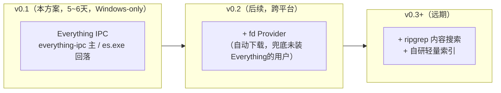
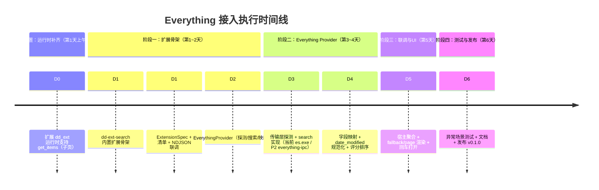
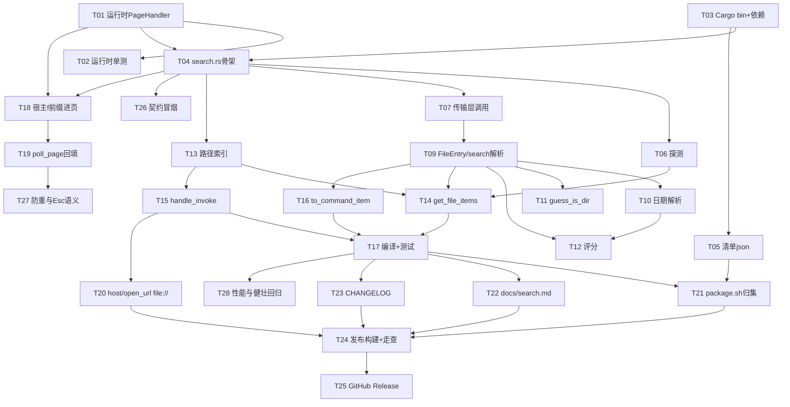

# dd-run 文件搜索执行方案

> **状态**：生效中 ｜ **版本**：v3.4 ｜ **最后更新**：2026-09-16
> **关联**：[protocol.md](./protocol.md) · [search.md](./search.md)

---

## 1. 当前生效结论（权威口径）

- **传输层 = 双通道**：`everything-ipc` crate 为**主通道**（已落地），`es.exe` 为**回落通道**（代码均存在：`search.rs` 中 `everything_available()` 约 :128、`run_es()` 约 :187、`decode_with_codepage()` 约 :245）。**不是 HTTP、不是 TCP 自研**。
- **已落地范围**：P0（占位项专属文案 / guide subtitle 对齐 es.exe 通道）、P1（`more_commands` 三动作 + `host/set_clipboard` + 宿主调用链）、P2（`everything-ipc` 主通道 + `es.exe` 回落）代码均已实施；§6 的 `f ` 前缀自动进页、页内二次输入 200ms 去抖重拉、`host/open_url` 经 `ShellExecuteW` 打开均已落地。
- **真机验收**：**A-33-05…A-33-10 首轮已完成（2026-09-15，结论见 §4）** —— A-33-07/A-33-10 通过、A-33-06/A-33-08 部分通过、A-33-05 性能未达标；其余 A-33-01…A-33-04、A-33-09 已通过或代码已具备。
- **用户承诺红线**：A-33-06 / A-33-08 通过前，不得把「无需 `es.exe` / Everything 运行中即可用」写入用户文档（当前已发布版本用户仍依赖 `es.exe`）。
- **依赖与超时（唯一正确值，详见 §2）**：`everything-ipc = "=0.1.4"`（`default-features = false`）、`fuzzy-matcher`、`chrono`、`windows-sys 0.61`；**无 `windows 0.62`、无 `reqwest`/`urlencoding`/`tokio`/`async-trait`**；超时统一 `ES_TIMEOUT = 1200ms`（≤ 宿主 `get_items` 2000ms）。

---

## 2. 传输层与依赖统一口径（取代全部旧追注）

> 本节为全文档**唯一权威口径**，合并原 v3.1「HTTP/TcpStream」、v3.2「es.exe」、v3.3「everything-ipc」三套互相推翻的追注。旧追注正文已删除，仅保留于 §8 版本演进表。

### 2.1 传输层：双通道

表：双通道角色与实现。

| 通道 | 角色 | 实现 | 状态 |
| --- | --- | --- | --- |
| `everything-ipc` | **主通道** | `EverythingClient::shared()`（WM_COPYDATA / `pipe`，纯 Rust，无 DLL 随包） | ✅ 已落地（P2） |
| `es.exe` | **回落通道** | `run_es()` 启动 `es.exe -json -n <limit> -size -dm -attributes <q>`，按系统 OEM 代码页（中文 Windows = 936/GBK）经 `MultiByteToWideChar`/`GetConsoleOutputCP` 解码 | ✅ 已落地（v0.1 起，P2 降级为回落） |

- 探测 `everything_available()`：主通道走 `EverythingClient::is_ipc_available() && is_db_loaded()`；回落走 `es.exe -get-everything-version`。
- 主通道优先，失败时**可观测地回落** `run_es`；连续失败超阈值后释放 `Arc` 触发重建，使通道能从回落态恢复到 IPC（见 §7.4 A-33-10）。
- 好处：用户**无需开启 Everything HTTP 服务器**；回落需 `es.exe` 已安装（`winget install --id=voidtools.Everything.Cli`）。

### 2.2 依赖（唯一正确清单）

表：dd-ext 与文件搜索相关的依赖。

| 依赖 | 版本 / 形态 | 用途 | 注 |
| --- | --- | --- | --- |
| `everything-ipc` | `=0.1.4`，`default-features = false` | P2 主通道（纯 Rust IPC） | 默认 feature 关闭，避免拉入 `tokio`/`folder`/`pe` |
| `fuzzy-matcher` | `0.3` | 文件名/路径模糊评分（skim `SkimMatcherV2`） | 本功能新增 |
| `chrono` | `0.4` | `date_modified` → Unix 秒（近因加分） | 本功能新增 |
| `windows-sys` | `0.61` | FILETIME / COM 接口等 Windows API | **既有基线**；原文档误写的 `windows 0.62` 不存在 |
| `dd-protocol` / `serde` / `serde_json` / `anyhow` | 既有 | 运行时与协议 | 基线复用 |

- **红线**：不得引入 `reqwest` / `urlencoding` / `tokio` / `async-trait`（同步模型 + 最小依赖）。
- `everything-ipc` 传递依赖 `tracing`：无 subscriber 时零开销，须实测**不向 stdout 输出**（stdout 是 NDJSON 协议通道）。

### 2.3 超时与编码（唯一正确值）

- **超时统一 `ES_TIMEOUT = 1200ms`**（`search.rs` 约 :53），探活与搜索共用；单请求总耗时（探活 + 查询 + 回落）≤ 宿主 `get_items` 2000ms。
- **编码**：路径 → `file://` 由 `path_to_file_url()`（`search.rs` 约 :99）完成，**不做 percent-encode**；`file://` 解析由宿主 `resolve_file_url_to_path()`（`platform.rs` 约 :529，旧的 `file_url_to_path` 已删除）以「存在性优先 + decode 兜底」处理。
- ⚠️ 原文档多处提及的 `pct_encode`（RFC 3986 URL 编码）**在全仓不存在**，相关段落已统一改为 `path_to_file_url`；查询参数对 Everything 为**原样直透**，不经任何 URL 编码（例外：以 `-`/`/` 开头的查询前置 `^` 转义，`search.rs:548-552`）。
- ⚠️ **未定义行为补录（2026-09-13）**：查询中的**双引号不转义**、查询**长度无上限**，均直接透传（`search.rs:556`）——含双引号的语义与超长查询的取舍由 Everything 自身决定，扩展层不做防护。

---

## 3. 已落地能力范围（P0/P1/P2 摘要）

- **P0（✅ 已实施）**：占位项专属文案（`files.hint`/`files.guide`/`files.error`）；`files.guide` subtitle 与模块注释对齐 es.exe 通道。
- **P1（✅ 已实施）**：每结果注册同一 `PATH_INDEX` pid，生成三动作——默认打开 / 显示所在目录（`explorer /select` + `raw_arg`）/ 复制路径（`host/set_clipboard`）；`spec().capabilities` 与 `examples/extensions.d/com.ddrun.filesearch.json` 同时声明 `host/set_clipboard`；宿主已渲染 `more_commands` 并发送 `sender=context_menu` 的 `invoke`（L2 NDJSON 冒烟通过）。
- **P2（✅ 代码已实施）**：`everything-ipc` 主通道 + `es.exe` 回落；L2 冒烟已验证 IPC 主通道真机返回真实结果。**真机验收 A-33-05…A-33-10 首轮已完成（2026-09-15，见 §4）**。
- **宿主侧（✅ 已落地）**：§6 `f ` 前缀自动进页、页内二次输入 200ms 去抖重拉（`PAGE_QUERY_DEBOUNCE`，定义于 `refresh.rs` :13；`page.rs:115` 为调用点）、`host/open_url` 经 `ShellExecuteW(verb="open")` 打开（P1.5 修复，与 P2 互不依赖）。

---

## 4. 真机验收：A-33-05/06/07/08/10（首轮已完成，2026-09-15）

> **状态：首轮真机验收已完成，未全通过**。逐项实测、耗时分解、复现命令与未闭环项见 **[文件搜索 P2 真机验收报告](./search-file-p2-acceptance-2026-09-15.md)**（本节只留结论，细节不重复）。A-33-01…A-33-04、A-33-09 已通过或代码已具备。
> ⚠️ **红线仍在**：A-33-06 / A-33-08 未**全**通过前，不得把「无需 `es.exe`」/「Everything 运行中即可用」写入用户文档。

表：首轮真机验收结论（环境：Windows 11 (26200) + Everything 1.4.1.1032 + `es.exe` 缺失；被验产物 release + `sha256 8f37896…5ac84`）。

| 编号 | 结论 | 关键实测 |
| --- | --- | --- |
| A-33-05 | ⚠️ **部分通过**（新阈值下达标）／🟨 基线无法验证 | 2026-09-16 修订阈值后达标：1000 次 p50 **26.87 ms**／p95 **31.49 ms**（对 < 30／< 50）；另 300 次复测 24.54／28.43。**扩展自身成本 ≲ 1 ms**，耗时几乎全在 IPC 查询往返 11–25 ms（＝ Everything 引擎地板）；`run_es` 基线需 `es.exe`，本机未安装 |
| A-33-06 | ⚠️ **部分通过** | 「两者均不可用 → 100% 引导项」**通过**（20/20，max 1.587 ms ≤ 2000 ms）；「IPC 不可用 → 100% 回落 `es.exe`」**无法验证**（缺 `es.exe`） |
| A-33-07 | ✅ **通过** | 1000 次查询无崩溃/无异常；RSS 稳态增长 **+5.97%**（<10%）且序列震荡非单调；线程恒 5、句柄恒 156 |
| A-33-08 | ⚠️ **部分覆盖** | 本机单元（Win11 × 1.4 × 非提升 × 默认实例）**有结果**；Win10 / Everything 1.5 / 提升(UIPI) / 1.5 命名实例 **未覆盖** |
| A-33-10 | ✅ **通过** | 两轮注入均恢复：轮次 1 经「3 次失败 → 释放 client → 重建」于**第 10 次查询／18.06 s** 回到 IPC；轮次 2 于**第 22 次／10.55 s**；长驻进程未停留回落态 |

⚠️ *A-33-03 的 `%` / `#` 实际打开验证**尚未执行**（需真机 GUI 手动）；与报告 §5 的其他未闭环项一并待办。A-33-09 已并入 CI 门禁；A-33-01…A-33-04 见 §7.4 表。*

⚙️ **2026-09-16 阈值修订**：A-33-05 的 p50/p95 门禁**经用户决策修订**为 p50 < 30 ms、p95 < 50 ms（原 < 10 ms / < 30 ms 经实测**低于 Everything 引擎地板 11–25 ms**，不可达）；修订依据、复测数据与判定变更见[验收报告](./search-file-p2-acceptance-2026-09-15.md) **§4.1.1**。**这是验收标准的正式修订（记入 §8 版本演进 v3.4），不是静默通过**——原标准下的 ❌ 判定保留在报告 §4.1。

---

## 5. 历史计划：Provider 路线 / 时间线 / 任务分解（v0.1 基线，已被 §2 取代）

> 🟨 **历史口径**：本节为 v0.1 计划期（v3.1 计划）的记录，反映「单 es.exe 通道 + HTTP 旧设想」等已被 §2 取代的内容。保留作 Release 验收门原始记录与任务分解蓝本，**不得据此新建传输层代码**。与当前实现冲突处已就地标注或指向 §2 / §7。

### 5.1 Provider 优先级与演进路线



v0.1 的 Provider 选择逻辑（极简）：

```text
扩展启动 → initialize 返回 provider（has_fallback=true）
用户在主面板输入 → 宿主对该 Provider 调 fallback_commands（得"在文件中搜索 {query}"入口）
  ├─ 选中该入口 → 宿主进 page（files.results），调 get_items(search_text=query)
  │     ├─ Everything 在线 → 返回前 N 条文件 CommandItem（可↑↓导航、回车打开）
  │     └─ Everything 不在线 → 返回单条引导项（点击显示开启方法 Toast）
  └─ 不选中 → 无动作
```

> 🟨 取舍（历史）：v0.1 已发布版本要求 Everything 在运行且 `es.exe` 可定位；P2 切主通道后 `es.exe` 降级为回落，普通用户不再需安装。两种情形都不要求开启 HTTP。Everything 仅 Windows，故 v0.1 仅 Windows 构建。

### 5.2 时间线（5~6 天，历史计划）



### 5.3 详细任务分解（历史计划，冲突处见 §2）

#### 5.3.1 前置：运行时补齐 `get_items`

当前 `crates/dd-ext/src/lib.rs` 的 `get_items` 分支曾硬编码返回 `-32005 Page not found`（5 个内置扩展无子页）。文件搜索需可浏览结果列表，协议 §6.3 已定义 `get_items(page_id, search_text)`，仅需在运行时补一个子页注册点，不改变协议。

```rust
// crates/dd-ext/src/lib.rs（已落地，签名与实现一致）
pub type PageHandler = fn(&GetItemsParams) -> GetItemsResult;

// ExtensionSpec 增加字段：
//   pub pages: Option<PageHandler>,
// serve_line 的 "get_items" 分支：
//   声明了 pages → 调 handler 返回 GetItemsResult（含 has_more_items / is_loading）
//   未声明（pages: None，如 5 个内置扩展）→ -32005 Page not found
```

- 验收：新增 `PageHandler` 后，原 5 个内置扩展 `pages: None` → 行为不变（仍 `-32005`）；文件搜索扩展 `pages: Some(get_file_items)` → 返回 `GetItemsResult`（单测见 `crates/dd-ext/src/lib.rs`）。
- 该变更为协议兼容（方法已存在），不修改 `docs/protocol.md`。

#### 5.3.2 任务 1.1：项目结构与注册位置

```text
dd-run/
├── crates/
│   └── dd-ext/                      # 复用既有内置扩展 crate
│       ├── Cargo.toml               # 依赖见 §2.2；[[bin]] 追加 dd-ext-search
│       └── src/
│           ├── bin/
│           │   ├── apps.rs          # 既有
│           │   ├── calc.rs          # 既有
│           │   ├── shell.rs         # 既有
│           │   ├── system.rs        # 既有
│           │   ├── websearch.rs     # 既有（最接近类比）
│           │   └── search.rs        # ⭐ 文件搜索内置扩展（bin 名 dd-ext-search）
│           ├── lib.rs               # 运行时（含 get_items 补齐）
│           └── i18n.rs              # 既有
├── examples/extensions.d/
│   └── com.ddrun.filesearch.json    # 清单（源码版，${EXT_DIR} 相对定位 exe）
└── （发布归集，M7 批次 7.4/7.5：免安装 sidecar）
    dist/extensions.d/               # dd-ext-search.exe + 清单（tools/package.sh 产出）
```

> 开发期可用指向本地构建产物的清单（`entry.command` → `target\release\dd-ext-search.exe`）联调；发布由 `tools/package.sh` 归集进 `dist/extensions.d/`（宿主扫描**可执行文件同目录**的 `extensions.d/`，清单 `${EXT_DIR}` 自动定位 exe，解压即用）。清单 schema 见 [`docs/manifest-schema.md`](./manifest-schema.md)。

**`Cargo.toml`（dd-ext）依赖**：见 §2.2（已修正，删除原 `windows 0.62` 与 `pct_encode` 旧注释）。

#### 5.3.3 任务 1.2：协议对齐（不新增协议方法）

复用 v1.0 已定义方法，不向 `docs/protocol.md` 追加方法：

表：文件搜索复用的协议方法。

| 协议方法 | 文件搜索中的用途 |
| --- | --- |
| `initialize` | 返回 `provider.id=com.ddrun.filesearch`、`has_fallback=true`、`capabilities=[host/open_url, host/show_status, host/set_clipboard]` |
| `top_level_commands` | 首屏（query 为空）：可返回一条"文件搜索"说明项；或留空由 fallback 承担 |
| `fallback_commands` | 每个非空 query 返回一条入口项 `"在文件中搜索 {query}"`，`command=Page{files.results}` |
| `get_items` | 进入 `files.results` 页后，宿主带 `search_text` 调用 → 返回前 N 条文件 `CommandItem`（前置任务已补齐） |
| `invoke` | `files.open.<u64>` → 经 `host/open_url`（`file://`）打开文件，`Dismiss` |
| `host/open_url` | 扩展反向请求，打开 `file://` 文件；`host/show_status` 已声明但当前扩展未实际发起 |

> 删除原 v3 的 `search` / `search_status` 两张表（不在 v1.0 协议）。统一结果条目（扩展内部 `FileEntry`，对外映射为 `CommandItem`）：

```json
{
  "id": "files.open.17",
  "title": "main.rs",
  "subtitle": "C:\\proj\\src\\main.rs",
  "icon": { "type": "glyph", "value": "\uE7C3" },
  "section": "文件",
  "command": { "kind": "invoke" },
  "details": { "title": "main.rs", "body": "大小 1.0 KB · 修改 2024-05-30 12:34" }
}
```

> id 为 `files.open.<u64>`：路径经进程内索引（`register_path`/`lookup_path`）取回，不内嵌路径字符。

#### 5.3.4 任务 1.3：ExtensionSpec 与子页处理器（骨架）

```rust
// crates/dd-ext/src/bin/search.rs（骨架，与实际实现同构）
use dd_ext::{i18n::tr, run, Effect, ExtensionSpec};
use dd_protocol::messages::{GetItemsParams, GetItemsResult, InvokeParams};
use dd_protocol::model::{CommandItem, CommandRef, CommandResult, Icon, IconKind};

fn spec() -> ExtensionSpec {
    ExtensionSpec {
        id: "com.ddrun.filesearch",
        display_name: tr("文件搜索", "File Search"),
        description: tr(
            "基于 Everything 的本地文件搜索（输入 f 后空格直接进入）",
            "Local file search powered by Everything (type 'f ' to jump in)",
        ),
        frozen: false,
        has_fallback: true,
        capabilities: &["host/open_url", "host/show_status", "host/set_clipboard"],
        log_tag: "dd-ext-filesearch",
        top_level: top_level_commands,
        fallback: Some(fallback_commands),
        invoke: handle_invoke,
        pages: Some(get_file_items),
    }
}

fn fallback_commands() -> Vec<CommandItem> {
    vec![CommandItem {
        id: "files.search.query".into(),
        title: tr("在文件中搜索 {query}", "Search files for {query}").into(),
        subtitle: Some(tr("用 Everything 搜索本地文件", "Search local files with Everything").into()),
        icon: Some(Icon { kind: IconKind::Glyph, value: file_glyph(false).to_string() }),
        section: Some(tr("文件", "Files").into()),
        tags: Some(vec!["files".into()]),
        details: None,
        text_to_suggest: None,
        more_commands: None,
        command: CommandRef::Page { page_id: "files.results".into() },
    }]
}

fn get_file_items(params: &GetItemsParams) -> GetItemsResult {
    let query = params.search_text.as_deref().unwrap_or("").trim();
    if query.is_empty() {
        return GetItemsResult { items: vec![hint_item()], has_more_items: false, is_loading: false };
    }
    if !everything_available() {
        return GetItemsResult { items: vec![guide_item()], has_more_items: false, is_loading: false };
    }
    match search(query, RESULT_LIMIT) {
        Ok(entries) => {
            // ⚠️ 原写法 score_and_sort(entries, query) 不存在；实际评分排序内联于
            // search.rs 约 :929-933（score/norm + sort_by 降序）。下为等价意图：
            let mut scored: Vec<_> = entries
                .into_iter()
                .map(|e| (score(&e, query), e))
                .collect();
            scored.sort_by(|a, b| b.0.partial_cmp(&a.0).unwrap_or(std::cmp::Ordering::Equal));
            let items: Vec<CommandItem> = scored
                .into_iter()
                .map(|(_, e)| e)
                .map(to_command_item)
                .collect();
            GetItemsResult { items, has_more_items: false, is_loading: false }
        }
        Err(e) => GetItemsResult { items: vec![error_item(&e.to_string())], has_more_items: false, is_loading: false },
    }
}

fn handle_invoke(params: &InvokeParams) -> (CommandResult, Vec<Effect>) {
    if let Some(n_str) = params.id.strip_prefix("files.open.") {
        if let Ok(n) = n_str.parse::<u64>() {
            if let Some(path) = lookup_path(n) {
                let url = path_to_file_url(&path);   // 见 §2.3：不做 percent-encode
                return (CommandResult::Dismiss, vec![Effect::HostRequest {
                    method: "host/open_url",
                    params: serde_json::json!({ "url": url }),
                }]);
            }
        }
    }
    (CommandResult::ShowToast { message: tr("未知命令", "Unknown command").to_string(), duration_ms: Some(2000) }, Vec::new())
}

fn main() { run(&spec()); }
```

> 架构验证点（历史）：v0.2 接 fd 时，只需在 `get_file_items` 内增加「Everything 不可用 → 调 fd 兜底」分支，运行时/协议/清单结构零改动。

#### 5.3.5 任务 2.1：传输层探测与搜索请求契约（历史计划）

> 🟨 历史说明：原任务定义「拿到 `Vec<FileEntry>`」的结果契约；传输载体现以 §2 双通道为准。下方 `search()` 不绑定具体传输；下游评分/映射对两种传输透明。

```rust
/// Everything 是否在线（availability TTL 3s 缓存）。
/// 主通道：EverythingClient::is_ipc_available() && is_db_loaded()；
/// 回落：es.exe -get-everything-version。
fn everything_available() -> bool { /* 见 §2.1 双实现，主通道优先 IPC */ }

/// 执行搜索，返回归一化的文件条目（不绑定传输层：当前 es.exe JSON，P2 everything-ipc QueryItem）。
fn search(q: &str, limit: usize) -> anyhow::Result<Vec<FileEntry>> {
    // 当前：run_es(&["-json", "-n", &limit.to_string(), "-size", "-dm", "-attributes", q]) → 解析 JSON
    // P2  ：EverythingClient::shared().query_wait(q).max(limit)
    //         .request_flags(NAME|PATH|SIZE|DATE_MODIFIED|ATTRIBUTES).timeout(1200ms).call()
    todo!()
}
```

表：Everything 字段映射（→ FileEntry，传输无关）。

| Everything 字段 | `FileEntry` 字段 | 说明 |
| --- | --- | --- |
| `name` | `name` | 文件名 |
| `path`（es.exe）/ `QueryItem::get_str(Path)`（IPC） | `dir` | 所在目录，需与 `name` 拼接为完整路径 |
| `size` | `size` | 单位字节 |
| `date_modified` | `modified` | 须规范化为 Unix 秒（es.exe 日期串 / FILETIME；IPC `QueryValue::Time(FILETIME)`，复用 `filetime_to_unix`） |
| `type`（`"folder"`）/ `attributes` | `is_dir` | 目录判定首选；缺失时退回启发式 |

> ⚠️ 超时与阻塞：运行时主循环同步，`available()`/`search()` 同步阻塞。Everything 本地响应通常 <50ms，远低于协议 `get_items` 默认 2000ms。

#### 5.3.6 任务 2.2：字段映射 + `date_modified` 规范化（历史计划）

```rust
/// 把 Everything 的 date_modified 规范化为 Unix 秒；任一步失败返回 0（不 panic）。
fn filetime_to_unix(...) -> i64 + fn combine_filetime(...) /* 实现落点：search.rs :322 / :332；早期草稿名 parse_everything_date 未采用 */

/// is_dir 启发式（best-effort，v0.1）：type=="folder" 优先；否则无扩展名且 size==0。
fn guess_is_dir(name: &str, size: u64, type_field: &str) -> bool {
    if type_field.eq_ignore_ascii_case("folder") { return true; }
    !name.contains('.') && size == 0
}
```

> IPC 通道精确目录判定：`get_u32(RequestFlags::Attributes) & 0x10`（§7.2 P2.5），`guess_is_dir` 仅回落通道保留。

#### 5.3.7 任务 2.3：评分排序（历史计划，修复类型与归一化）

原 `score()` 的硬伤：`SkimMatcherV2::fuzzy_match` 返回 `Option<i64>`，与 `f64` 混算编译失败；skim 分数量级大。修正如下：

```rust
use fuzzy_matcher::skim::SkimMatcherV2;
use fuzzy_matcher::FuzzyMatcher;

/// 把 skim 原始分（i64）归一化到 0~1。
fn norm(skim: i64) -> f64 {
    if skim <= 0 { 0.0 } else { (skim as f64 / 1000.0).min(1.0) }
}

fn score(entry: &FileEntry, query: &str) -> f64 {
    let matcher = SkimMatcherV2::default();
    let name_score = norm(matcher.fuzzy_match(&entry.name, query).unwrap_or(0));
    let path_score = norm(matcher.fuzzy_match(&entry.full_path(), query).unwrap_or(0)) * 0.3;
    let recency = if entry.modified > now_7days_unix() { 0.1 } else { 0.0 };
    (name_score + path_score + recency).clamp(0.0, 1.0)
}

fn now_7days_unix() -> i64 {
    chrono::Utc::now().timestamp() - 7 * 24 * 3600
}
```

> ⚠️ `score_and_sort` 不存在：评分排序逻辑内联于 `search.rs` 约 :929-933（`entries.into_iter().map(|e| (score(&e, query), e))` 后 `sort_by` 降序）。`score`/`norm` 函数名保留。归一化阈值（`/1000.0`）为启发式，应标定。

#### 5.3.8 任务 2.4：Everything 侧适配（用户操作清单，历史）

1. 安装并运行 Everything（1.4+）；不要求开任何服务 / HTTP。
2. 安装 `es.exe`：`winget install --id=voidtools.Everything.Cli`（P2 后普通用户不再需此步，仅回落用）。
3. 验证：`es.exe -get-everything-version` 应返回版本号。
4. 无需网络/端口/防火墙配置——本机 IPC，无局域网暴露风险。

#### 5.3.9 任务 3：宿主联调与 UI（历史计划）

1. **入口**：主面板输入 → `fallback_commands` → "在文件中搜索 {query}"。
2. **进入结果页**：选中 → 进 `files.results`，调 `get_items` → 渲染前 30 条。
3. **结果渲染**（egui）：`title`=文件名，`subtitle`=灰色完整路径，`details`=大小/修改时间；↑↓ 导航，Enter 打开，Esc 返回。
4. **Everything 不可用**：`get_items` 返回引导项；不卡死不 panic。
5. **防抖**：由宿主侧控制（见 §6）。

> 删除原 v3 独立 Ctrl+F 面板（与单一聚合面板宿主模型不符）。

#### 5.3.10 任务 4：测试与发布（历史计划）

测试清单（基于本机 Everything）：

表：v0.1 测试清单（历史，量化值以 §5.6 / §2 为准）。

| 测试项 | 方法 | 预期 |
| --- | --- | --- |
| 基础搜索 | 搜 `readme` | 返回全盘匹配，<100ms |
| 中文搜索 | 搜 `文档`、`项目` | UTF-8 正常，无乱码 |
| 特殊字符 | 搜 `dd-run`、`v0.1` | 查询原样直透（不经 URL 编码；`-`/`/` 开头前置 `^` 转义除外），结果准确 |
| Everything 语法透传 | 搜 `ext:rs dm:today` | query 直接透传（免费获得高级搜索） |
| Everything 未启动 | 退出 Everything | `get_items` 返回引导项；点击弹 Toast；不卡死 |
| es.exe 路径变更 | 非 PATH 位置 | 环境变量 `DDRUN_ES_PATH=...` 指定 |
| 空结果 | 搜不存在关键词 | 返回空数组 |
| limit 截断 | 搜 `e` | 只返回 30 条 |
| `file://` 打开 | 回车打开 | 宿主 `host/open_url` 经 `ShellExecuteW(verb="open")` 用系统默认程序打开（P1.5 已落地，无 `cmd /c start` 兜底） |
| 长时间运行 | 连续 100 次请求 | 无内存/句柄泄漏 |
| `date_modified` 解析 | 本机真实响应 | 单测覆盖；异常置 0 |

单元测试重点（随扩展代码提交）：

- `filetime_to_unix` / `combine_filetime`（多格式 + 异常返回 0；文档旧称 `parse_everything_date` 的函数并不存在）。
- `score`：归一化 0~1；`搜 dd` 时 `dd-run` 排前；近因加分。
- `guess_is_dir`：`type=="folder"` 优先。
- `to_command_item`：`files.open.<u64>` id round-trip（`path_index_roundtrip`）。
- `path_to_file_url`（取代原 `pct_encode`）：UNC / 本地盘 / 含 `%` `#` 原样 / 退化形态（单测见 `search.rs` 约 :1403-1439）。⚠️ 原单测名 `pct_encode_*` 已随函数移除而废弃。
- `get_file_items`：空查询→hint、Everything 不可用→guide。

发布 v0.1.0（Windows-only）：

1. `bash tools/package.sh` 产出 `dist/dd-run-<版本>.exe` + 归集 `dist/extensions.d/`（file-search sidecar）。
2. `docs/search.md`：前置条件 Everything 安装 + `es.exe` 可定位（无需 HTTP）；语法速查表；配置项 `DDRUN_ES_PATH`/`DDRUN_EVERYTHING_DIR`；明确 v0.1 仅 Windows。
3. CHANGELOG："v0.1 文件搜索依赖 Everything（Windows）；fd 兜底 Provider 计划于 v0.2"。
4. 真机走查：解压绿色 zip → `f ` 进文件搜索、升级覆盖 → tag → GitHub Release。

### 5.4 每日验收清单 D0–D6（历史）

> 🟨 历史计划期验收门（v3.1）；v3.2 落地后核心行为由 §6.3 承接。保留作原始记录。

- [ ] **D0 结束**（前置）：`dd_ext` 运行时 `get_items` 支持 `PageHandler`；既有 5 扩展 `pages: None` 行为不变。
- [ ] **D2 结束**：`echo '{"jsonrpc":"2.0","id":1,"method":"initialize","params":{}}' | cargo run -p dd-ext --bin dd-ext-search` 返回正确 `provider`。
- [ ] **D3 结束**：扩展 `get_items` 能从本机 Everything 拿到结果并映射 `CommandItem`。
- [ ] **D4 结束**：`date_modified` 解析正确（单测）；搜 `dd` 时 `dd-run` 排前；退出 Everything 后返回引导项不挂起。
- [ ] **D5 结束**：主面板输入即出"在文件中搜索 {query}" → 回车进结果页 → 打开文件 → Esc 返回。
- [ ] **D6 结束**：测试清单全过；用户文档发布；GitHub Release v0.1.0（Windows）。

### 5.5 AI Agent 原子任务分解 T-01…T-25（历史计划）

> 🟨 历史计划，依赖拓扑图与任务表保留。与 §2 冲突的细节（如 T-08 `pct_encode`、T-06/T-07 超时 800ms/3s）已就地修正。

#### 5.5.1 依赖拓扑图



#### 5.5.2 任务清单（P0 → P7）

表：P0 · 前置。

| ID | 任务 | 目标文件 | 具体动作 | 验收 | 依赖 |
| --- | --- | --- | --- | --- | --- |
| **T-01** | 运行时支持 `PageHandler` | `crates/dd-ext/src/lib.rs` | 新增 `pub type PageHandler`；`ExtensionSpec` 增 `pages: Option<PageHandler>`；`serve_line` 的 `get_items` 分支按有无 `pages` 返回或维持 `-32005`。不修改 `docs/protocol.md`。 | 5 扩展 `pages: None` 行为不变。 | — |
| **T-02** | 运行时 `PageHandler` 单测 | `crates/dd-ext/src/lib.rs` | `page_handler_none_still_32005` / `page_handler_returns_items`。 | `cargo test -p dd-ext` 通过。 | T-01 |

表：P1 · 扩展骨架。

| ID | 任务 | 目标文件 | 具体动作 | 验收 | 依赖 |
| --- | --- | --- | --- | --- | --- |
| **T-03** | 注册 bin 与依赖 | `crates/dd-ext/Cargo.toml` | `[[bin]]` 追加 `dd-ext-search`；`[dependencies]` 含 `fuzzy-matcher`/`chrono`（依赖见 §2.2）。 | `cargo metadata` 无误。 | — |
| **T-04** | `search.rs` 骨架 | `crates/dd-ext/src/bin/search.rs` | 照 §5.3.4 写 `spec()`；所有文案走 `tr(中文, English)`。 | 编译通过；字段与 §5.3.4 一致。 | T-01, T-03 |
| **T-05** | 扩展清单 | `examples/extensions.d/com.ddrun.filesearch.json` | 照 manifest-schema 写 `id`/`display_name`/`entry.command`/`platforms=["windows"]`/`capabilities`。 | `python -m json.tool` 合法。 | T-03 |
| **T-26** | NDJSON 契约冒烟 | `crates/dd-ext/src/bin/search.rs`、`examples/extensions.d/` | 管道驱动校验 `initialize`/`fallback_commands`/`get_items` 契约（不新增字段）。 | 响应与 §5.3.3 一致；对应 §5.4 D2。 | T-04, T-05 |

表：P2 · 传输层（探测 / 解析，everything-ipc 主 / es.exe 回落）。

| ID | 任务 | 目标文件 | 具体动作 | 验收 | 依赖 |
| --- | --- | --- | --- | --- | --- |
| **T-06** | Everything 可用探测 | `crates/dd-ext/src/bin/search.rs` | 实现 `everything_available()`：主通道 `is_ipc_available() && is_db_loaded()`；回落 `es.exe -get-everything-version`（3s TTL）。可注入。 | 单测 up/down 用注入式，不依赖真实 Everything。 | T-04 |
| **T-07** | 搜索传输 | `crates/dd-ext/src/bin/search.rs` | `run_es(args)`：启动 `es.exe -json -n <limit> -size -dm -attributes <q>`，超时 `ES_TIMEOUT=1200ms` 后 kill；解析 → `Vec<FileEntry>`。P2 增 `ipc_search(q, limit)`：`.timeout(1200ms).call()` → `QueryItem`；主通道优先 IPC、回落 `run_es`。 | 单测 `run_es_parses_json`（fixture）/ `ipc_search_maps_queryitem`（L3）；超时返回 Err 不 panic。 | T-04 |
| **T-08** | `path_to_file_url`（取代原 `pct_encode`） | `crates/dd-ext/src/bin/search.rs` | 实现 `path_to_file_url(path)`：UNC → `file://host/share/x`；常规 → `file:///<path>`（`\`→`/`），**不做 percent-encode**。 | 单测 `path_to_file_url_local_drive_keeps_third_slash` / `_unc_share_uses_host_authority` / 含 `%` `#` 原样 / 退化形态（见 `search.rs` 约 :1403-1439）。⚠️ 原 `pct_encode` 不存在，已废弃。 | T-04 |
| **T-09** | `FileEntry` + `search` 解析 | `crates/dd-ext/src/bin/search.rs` | 定义 `RawEntry`/`FileEntry`；`search(q, limit)` 经 `run_es`/`ipc_search` 取响应 → 解析 → `Vec<FileEntry>`。解析抽为纯函数 `parse_response(&str)` 以离线单测。 | 单测 `search_parses_everything_response` / `parse_response_malformed_returns_err`（本机真实响应 fixture）。 | T-07, T-08 |

表：P3 · 字段映射 / 评分 / 路径索引。

| ID | 任务 | 目标文件 | 具体动作 | 验收 | 依赖 |
| --- | --- | --- | --- | --- | --- |
| **T-10** | `date_modified` 规范化 | `crates/dd-ext/src/bin/search.rs` | `filetime_to_unix` / `combine_filetime` → chrono UTC 秒；失败返回 0（函数名以实现为准）。 | `date_parse_known_formats` / `date_parse_invalid_returns_zero`。 | T-09 |
| **T-11** | `guess_is_dir` | `crates/dd-ext/src/bin/search.rs` | `type=="folder"` 优先；否则无扩展名且 size==0。 | `guess_is_dir_folder_priority` / `_heuristic_boundary`。 | T-09 |
| **T-12** | 评分排序 | `crates/dd-ext/src/bin/search.rs` | `norm`/`score`（name + path*0.3 + 近因 0.1）；⚠️ `score_and_sort` 不存在，逻辑内联 `search.rs` 约 :929-933。 | `score_normalizes_and_ranks_name_over_path` / `score_recency_bonus_for_recent`。 | T-09, T-10 |
| **T-13** | 进程内路径索引 | `crates/dd-ext/src/bin/search.rs` | `register_path`/`lookup_path`（线程安全）；`id` 用 `files.open.<u64>`；带容量上限与淘汰。 | `path_index_roundtrip` / `path_index_evicts_beyond_capacity`。 | T-04 |

表：P4 · 组装 `get_items` / `invoke` / 映射。

| ID | 任务 | 目标文件 | 具体动作 | 验收 | 依赖 |
| --- | --- | --- | --- | --- | --- |
| **T-14** | `get_file_items` | `crates/dd-ext/src/bin/search.rs` | 空 query→hint；`!everything_available()`→guide；否则 search→评分→`to_command_item`；错误→error。⚠️ 评分调用内联逻辑而非 `score_and_sort`。 | `get_file_items_empty_query_returns_hint` / `everything_unavailable_returns_guide`。 | T-06, T-09, T-10, T-11, T-12, T-13 |
| **T-15** | `handle_invoke` | `crates/dd-ext/src/bin/search.rs` | `files.open.<u64>` → `lookup_path` → `path_to_file_url` → `Effect::HostRequest{host/open_url}` + `Dismiss`；其余→Toast。 | `handle_invoke_opens_file_via_host_request` / `_unknown_command_toast`。 | T-13 |
| **T-16** | `to_command_item` + 静态项 | `crates/dd-ext/src/bin/search.rs` | `to_command_item(entry)`；`hint_item()`/`guide_item()`/`error_item()`。 | `to_command_item_maps_fields` / `hint_guide_error_items_shape`。 | T-09, T-10, T-11 |

表：P5 · 编译 + 全量测试。

| ID | 任务 | 目标文件 | 具体动作 | 验收 | 依赖 |
| --- | --- | --- | --- | --- | --- |
| **T-17** | 编译 + 全量门禁 | 仓库根 | `cargo fmt --all --check` → `cargo clippy --workspace --all-targets` → `cargo test --workspace` → Windows gnu build。 | fmt 0、clippy 零 warning、`cargo test` 0 failed；build exit 0。 | T-14, T-15, T-16 |

表：P6 · 宿主联调。

| ID | 任务 | 目标文件 | 具体动作 | 验收 | 依赖 |
| --- | --- | --- | --- | --- | --- |
| **T-18** | 宿主 `f ` 前缀自动进页 | `crates/dd-gui/src/app/mod.rs`、`page.rs` | `FILE_SEARCH_PREFIX="f "` + `file_search_drill_target()` + `maybe_drill_file_search()` / `file_search_present()`；状态 `file_drill`/`file_drill_armed`。 | §6.1 便捷项；以该验收为回归基线。 | T-04, T-01 |
| **T-19** | `poll_page` 回填查询 | `crates/dd-gui/src/app/page.rs`、`mod.rs` | `file_drill_armed` 命中则写回查询并消耗；Esc else 分支清 `file_drill_armed`。 | §6.3 边角。 | T-18 |
| **T-20** | `host/open_url` 开 `file://` | `crates/dd-gui/src/app/host_actions.rs` | ✅ 已落地：经 `platform::open_path` 的 `ShellExecuteW(verb="open")`（无 `cmd /c start` 兜底；`webbrowser::open` 仅用于 http(s)）。 | §6.3「`file://` 打开实测」。 | T-15 |
| **T-27** | 防重与 Esc 语义 | `crates/dd-gui/src/app/mod.rs`、`page.rs` | 连续多帧仅进页一次；Esc 后不立即重进；清空复位可再进。 | 单测 + 真机勾选。 | T-18, T-19 |
| **T-28** | 性能与健壮回归 | `crates/dd-ext/src/bin/search.rs`、宿主 | 速度 <200ms、TTL 内不重复探测；健壮不挂起；回归 5 扩展仍 `-32005`。 | `cargo test --workspace` 0 failed。 | T-17, T-19, T-06 |

表：P7 · 打包 / 文档 / 发布。

| ID | 任务 | 目标文件 | 具体动作 | 验收 | 依赖 |
| --- | --- | --- | --- | --- | --- |
| **T-21** | `package.sh` 归集 | `tools/package.sh`、`dist/` | 归集 `dd-ext-search.exe` + 清单进 `dist/extensions.d/`。 | `dist/extensions.d/` 含两者。 | T-17, T-05 |
| **T-22** | 用户文档 | `docs/search.md` | Everything 安装 + es.exe + 语法速查 + 配置项 + 仅 Windows。 | 用户可照做搜到结果。 | T-17 |
| **T-23** | CHANGELOG | `CHANGELOG.md` | 追加 v0.1 条目。 | 含条目。 | T-17 |
| **T-24** | 发布构建 + 走查 | `dist/`、仓库 | `package.sh` + 真机走查（`f ` 进页 / 打开 / Esc / 升级）。 | §5.6.5 真机清单全过。 | T-21, T-20, T-22, T-23, T-27, T-28 |
| **T-25** | GitHub Release | GitHub | tag + Release v0.1.0（Windows 绿色包）。 | 资产含 dist 产物。 | T-24 |

#### 5.5.3 执行纪律

1. 同层并行、跨层串行；P0→P1→…→P7 严格递进。
2. 三层门禁：单测 + `cargo fmt --all --check` + `cargo clippy --workspace --all-targets`（零 warning）+ `cargo test --workspace`（0 failed）。
3. 零协议改动：T-01 仅补 `get_items`，不向 `docs/protocol.md` 追加。
4. 最小依赖：仅 `fuzzy-matcher`/`chrono`（见 §2.2），不引入 `reqwest`/`urlencoding`/`tokio`/`async-trait`。
5. 回归基线：§6.3 已 `[x]` 的 P6 任务以现有实现为基线核对。
6. 边界不越界：§6.4 遗留项不在本分解范围。

### 5.6 验证标准与测试规则（历史判定基准）

> 🟨 历史计划期判定基准。量化值以本节为准，超时统一 1200ms（取代原 800ms/3s）。

#### 5.6.1 测试分层（L1–L4）

表：测试分层。

| 层 | 类型 | 覆盖范围 | 依赖 Everything | 运行方式 |
| --- | --- | --- | --- | --- |
| **L1** | 纯函数单测 | `path_to_file_url` / `filetime_to_unix`+`combine_filetime` / `guess_is_dir` / `norm` / `score` / `register_path`+`lookup_path` / `parse_response` / `to_command_item` / `handle_invoke` / `file_search_drill_target` | ❌ 否 | `cargo test --workspace` |
| **L2** | 契约测试（NDJSON） | stdin/stdout 驱动校验 `initialize`/`top_level_commands`/`fallback_commands`/`get_items`/`invoke` | ❌ 否（可注入） | `echo '<json>' \| cargo run -p dd-ext --bin dd-ext-search` |
| **L3** | 集成测试（真实 Everything） | 端到端：探测→搜索→评分→映射 | ✅ 是 | `#[ignore]` + `--ignored` |
| **L4** | 真机验收 | GUI：`f ` 进页、↑↓/Enter/Esc、打开、长跑、防重 | ✅ 是 | 真机走查 |

**硬规则**：L1/L2 必须在无 Everything、无 GUI 的干净 CI 全绿；L3/L4 可跳过，但被跳过用例须在 §5.6.5 清单人工执行勾选。

#### 5.6.2 测试规则（硬性）

1. **可离线性**：L1 禁止真实传输连接 / Everything 进程 / 真实文件系统结果；用注入 fixture 字符串模拟。
2. **解析与传输解耦**：`search()` 的传输层与 `parse_response(&str)` 解耦；fixture 取自本机真实响应。
3. **命名规范**：`<被测函数>_<场景>_<预期>`；§5.3.10 已列名字保持不变。
4. **L3 标记**：依赖真实 Everything 的测试 `#[ignore]`。
5. **禁 panic**：日期解析（`filetime_to_unix` / `combine_filetime`）异常输入返回 0，覆盖空串/缺字段/FILETIME/超长。
6. **确定性**：评分单测用固定 `modified` 时间戳。
7. **不改协议**：L2 断言 v1.0 已定义字段。
8. **依赖红线**：出现 `reqwest`/`tokio`/`async-trait`/`urlencoding` 即违规。

#### 5.6.3 门禁命令

```bash
cargo fmt --all --check
cargo clippy --workspace --all-targets
export APPDATA='C:\Users\y7398\AppData\Roaming'
cargo test --workspace
export PATH="/c/Users/y7398/.rustup/toolchains/stable-x86_64-pc-windows-gnu/lib/rustlib/x86_64-pc-windows-gnu/bin/self-contained:$PATH"
cargo +stable-x86_64-pc-windows-gnu build -p dd-ext --bin dd-ext-search
cargo test --workspace -- --ignored   # 可选 L3
```

> ⚠️ incremental 缓存 ICE：若 `rustc_metadata rmeta encoder panic`（`os error 5 ... metadata.rmeta`），属 incremental 缓存目录权限损坏而非代码问题，统一加 **`CARGO_INCREMENTAL=0`** 重跑即可，不要改代码。

#### 5.6.4 量化验收基准（数值红线）

表：量化验收基准（超时统一 1200ms）。

| 指标 | 基准值 | 来源 |
| --- | --- | --- |
| 可用性探测超时 | **1200ms**（`ES_TIMEOUT`） | `search.rs` 约 :53 |
| 可用性 TTL 缓存 | **3s** | §5.3.5 |
| 搜索读超时 | **1200ms**（≤ 宿主 2000ms，不再被截断矛盾） | §2.3 |
| 宿主 `get_items` 超时 | **2000ms**（固定，不改） | 协议 §10 |
| 结果条数上限 | **30 条** | §5.3.10 |
| 评分区间 | **0.0~1.0**（`norm = skim/1000.0`，`clamp`） | §5.3.7 |
| 路径权重 | `path_score × 0.3` | §5.3.7 |
| 近因加分 | `modified > now − 7d` → **+0.1** | §5.3.7 |
| 本地搜索响应 | **<100ms** | §5.3.10 |
| 端到端（输入→填充） | 主观 **<200ms**（本地回环） | §6.3 |
| 长跑 | 连续 **100 次**请求无泄漏 | §5.3.10 |

> ⚠️ 原 §7.2 / §8.4.4 的「探测 800ms / 搜索 3s」已统一为 1200ms；原「搜索 3s 被宿主 2000ms 截断」矛盾因 1200ms ≤ 2000ms 而消解。

#### 5.6.5 真机验收清单（L4，T-24 前逐项勾选）

表：真机验收清单（L4）。

| # | 场景 | 操作 | 判定标准 |
| --- | --- | --- | --- |
| 1 | 基础搜索 | `f readme` | 响应 <100ms |
| 2 | 中文搜索 | `f 文档` | UTF-8 正常 |
| 3 | 特殊字符 | `f dd-run`、`f v0.1` | 查询原样直透，结果准确 |
| 4 | 语法透传 | `f ext:rs dm:today` | Everything 语法生效 |
| 5 | Everything 未启动 | 退出 Everything 后进页 | 返回引导项；不挂起、不 panic |
| 6 | es.exe 路径 | 非默认 + `DDRUN_ES_PATH` | 正常搜索 |
| 7 | 空结果 | 不存在关键词 | 空数组 |
| 8 | limit 截断 | `f e` | 仅 30 条，排序稳定 |
| 9 | `file://` 打开 | 回车打开 | 系统程序打开（或 `cmd /c start`） |
| 10 | 长跑 | 连续 100 次 | 无泄漏 |
| 11 | 防重 | 停留多帧 → Esc → 清空 → 重输 | 仅进页一次；Esc 后不立即重进 |
| 12 | 回归 | 5 个既有扩展 | `pages: None` 仍 `-32005` |

---

## 6. 便捷 + 速度优化（已落地）

> 用户诉求（2026-09-07）：文件搜索高频，要「更便捷、更快速」。决策：直达前缀 + 自动进页（§6.1）+ 扩展侧速度打磨（§6.2）。本节为已落地能力。

### 6.1 便捷：`f ` 前缀自动进页（宿主侧，零协议改动）

- **触发**：根查询以 `f `（`FILE_SEARCH_PREFIX`）开头，且 `com.ddrun.filesearch` 已加载未禁用 → 每帧 `ui()` 经 `maybe_drill_file_search()` 自动 `open_page` 到 `files.results`，回填剩余查询。
- **防抖/防重**：仅栈顶 Root 触发；同查询已进页不再重复；前缀消失即清 `file_drill`；Esc 返回 Root 不重置 `file_drill`（由 else 分支在「前缀消失」时复位）。
- **协议零改动**：复用 `get_items(files.results, search_text)`；新增宿主纯函数 `file_search_drill_target` + `PaletteApp` 两方法。
- 既有入口（顶层「文件搜索」+ fallback 模板）仍可用。

### 6.2 速度：扩展侧打磨（零宿主改动）

表：扩展侧速度打磨点。

| 打磨点 | 做法 | 预期 |
| --- | --- | --- |
| availability 探测缓存 | `AVAIL` TTL 缓存（默认 3s），窗口内跳过重复探测 | 连续按键不每次探测 |
| 超时统一 | `ES_TIMEOUT = 1200ms`（探活与搜索共用，≤ 宿主 2000ms） | 异常快速失败，不挂起 |
| 结果数自适应 | 默认前 30 条，skim 评分排序 | 海量结果只取前 N |
| 查询直透 | Everything 全部语法原样透传 | 扩展侧零解析 |
| 依赖最小 | es.exe 进程 / everything-ipc 纯 Rust；评分 `fuzzy-matcher`；时间 `chrono` | 仅新增 fuzzy-matcher/chrono（见 §2.2） |

### 6.3 验收（acceptance）

- [x] **便捷**：根视图 `f report` → 无需第二次 Enter 即进结果页并展示 Everything 前 30 条；搜索框保留 `report`。
- [ ] **防重**：连续多帧不重复进页；Esc 后不立即重进；清空复位可再进。
- [ ] **速度**：在线时输入到填充主观 <200ms；`everything_available()` TTL 内不重复探测。
- [ ] **健壮**：退出 Everything / es.exe 不可用 → 返回引导项，不挂起、不 panic。
- [x] **回归**：5 扩展 `pages: None` 仍 `-32005`；`cargo test -p dd-ext` 全过。2026-09-08 实证 `cargo test --workspace` **274 passed / 0 failed**。
- [x] **单测新增**：`search.rs` 覆盖日期多格式 / `score` 归一化与近因 / 路径索引 round-trip / `get_file_items` 空查询→hint、不可用→guide；`dd-ext-search` 单测由 9 → **21**。`path_to_file_url` 单测（约 :1403-1439）取代原 `pct_encode`。

### 6.4 已知边界（已解决项记录）

- **初始进页搜索框回填（✅ 已解决）**：`maybe_drill_file_search` 进页后标记 `file_drill_armed`，`poll_page` 落地时写回查询（`page.rs` + `mod.rs`）。
- **结果页随二次输入实时重拉（✅ 已解决）**：宿主嵌套页 query 变化 → 200ms 去抖（`PAGE_QUERY_DEBOUNCE`，定义于 `refresh.rs` :13）重发 `get_items`；进嵌套页自动聚焦搜索框；不再本地二次模糊过滤。
- **`f ` 前缀劫持根视图字面查询**：用户想搜字面 `f report` 会被进文件页，属设计取舍。
- **搜索超时（✅ 已解决）**：`ES_TIMEOUT = 1200ms` ≤ 宿主 2000ms，不再有「扩展 3s 兜底到不了」矛盾。
- **引导项/占位项点击文案（✅ 已解决）**：`handle_invoke` 对 `files.hint`/`files.guide`/`files.error` 给专属 Toast；`files.guide` subtitle 对齐 es.exe 通道。

---

## 7. v3.3 变更方案：IPC 直连与高频操作（落地详情）

> **实施状态（2026-09-09/10 更新）**：**P0 ✅**、**P1 ✅**、**P2 ✅ 代码已实施**（everything-ipc 主通道 + es.exe 回落；L2 冒烟验证 IPC 主通道真机生效）；**P2 真机验收 A-33-05…A-33-10 首轮已完成（2026-09-15，见 §4）**。`Sender::ContextMenu` / `InvokeContext.selected_item_id` 为协议 v1.0 既有定义，零协议改动兑现。

### 7.0 已核实事实与硬约束

**已核实（此前标注待核实的项，现结案）**：

表：P2 已核实事实。

| 项 | 结论 | 证据 |
| --- | --- | --- |
| `RequestFlags::Attributes` | **存在**（共 16 常量，含 `Attributes`/`DateModified`/`DateCreated`/`Size`/`Path`/`FileName`） | docs.rs |
| 目录判定 | `QueryItem::get_u32(RequestFlags::Attributes) & 0x10` 精确判定，IPC 不再依赖 `guess_is_dir`（回落保留） | `QueryValue::U32` |
| `DateModified` 单位 | **FILETIME**（`QueryValue::Time(FILETIME)`）→ 复用 `filetime_to_unix` | docs.rs |
| `EverythingClient` 线程安全 | **Send + Sync**；`EverythingClient::shared() -> Result<Arc<Self>, IpcError>` | docs.rs |
| 超时能力 | crate **提供** `.timeout(Duration)`（默认 3000ms） | builder |
| crate 现状 | `everything-ipc 0.1.4`（2026-07，MIT，Rust 2024），支持 1.4/1.5 | crates.io |

**硬约束（违反即 P2 阻断）**：

1. **超时预算倒挂**：宿主 `TIMEOUT_GET_ITEMS = 2000ms`（`dd-host/src/process.rs`）> crate 默认 3000ms → 必须显式设 **1000–1200ms**（与 `ES_TIMEOUT=1200ms` 同口径），单请求总耗时 ≤2000ms。
2. **client 必须可失效重建**：宿主 warm 进程池（LRU 8）使 `dd-ext-search` 长驻，Everything 重启后静态持有的 client 会永久失效 → 用 `shared()` 的 `Arc` 语义（全部引用释放后自动重建）+ 探活重建阈值，禁止自建全局 `LazyLock`。
3. **依赖形态**：crate 依赖写在 `[target.'cfg(windows)'.dependencies]`，为读取 FILETIME 复用既有 **`windows-sys 0.61`**；**不引入 `windows 0.62`**（原文档此条为误写，已更正，见 §2.2）。`dd-ext-search` 不在 `EMBED_EXES`，依赖膨胀只影响 sidecar 体积。
4. **默认 feature 须关闭**：`default-features = false`，否则可能拉入 `tokio`/`folder`/`pe`，与「禁止异步运行时」冲突。

### 7.1 评审结论与范围

表：评审结论。

| 结论 | 评审结果 |
| --- | --- |
| 项目需要 | **需要**：每查询启动 `es.exe` 有启动开销，且结果仅默认打开，存在操作缺口。 |
| 技术可实施性 | **有条件可实施**：P0/P1 在现有扩展模型内完成；P2 依赖第三方 crate API / Everything 版本 / Windows 真机验证。 |
| 协议兼容性 | 目标协议 v1.0 零改动；`more_commands`/`CommandResult`/`Effect`/`host/set_clipboard` 用既有定义。 |
| 发布风险 | P2 失败须保留 `es.exe` 回落；P1 失败不得发布声明了却不可执行的命令。 |

纠正项：环境变量统一 `DDRUN_ES_PATH` 和 `DDRUN_EVERYTHING_DIR`；当前用户文档的 `es.exe` 依赖仍有效，直到 P2 通过并发布。

### 7.2 分阶段实施步骤

#### P0：文案和契约基线

1. 在 `search.rs`/`search.md`/manifest/本方案统一状态、环境变量名和错误提示。
2. 以 `cargo metadata`/锁文件/crate 源码确认 `everything-ipc` 版本、许可证、MSRV、Windows-only、同步/线程安全约束；确认失败则停 P2。
3. 先核对宿主已渲染 `CommandItem.more_commands`、生成上下文菜单并发送 `sender=context_menu` 的 `invoke`。
4. 建立回滚点：P0/P1/P2 各自独立提交，P2 只新增 IPC 适配层，不得删除 `run_es`。

#### P1：`more_commands` 与用户动作

1. 每文件结果注册同一 `PATH_INDEX` pid，生成三动作：默认打开 / 显示所在目录 / 复制路径。
2. `spec().capabilities` 与 `examples/extensions.d/com.ddrun.filesearch.json` **同时**加 `host/set_clipboard`；加启动时一致性测试。
3. `handle_invoke` 校验命令前缀、pid 数字格式、pid 是否在索引中、`context`（若存在）选中项；失效项返回 Toast。
4. Windows 显示动作用 `CommandExt::raw_arg` 构造 `explorer.exe /select,"path"`；测试覆盖空格/Unicode/目录/不存在路径（不含双引号）。
5. 复制动作返回 `ShowToast` 并经 `host/set_clipboard` 发路径。

#### P2：`everything-ipc` 主通道与 `es.exe` 回落

1. 仅 P0 第 2 步通过后锁定依赖；写在 `[target.'cfg(windows)'.dependencies]`，禁止异步运行时。形态（§7.0 硬约束 3/4）：

```toml
everything-ipc = { version = "=0.1.4", default-features = false }  # 精确版本：0.1.x API 不稳定
# 读取 FILETIME 复用既有 windows-sys 0.61，不引入 windows 0.62
```

   - `default-features = false` 后逐项核对，确认未拉入 `tokio`/`folder`/`pe`；
   - crate 传递依赖 `tracing`：无 subscriber 零开销，须实测不向 stdout 输出；
   - `dd-ext-search` 为 sidecar（不在 `EMBED_EXES`），依赖膨胀只影响 sidecar 体积，记录 release 前后 `dist/extensions.d/dd-ext-search.exe` 大小差。
2. **client 生命周期**：用 `EverythingClient::shared() -> Result<Arc<Self>, IpcError>` 全局 `Arc`，全部引用释放后下次自动重建；禁止自建全局 `LazyLock`。每次查询前 `is_ipc_available()`/`is_db_loaded()` 探活（`is_db_loaded=false` 返回引导项）；失败/超时/版本不兼容/UIPI 受限均须可观测并回落 `run_es`；**重建阈值**：连续 N 次失败超 TTL 即释放 `Arc` 触发重建（验收 A-33-10）。
3. **超时与阻塞**：crate 提供 `.timeout(Duration)`，默认 3000ms > 宿主 2000ms → **必须显式设 1000–1200ms**，探活+查询+回落总耗时 ≤2000ms；超时/异常路径验证线程/句柄/窗口资源不持续增长；连续 1000 次查询确认线程/句柄数不增长。
4. 保留 `es.exe` 的 GBK/代码页解码，仅 IPC 的 UTF-16 走明确 UTF-16 解码；不静默猜测编码。
5. **字段接入**：
   - 目录：`get_u32(RequestFlags::Attributes) & 0x10` 精确判定；IPC 弃用 `guess_is_dir`（`es.exe` 回落保留）。
   - 修改时间：`get_time(RequestFlags::DateModified)` 返回 FILETIME → 组合 `dwHighDateTime/dwLowDateTime` 复用 `filetime_to_unix` → Unix 秒 → 近因加分；记录 100ns→秒截断精度边界。
6. **支持矩阵（UIPI / 实例）**：`wm` 通道受 UIPI 限制（Everything 提升/服务/完整性级别不同 → 消息静默拒绝）。L3 须覆盖「完整性级别 / 服务实例 / 1.5 实例名（`with_instance`）」；1.5 可评估 `pipe` 通道。1.5a 默认实例名 `1.5a`，禁用 `alpha_instance` 后置空；1.4 传 `None`。⚠️ **实现现状（2026-09-13）**：`search.rs` 探活/查询仅用默认实例（`IpcWindow::new()` / `EverythingClient::shared()`），**无任何实例名处理**——本条为 L3 待验证设想，非已实现能力。
   P3 自动拉起 Everything 不在本次范围。

> **边界注记（P1.5 与 P2 区分）**：`file://` 打开走 `ShellExecuteW(verb="open")` 属 **P1.5 已落地的宿主侧修复**，与 P2 检索通道互不依赖；P2 只改「如何拿结果」，不改「结果如何打开」。

### 7.3 严格测试流程

#### L0：静态与依赖审查

1. `cargo metadata --locked`：依赖可解析、锁文件变化仅含批准 crate。
2. `cargo tree -i everything-ipc` / `-e features`：许可证 MIT、MSRV（Rust 2024 → rustc ≥ 1.85）、默认 feature 不含 `tokio`/`folder`/`pe`、release 包体差异。
3. 协议 v1.0 / manifest / `more_commands` / `Effect` / capability 前置字段级审查。
4. **超时与生命周期静态审查**：不存在未带 `.timeout(...)` 的 `query_wait(...).call()`；不存在自建全局持有 `EverythingClient`；存在探活与重建触发点；`tracing` 无向 stdout 写日志路径。

#### L1：离线单测（全绿）

覆盖命令 id/pid 构造与解析、三分支 invoke、失效 pid、路径含空格/Unicode、目录/文件、`raw_arg` 参数、复制 Toast 与 Effect、`PATH_INDEX` 容量、IPC UTF-16 解码、es.exe 回落、超时/错误映射、`RequestFlags`/日期单位适配、`spec` 与 manifest capability 集合相等。不得启动 Everything/`explorer.exe`/真实剪贴板。

#### L2：协议、宿主调用链与进程契约

NDJSON 驱动 `dd-ext-search`，断言 `initialize`/`get_items`/`invoke` 与协议 v1.0 一致；真实打开每个 `more_commands`，验证上下文菜单到 `sender=context_menu` 调用链；`files.open.<pid>` 行为保持兼容。

#### L3：Windows 集成与回落

Win10/11 × Everything 1.4/1.5 分别执行：运行/退出、IPC 可用/不可用、es.exe 存在/缺失、中文/长路径、冷/热查询、连续 1000 次查询；记录通道/耗时/结果数/错误/进程句柄数。

#### L4：发布回归

`cargo fmt --all --check`、`cargo clippy --workspace --all-targets -- -D warnings`、`cargo test --workspace`、Windows release 构建、`tools/package.sh`；检查 sidecar manifest/可执行/DLL/能力声明随包存在。P2 失败验证回滚到 P1/现状仍可搜索。

### 7.4 可量化验收标准

表：A-33 验收标准。

| 编号 | 标准 | 通过证据 |
| --- | --- | --- |
| A-33-01 | 实现/用户文档/manifest 能力声明 100% 一致；当前路径无 HTTP 配置残留（历史设计记录可保留并标注） | `rg` 审查 + manifest/`spec` 测试 |
| A-33-02 | 每结果最多 3 动作；30 条均可生成合法 pid；`PATH_INDEX` 始终 `<=1024` | 离线测试 + 1000 次压力 |
| A-33-03 | open/reveal/copy 三动作成功率 100%（各 100 次，含空格/Unicode）；失败均有 Toast 无错误副作用 | L1/L2/L3 日志；⚠️ `%`/`#` 实际打开随 §4 一并验证 |
| A-33-04 | manifest 与 `spec` 能力集合相等；宿主拒绝未声明能力返回可观测错误 | 契约测试 + 宿主集成 |
| A-33-05 | IPC 查询 p50 <30ms、p95 <50ms（**2026-09-16 修订**；原 <10ms/<30ms 低于 Everything 引擎地板。p99/max 为**观察项**、不作门禁）；相对 `run_es` 基线 p95 降 ≥50%（端到端另设「输入到首屏 ≤200ms」） | ✅ **达标**（新阈值下：1000 次 p50 26.87／p95 31.49ms；插桩后 300 次复测 24.54／28.43ms）；基线 🟨 阻塞（缺 `es.exe`）——[报告](./search-file-p2-acceptance-2026-09-15.md) §4.1 / §4.1.1 |
| A-33-06 | IPC 不可用 100% 回落 es.exe；均不可用 100% 返回引导项；单请求 ≤2000ms | ⚠️ **部分**：引导项分支 ✅（20/20，max 1.587ms）；`es.exe` 回落分支 🟨 阻塞（缺 `es.exe`）——[报告](./search-file-p2-acceptance-2026-09-15.md) §4.2 |
| A-33-07 | 连续 1000 次无崩溃/线程句柄增长/PATH_INDEX 超限；RSS 增长 <10% | ✅ **通过**：1000 次无崩溃；RSS 稳态 +5.97%、序列非单调；线程恒 5、句柄恒 156——[报告](./search-file-p2-acceptance-2026-09-15.md) §4.3 |
| A-33-08 | Win10/11 × 1.4/1.5 × 完整性级别 × 1.5 实例名 矩阵全有结果或明确不支持；UIPI 受限可观测回落 | ⚠️ **部分覆盖**：本机单元有结果、回落可观测；Win10／1.5／提升／命名实例未覆盖——[报告](./search-file-p2-acceptance-2026-09-15.md) §4.4 |
| A-33-09 | fmt/clippy/workspace 测试/release 打包均 exit 0；协议测试无新增字段 | CI 日志 |
| A-33-10 | IPC 恢复：Everything 退出→重启后 N 次查询内回 IPC；长驻不永久停留 es.exe 回落态 | ✅ **通过**：两轮注入均恢复（第 10 次/18.06s、第 22 次/10.55s）+ 通道切换日志——[报告](./search-file-p2-acceptance-2026-09-15.md) §4.5 |

### 7.5 不通过处理

- 依赖 API / 协议字段 / Everything 版本 / 性能指标任一未验证：P2 标记 blocked，不合并。
- **未显式设 `.timeout()`（落 3000ms 默认）、默认 feature 含 `tokio`、或采用不可重建全局 client：P2 blocked**（§7.0 硬约束 1/2/4）。
- P1 任一动作失败：撤销对应 `more_commands` 与 capability 声明，保留打开与搜索。

### 7.6 既有缺陷修复：`file://` URL 解析（属 P1 已落地代码）

> **状态：三项已于 2026-09-10 全部修复**（同步 `CHANGELOG.md`「文件搜索 v3.3 P2：file:// URL 解析三缺陷」）。

表：三缺陷与修法。

| # | 缺陷 | 位置 | 后果 | 修法 |
| --- | --- | --- | --- | --- |
| 1 ✅ | `file://` 路径未 percent-encode，宿主对 `%XX` 无条件解码 | 扩展 `search.rs` + 宿主 `platform.rs` | `report%20final.txt` 被解成 `report final.txt` → 打开失败 | 采用宿主侧「存在性优先 + decode 兜底」（见 §7.6.1） |
| 2 ✅ | `#`/`?` 未做 fragment/query 截断 | 同上 | 含 `#` `?` 路径被截断 | 随第 1 项处理（`strip_query_fragment`） |
| 3 ✅ | UNC 路径不支持 | 旧 `file_url_to_path` 对非空 host 返回 `None` | `\\server\share\x` 走不到 ShellExecute | 扩展识别 UNC + 宿主解析 authority 映射 UNC |

#### 7.6.1 修复实施记录

**取舍**：不动扩展侧做 percent-encode——宿主侧「存在性优先 + decode 兜底」已覆盖三种来源（① 文件名真含 `%` → 原样候选命中；② 标准编码 URL → 回退 decode；③ 标准 `file://` 第三方）。改扩展侧会让 sidecar 与宿主隐性耦合。故 `search.rs` 侧**只补 UNC 识别**，不做 encode；实际函数为 `path_to_file_url`（不做 percent-encode，见 §2.3）。

**宿主侧（`crates/dd-gui/src/platform.rs`，`resolve_file_url_to_path` 约 :529）**：

表：宿主侧 `file://` 解析函数。

| 函数 | 职责 |
| --- | --- |
| `split_file_url` | 拆 authority：`file:///<path>` → `(None, path)`；`file://<host>/<path>` → `(Some(host), path)` |
| `to_windows_path` | `/`→`\`；有 host 拼 UNC `\\host\share\…` |
| `strip_query_fragment` | 去 `?query`/`#fragment` |
| `file_url_candidates` | 纯函数，产出排序候选：原样 → 去 query/fragment → 两者 percent-decode |
| `resolve_file_url_to_path` | 按候选取第一个存在者；全不存在回退首选。**UNC 不做 `exists()`**（离线 SMB 会阻塞） |

旧的 `file_url_to_path`（无条件 decode）已删除，调用点改用 `resolve_file_url_to_path`。

**扩展侧（`search.rs`，`path_to_file_url` 约 :99）**：UNC → `file://server/share/x`；常规 → `file:///<path>`（`\`→`/`）。

**验证**：`fmt`/`clippy -- -D warnings`/workspace 测试全绿；宿主 8 条单测（真实文件系统夹具：`report%20final.txt` 与 `report final.txt` 同目录，断言前者优先）+ 扩展 4 条（`path_to_file_url` 本地/CJK/`%`/`#`/UNC）。⚠️ 仍待真机：A-33-03 的 `%`/`#` 实际打开（随 §4 执行）。

### 7.7 对标核实：lin-ycv/EverythingCommandPalette（ECP）

> **结论**：参考面仅两点——① 命令丰富度；② 传输通道（不经 HTTP，直接用 Everything SDK/IPC，与 P2 一致）。

**ECP 传输机制**：不依赖 `es.exe`，通过 **Everything SDK（`Everything64.dll`）C# P/Invoke** 与运行中的 Everything 通信；底层仍走 IPC（WM_COPYDATA / 1.5 命名管道）；要求非 lite 版 Everything。

**与 dd-run P2 等价关系**：两者皆「不 spawn es.exe、直接 IPC 通信」，仅封装不同——ECP 用原生 DLL + P/Invoke（MSIX 随包 `Everything64.dll`），dd-run P2 用纯 Rust `everything-ipc` crate（基于 `windows-sys 0.61` 的 WM_COPYDATA / `pipe` 通道，**无需随包 DLL**），对 M5 单文件分发更友好。但两者走同一套 Everything IPC 协议，故 §7.0 的 UIPI/完整性级别/服务实例/1.5 实例名边界**同样适用**。

**ECP 命令集（12 项）与 dd-run 对照**：

表：ECP 命令与 dd-run 现状对照。

| # | ECP 命令 | dd-run 现状 | 说明 |
| --- | --- | --- | --- |
| 1 | Open file | ✅ `files.open.{pid}` | 经 `host/open_url` + ShellExecuteW |
| 2 | Browse（页内进目录） | ❌ | 可 `get_items`+路径前缀 |
| 3 | Open with | ❌ | 需 `ShellExecuteW(verb="openas")` |
| 4 | Send to specified | ❌ | 需设置项 |
| 5 | Run as admin | ❌（文件类） | 宿主 `run_as_admin` 仅对应用渲染 |
| 6 | Run as user | ❌ | 低优先 |
| 7 | Open folder | ✅ `files.reveal.{pid}` | `explorer /select` + `raw_arg` |
| 8 | Copy（文件本身） | ❌ | ECP 因 CmdPal 限制不可用；dd-run 无此限 |
| 9 | Copy path | ✅ `files.copy.{pid}` | `host/set_clipboard` |
| 10 | Open in console | ❌ | 可复用 `shell` 思路 |
| 11 | Delete（永久删除） | ❌ | 需 `CommandResult::Confirm` |
| 12 | Open properties | ❌ | 需 `ShellExecuteW(verb="properties")` |

**覆盖度口径修正**：原 `search-file-update.md` 写「覆盖度 30%→70%」——按命令条目数实为 **3/12 = 25%**（打开/显示目录/复制路径）；原文 70% 为加权口径，**两口径须同时写明**。

**可低成本借鉴（候选 v0.2，不在 P2）**：Show more / 在 Everything 中查看、Run as admin 对文件类开放、Open in console / Open properties、实例名设置。

**dd-run 结构性优势**：自建宿主不受 CmdPal 两项限制（Copy 文件本身、除 Enter/Ctrl+Enter 外快捷键"已实现但不生效"）。

- P2 任一故障：关闭 IPC 优先，用 `es.exe` 回落；不得把「Everything 运行中即可用」写入用户文档，直到 A-33-06/A-33-08 通过。

---

## 8. 版本演进（v3.1 / v3.2 / v3.3 追注合并）

> 原文档开头的 v3.1/v3.2/v3.3 三套互相推翻的追注，合并为下表。正文已只保留「活的那一层」（§2 双通道）。

表：版本演进与关键结论。

| 版本 | 日期 | 关键结论 | 是否被取代 |
| --- | --- | --- | --- |
| v3.1 | 2026-09-07 | 计划期：自创 `search`/`search_status` 方法 + 异步 Provider + 独立 Ctrl+F 面板；传输层设想 HTTP/TcpStream、`pct_encode` URL 编码 | ✅ 被 v3.3 推翻（协议已冻结不新增方法；运行时同步；传输非 HTTP） |
| v3.2 | 2026-09-08 | 落地 `es.exe` 单一通道（`run_es`），修正为免安装 sidecar；`f ` 前缀自动进页 | 部分被 v3.3 取代（传输层扩展为双通道，es.exe 降回落）；便捷优化保留 |
| v3.3 | 2026-09-08~10 | 传输层切 `everything-ipc` 主通道 + `es.exe` 回落（双通道均落地）；P0/P1/P2 代码实施；`path_to_file_url` 取代 `pct_encode`；超时统一 1200ms | 部分被 v3.4 追注（验收结论与 A-33-05 阈值已修订） |
| v3.4 | 2026-09-16 | 首轮真机验收结论落地（A-33-07/A-33-10 ✅、A-33-06/A-33-08 ⚠️ 部分、A-33-05 见下）；**修订 A-33-05 性能阈值**：p50 <10→**<30 ms**、p95 <30→**<50 ms**（依据实测 Everything 引擎地板 11–25 ms，扩展自身 ≲1 ms）；新增分阶段计时日志用于定因 | ❌ 当前生效 |

---

## 9. 事实修正对照表（pct_encode / score_and_sort / 行号等）

表：原文档错误/过时表述与当前正确事实对照。

| 原表述（已修正） | 当前事实 | 依据 |
| --- | --- | --- |
| 传输层用 HTTP（v3.1） | 双通道：everything-ipc 主 + es.exe 回落，非 HTTP | §2.1、`search.rs` |
| `pct_encode`（RFC 3986 URL 编码） | 全仓不存在；实际为 `path_to_file_url`（不做 percent-encode） | Grep 核实；`search.rs` 约 :99 |
| 超时「探测 800ms / 搜索 3s」（§7.2、§8.4.4） | 统一 `ES_TIMEOUT = 1200ms` | `search.rs` 约 :53 |
| 依赖 `windows = "0.62"`（§9.0 硬约束 3、§9.2） | 无此依赖；为 `windows-sys 0.61` | `Cargo.toml` 约 :33 |
| `score_and_sort` 函数 | 不存在；评分排序内联 `search.rs` 约 :929-933 | Grep 核实 |
| `file_url_to_path`（宿主） | 已删除；改用 `resolve_file_url_to_path` | `platform.rs` 约 :529 |
| `decode_output()` / `decode_with_codepage()` | 两函数**并存**：`decode_output`（约 :230）内部调 `decode_with_codepage`（约 :245）做代码页解码，并非改名关系 | `search.rs` 约 :230/:245 |

> 行号均按「约 :NNN」标注，可能因代码漂移变化，以函数名为准。

