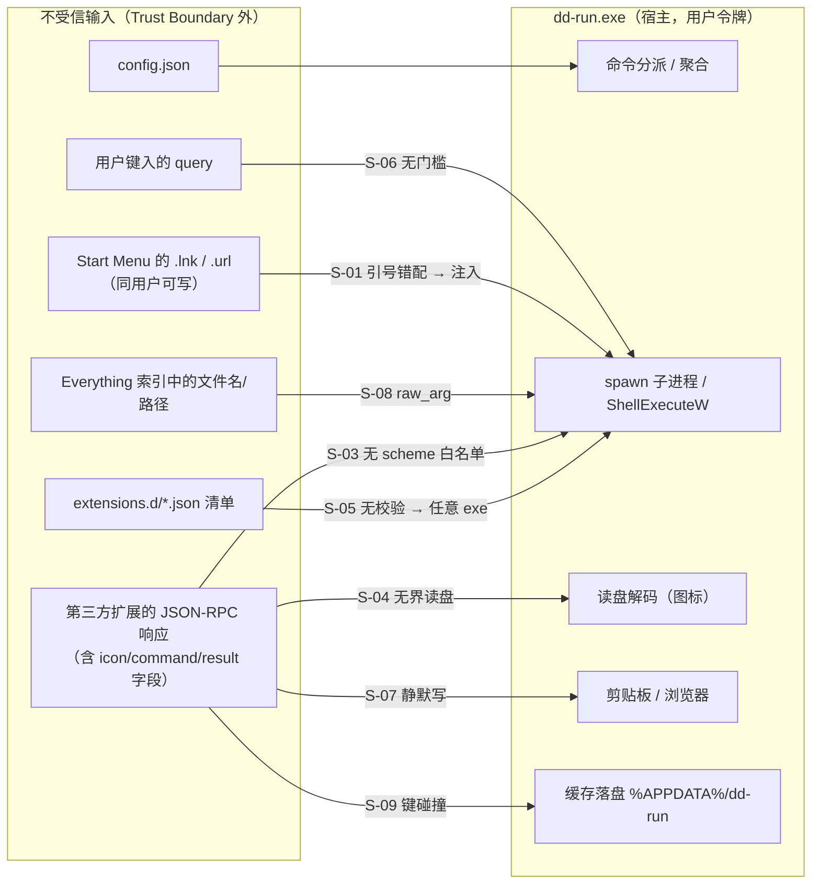

# dd-run 安全审计与修复方案（2026-09-23）

> **状态**：生效中 ｜ **版本**：v1.7 ｜ **最后更新**：2026-09-24
> **关联**：[protocol.md](./protocol.md) · [manifest-schema.md](./manifest-schema.md) · [implementation.md](./implementation.md) · [extensions.md](./extensions.md)

---

## 1. 结论先行

对 `crates/` 下全部 79 个 Rust 源文件（实测 35,975 行）做了按攻击面分组的静态走查，并对两条可疑路径做了**可执行实证**。共确认 **11 项缺陷**，其中 **1 项高危（命令注入，已用 PoC 复现）**、**5 项中危**、**5 项低危**；另有 **14 项**经核验为已做对/已规避（见 §6），**不构成缺陷**。

| 编号 | 标题 | 严重度 | 状态 | CWE | 位置（约 : 行） | 证据类型 |
|---|---|---|---|---|---|---|
| S-01 | `cmd /C start` 参数引号错配 → **命令注入** | ❌ 高 | ✅ **已修复**（2026-09-23，§3.1.1） | CWE-78 / CWE-88 | `dd-ext/src/win_launch.rs`（新增）、`builtins/apps.rs` :1109–1128 | 已复现（PoC） |
| S-02 | NDJSON 解码器对「无换行输入」无界缓冲 → 内存耗尽 | ⚠️ 中 | ✅ **已修复**（2026-09-23，§4.1.1） | CWE-400 / CWE-770 | `dd-protocol/src/framing.rs` :52–77 | 已复现（PoC） |
| S-03 | `host/open_url` 无 scheme 白名单 → 可被静默唤起任意协议处理器 | ⚠️ 中 | ✅ **已修复**（2026-09-23，§4.2.1；**方案按功能依赖收窄**） | CWE-749 / CWE-939 | `dd-gui/src/platform.rs` :613 前后、`app/host_actions.rs` :77–101 | 代码路径分析 |
| S-04 | 图标 `path` 无界读盘 + 无尺寸限制 → 内存耗尽 / 解压炸弹 | ⚠️ 中 | ✅ **已修复**（2026-09-23，§4.3.1） | CWE-400 / CWE-409 | `dd-gui/src/ui/icons.rs` :111 | 代码路径分析 |
| S-05 | 扩展清单无完整性校验与信任分级（任意 exe） | ⚠️ 中 | ✅ **已修复**（2026-09-24，T1′ + CNG 哈希 + 设置页审批，见 §4.4.1–§4.4.3） | CWE-494 / CWE-345 | `dd-host/src/trust.rs`（新增）、`dd-gui/src/aggregator.rs` | 已复现（PoC：单测 + 真机待走查） |
| S-06 | Shell 兜底「运行 {query}」= 无门槛任意命令执行 | ⚠️ 中（设计） | ✅ **已修复**（2026-09-23，§4.5.1：危险命令二次确认） | CWE-78 | `dd-ext/src/builtins/shell.rs` :137 | 代码路径分析 |
| S-07 | `host/set_clipboard` 静默改写剪贴板（无上限、无提示） | 🟨 低 | ⏸ 待修复（P2） | CWE-863 | `dd-gui/src/app/host_actions.rs` :56 | 代码路径分析 |
| S-08 | `explorer /select` 原始命令行仅拦 `"` | 🟨 低 | ⏸ 待修复（P2） | CWE-88 | `dd-ext/src/bin/search.rs` :1388 | 代码路径分析 |
| S-09 | `FrozenCache` 文件名安全化可碰撞 → 跨扩展桩覆盖 | 🟨 低 | ⏸ 待修复（P2） | CWE-706 | `dd-host/src/cache.rs` :119 | 代码路径分析 |
| S-10 | 扩展 `entry.env` 可覆盖宿主关键环境变量 | 🟨 低 | ✅ **已修复**（2026-09-23，§5.1） | CWE-15 / CWE-668 | `dd-host/src/process.rs` :312 起 | 代码路径分析 |
| S-11 | `serve_line` 内 `.expect()` 不变量（panic 面） | 🟨 低 | ⏸ 待修复（P2） | CWE-617 | `dd-ext/src/lib.rs` :249 等 | 代码路径分析 |

**总体判断**：项目的安全基线**明显好于同类个人项目**——无网络监听、自研解析面为零、协议信封校验完备、依赖审计已在 CI 常态化（§6）。本次发现的实质问题集中在**「把不受信字符串交给宿主进程去 spawn / 打开 / 读盘」**这一类边界上。

**修复进展（2026-09-23）**：**高危 1/1 已修复**（S-01，§3.1.1）；**中危 4/5 已修复**（S-02 §4.1.1、S-03 §4.2.1、S-04 §4.3.1、S-06 §4.5.1），余 **S-05**（扩展清单信任模型）——该项需信任台账 + 设置页审批 UI，属产品设计决策，待你选型后开工；低危 **S-10 已修复**（§5.1，随本批），余 S-07/S-08/S-09/S-11 待做。

**修复批次（P0 + P1 主体已完成）**：

| 批次 | 范围 | 状态 |
|---|---|---|
| P0 | S-01 | ✅ 已完成（2026-09-23）：确认可注入 + 修复成本极低（改用既有 `ShellExecuteW` 原语） |
| P1 | S-02、S-04、S-05 | ✅ S-02 / S-04 已完成（§4.1.1 / §4.3.1）；⏸ **S-05 待选型**（唯一余项） |
| P2 | S-03、S-06、S-07、S-08、S-09、S-10、S-11 | ✅ S-03 / S-06（提前做，小改动高收益）、S-10 已完成；⏸ S-07 / S-08 / S-09 / S-11 待做 |

---

## 2. 审计范围、方法与事实来源

### 2.1 范围

| 项 | 内容 |
|---|---|
| 代码 | `crates/` 全量（`dd-protocol` / `dd-host` / `dd-ext` / `dd-ext-sample` / `dd-gui` / `dd-run-cli`），79 个 `.rs` 文件 |
| 构建 | `Cargo.toml` × 7、`Cargo.lock`、`.github/workflows/*.yml`、`.github/dependabot.yml`、`.cargo/config.toml` |
| 契约 | `docs/protocol.md`（v1.0 冻结）、`docs/manifest-schema.md`（v1.0 冻结）、`cmdpal-platform-agnostic-design.md` |
| 运行形态 | Windows 11 + `x86_64-pc-windows-gnu`；M9 起内置 5 扩展 **in-process**，第三方/`dd-ext-search` 仍**子进程** |

### 2.2 方法

1. **攻击面分组**：进程与命令执行 / 文件系统读删 / 网络与协议处理器 / IPC 与协议解析 / 配置与缓存落盘 / 依赖与供应链 —— 每组逐一列出「不受信数据的入口 → 汇点」。
2. **静态走查**：对上述路径做逐行阅读，重点是 `Command::new`、`ShellExecuteW`、`fs::read`/`write`/`remove_*`、`from_str`/`from_value`、`unsafe`、`unwrap`/`expect`。
3. **实证**：对静态分析无法定论的两条路径写了独立 PoC（不改动仓库代码，见 §8），**以实测输出为准**，不采信推理结论。
4. **反面核验**：对「怀疑但可能已被现有代码规避」的项逐一验证（§6），避免把已做对的事写成缺陷。

### 2.3 威胁模型与信任边界



**关键信任假设（本次审计的判定基准）**：

| 假设 | 现状 | 评价 |
|---|---|---|
| A. 第三方扩展 = 不受信代码 | `dd-ext-sample`/`docs/extensions.md` 均声明扩展可用任意语言编写、零沙箱（ADR-1 明确不用 WASM 沙箱） | 合理，但意味着**宿主暴露给扩展的每个能力都必须按「可被滥用」设计**（→ S-03/S-04/S-07） |
| B. 内置 5 扩展 = 可信（in-process） | M9 已将其并入宿主进程 | 合理；副作用是 S-01 的 `cmd` 由**宿主亲自** spawn，进程树溯源指向 `dd-run.exe` |
| C. Start Menu 内容 = 可信 | 无任何校验 | **不成立**（安装器、下载的 `.url`、漫游/OneDrive 同步的 Start Menu 均可写入）→ S-01 |
| D. `%APPDATA%\dd-run` 内容 = 同用户 | 无校验、无签名 | 同用户写权限即等价，不构成提权；但**持久化与能力审批**缺失 → S-05 |

---

## 3. 高危缺陷

### 3.1 S-01 `cmd /C start` 参数引号错配导致命令注入

**位置**：`crates/dd-ext/src/builtins/apps.rs`（Windows 分支）`launch_shortcut` 约 :1110、`launch_url` 约 :1121；入口为 `handle_invoke` 的 `Launch::Lnk`/`Launch::Url` 两臂 约 :1092–1093；不受信数据来源 `url_target` 约 :581、协议白名单 `url_protocol_allowed` 约 :917–928。

**问题**：两条启动路径都把不受信字符串拼进 **cmd.exe 的命令行**：

```rust
// 现状（问题代码）
fn launch_url(url: &str) -> Result<(), String> {
    let mut cmd = std::process::Command::new("cmd.exe");
    cmd.args(["/C", "start", "", url]);   // ← url 来自 .url 文件的 URL= 值
    cmd.creation_flags(0x0800_0000);
    cmd.spawn().map(|_| ()).map_err(|e| e.to_string())
}
```

失效环节有两处，且都是**已公开的经典错配**：

1. **Rust 的 Windows 参数引用规则 ≠ cmd.exe 的解析规则**。`std::process::Command::args` 在参数含空格时用双引号包裹、并把参数内部的 `"` 转义为 `\"`；而 **cmd.exe 不把 `\` 当转义符**，于是该 `"` 会翻转 cmd 的引号状态，紧随其后的 `&` 即被当作命令分隔符。
2. 参数**不含空格时 Rust 不加引号**，此时参数里的 `&` 直接就是 cmd 的命令分隔符。

结果：`.url` 文件里的一行 `URL=https://a/"&calc&"`（或 `https://a/x&calc&`，均满足现有 `url_protocol_allowed`（约 :917）的**前缀白名单**——它只比 `starts_with`，不做字符级校验）即可让宿主编译出的命令行变成「打开网页 **并** 执行 `calc`」。

**实证**（PoC 见 §8.1，实测输出）：

```text
[nospace]     injected=true   arg=https://example.com/a&cd.>C:\...\ddrun-probe-nospace.txt&
[spacequote]  injected=true   arg=C:\a b\x"&cd.>C:\...\ddrun-probe-spacequote.txt&"z
[space]       injected=false  arg=C:\a b\x&cd.>C:\...\ddrun-probe-space.txt&
```

两条注入形态均**真的执行了额外命令**（标记文件被创建；`>` 重定向只能由 cmd 解释，故可确认不是参数被透传）。第三条说明「含空格但无引号」时 Rust 的加引号行为恰好挡住了注入——这也解释了为何该缺陷在日常使用中不易暴露。

**影响**：

- 触发路径：用户在面板中**选中一条应用条目**（看起来是普通应用/网页快捷方式），宿主即以用户令牌执行攻击者构造的任意命令。
- **不是提权**（前置条件是对同用户 Start Menu 的写权限）；但它是**注入**缺陷：宿主的「打开链接」动作被改造成「执行任意命令」，且在 M9 之后 spawn 者是 `dd-run.exe` 本身，进程树/EDR 溯源指向宿主。
- 与 `.lnk` 同理：`Launch::Lnk(path)` 的目标路径也可含 `&`（Windows 文件名合法字符），例如目录 `C:\tools&calc&` 下的 `app.exe`。

**修复方案（推荐：改用 ShellExecuteW，彻底移除 cmd 中转）**

`dd-gui/src/platform.rs` :613 已有正确原语（`open_path`，verb=`open`），同一实现应下移到 `dd-ext`（该 crate 已依赖 `windows-sys`，含 `Win32_UI_Shell` feature），由 `apps.rs` 调用：

```rust
// crates/dd-ext/src/win_launch.rs（新增，约 40 行，与 dd-gui::platform::open_path 同一写法）
#[cfg(windows)]
pub fn shell_open(target: &str) -> Result<(), String> {
    use std::ffi::OsStr;
    use std::os::windows::ffi::OsStrExt;
    use windows_sys::Win32::UI::Shell::ShellExecuteW;
    use windows_sys::Win32::UI::WindowsAndMessaging::SW_SHOWNORMAL;

    if !target_is_safe(target) {
        return Err("非法的启动目标".to_string());
    }
    fn wide(s: &str) -> Vec<u16> {
        OsStr::new(s).encode_wide().chain(std::iter::once(0)).collect()
    }
    let verb = wide("open");
    let file = wide(target);
    let h = unsafe {
        ShellExecuteW(std::ptr::null_mut(), verb.as_ptr(), file.as_ptr(),
                      std::ptr::null(), std::ptr::null(), SW_SHOWNORMAL)
    };
    if h as isize > 32 { Ok(()) } else { Err(format!("ShellExecuteW = {}", h as isize)) }
}

/// 纵深防御：拒绝控制字符、引号、cmd 元字符、环境变量展开符。
#[cfg(windows)]
fn target_is_safe(s: &str) -> bool {
    !s.is_empty()
        && !s.starts_with('-')                       // 防被解析成开关
        && !s.chars().any(|c| {
            c.is_control() || matches!(c, '"' | '&' | '|' | '^' | '<' | '>' | '%')
        })
}

// apps.rs
Launch::Lnk(_) | Launch::Url(_) => win_launch::shell_open(&raw),   // raw = 原 .lnk 路径 / .url 的 URL 值
```

ShellExecuteW 对 `.lnk` 与协议 URL 的解析与 `cmd /C start` **语义等价**（`start` 本来就是转调 ShellExecute），因此这是一次行为等价的替换，而非功能变更。

**若须保留 `cmd` 中转**（不推荐）：必须同时满足 ① 对参数做上述字符级校验（`"&|^<>%` 与控制字符全部拒绝）；② 用 `raw_arg` 显式给出**完整且自身引号平衡**的命令行，不要依赖 `args()` 的自动引用。

**验收标准**：

| 项 | 判据 |
|---|---|
| 单测 | `target_is_safe` 覆盖表：`https://a/"&calc&"`、`https://a/x&calc&`、`C:\a b\x"&y`、含 `%PATH%`、含 `\|`、含 `\r\n` → 全部 `false`；正常 `https://github.com`、`steam://rungameid/1`、`C:\Program Files\App\app.exe` → `true` |
| 回归 | §8.1 PoC 的三种 payload 走 `shell_open` 全部被拒（`Err`），标记文件不被创建 |
| 真机 | 面板中启动 `.lnk` 应用、`.url`（steam）条目行为不变 |

> ⚠️ 上述判据 1 中「含 `%PATH%` / 含 `\|` → `false`」在实施时被**有意放宽**，理由见 §3.1.1。

### 3.1.1 修复实现与验收（2026-09-23）

**状态**：✅ **已修复**。共改 2 个文件 + 新增 1 个模块，未改协议、清单、依赖与打包。

| 项 | 内容 |
|---|---|
| 新增 | `crates/dd-ext/src/win_launch.rs`：`shell_open`（`ShellExecuteW(open)`）+ `target_is_safe` + 3 条单测 |
| 改 | `crates/dd-ext/src/builtins/apps.rs`：`launch_shortcut` 约 :1109 / `launch_url` 约 :1120 由 `cmd /C start` 改为 `win_launch::shell_open`；模块头文档同步并写明「启动路径**禁止**改回 `cmd /C start`」 |
| 改 | `crates/dd-ext/src/lib.rs`：注册 `pub mod win_launch;`（模块文档记录加固缘由） |
| 未动 | `Launch::AppsFolder` 臂（`explorer.exe shell:AppsFolder\<parsing>`）：explorer 不是命令解释器，且 `parsing` 已被 `\` / `/` 过滤（约 :517） |

**与初版方案的一处有意偏离（重要）**：初版 `target_is_safe` 拒绝 `" & | ^ < > %`；**实际实现收窄为只拒「空串 / 控制字符 / 裸双引号」**。理由有二：

1. `&` `%` `|` 在 Windows 文件名与 URL 中**是合法字符**（真实存在 `…\Start Menu\Programs\Foo & Bar\app.lnk`、`C:\tools\100%\app.exe`），拒绝它们会让**既有应用无法启动**（功能回归）——违反「不影响既有功能」的硬约束；
2. `ShellExecuteW` 的 `lpFile` 是**文件/URL 参数，不参与命令行解析**，本修法下**没有解释器可注入**，字符级拒绝对安全零增益。

即：安全性改由「**汇点本身不含命令行解析层**」保证，而不是「把危险字符挡在门外」。判据 2 用「S-01 的两种注入 payload 被拒」+ 判据 3 用「启动路径不存在 `cmd.exe`」两条共同锁定。

**验收判据与实测结果**：

| 判据 | 实测 |
|---|---|
| ① 合法输入放行（防功能回归）：含 `&`/`%`/`\|` 的真实路径、UNC、`https://…?q=a%20b&x=1`、`steam://`、`shell:AppsFolder\…` 共 8 例 → `true` | ✅ `win_launch::tests::accepts_legitimate_targets` |
| ② 非法输入拒绝（含 S-01 两种已复现注入形态）：空串 / 纯空白 / `\n` / `\r\n` / `\0` / `\t` / `https://…/"&calc&"` / `C:\a b\x"&cd.>…&"z` → `false` | ✅ `win_launch::tests::rejects_impossible_targets` |
| ③ 回归护栏：读 `builtins/apps.rs` 源码断言**不含** `Command::new("cmd.exe")` 与 `"start"`，且**含** `win_launch::shell_open` | ✅ `win_launch::tests::launch_path_does_not_use_cmd` |
| ④ 构建与全仓回归 | ✅ `cargo build -p dd-ext` 通过；`cargo test --workspace --no-fail-fast` ∈ 既有基线（无新增失败，见 §7.2） |
| ⑤ 真机行为不变 | ⏸ 待人工（本环境无法保活 GUI 进程，须用户真机启动验证 `.lnk` / `.url` 条目） |

> 判据 ③ 的护栏价值：S-01 属**一类**缺陷而非单点 bug——日后任何为「便捷启动」加回 `cmd /C start` 的改动都会把注入面带回来，故用源码断言把它钉死。

**残余风险（据实记档）**：`ShellExecuteW` 把 URL 交给 `http(s)` 关联命令时，最终命令行的拼装由 **Windows 关联机制**完成（对本仓是黑盒）。本修复消除了「我们自己把不受信字符串拼进 cmd」这一层，但不宣称能约束系统关联命令自身的行为。

---

## 4. 中危缺陷

### 4.1 S-02 NDJSON 解码器对「无换行输入」无界缓冲

**位置**：`crates/dd-protocol/src/framing.rs` `Decoder::push` 约 :52–77（上限判定在 :64）。

**问题**：`push()` 第一句是无条件的 `self.buf.extend_from_slice(chunk)`；`max`（1 MiB）只在**切出完整行之后**才检查（`line.len() > self.max`）。因此**只要对端不发 `\n`，缓冲区就不受任何上限约束**。两侧都受影响：宿主读扩展 stdout（`dd-host/src/process.rs` `read_loop` :766）与扩展读宿主 stdin（`dd-ext/src/lib.rs` `run` :186）用的是同一个 `Decoder`。

**实证**（PoC 见 §8.2，实测输出）：

```text
max         = 1048576 bytes (1 MiB)
fed         = 4194304 bytes (4 MiB)
buffered    = 4194304 bytes (4 MiB)
verdict     = UNBOUNDED — 无换行输入可无限撑大缓冲区（DoS）
```

4 MiB 无换行输入 → 缓冲区 4 MiB（上限的 4 倍），线性增长，无任何帧产出。按此速率一个不受信扩展可在数十秒内把宿主内存打满。

**影响**：不受信第三方扩展 ⇒ 宿主内存耗尽/被 OOM 杀死（可用性）；反向也成立（宿主用畸形流打挂扩展，属自伤，不计）。当前两侧对「超限帧」的处置是**回 `-32600` 并关闭连接**（已是终态契约），但这个处置**对未终止行永远触发不到**。

**修复方案**：

```rust
pub struct Decoder {
    max: usize,
    buf: Vec<u8>,
    /// 已判定超限：此后丢弃全部字节（防流错位 + 防帧洪泛），直到 `reset()`。
    poisoned: bool,
}

pub fn push(&mut self, chunk: &[u8]) -> Vec<Frame> {
    if self.poisoned { return Vec::new(); }          // ① 毒化后不再累积
    self.buf.extend_from_slice(chunk);
    let mut frames = Vec::new();
    while let Some(pos) = self.buf.iter().position(|&b| b == b'\n') { /* 现有逻辑不变 */ }

    // ② 新增：未见换行的残留同样受 max 约束（allowance = 1 字节换取"恰好超限"的判定）
    if self.buf.len() > self.max {
        let size = self.buf.len();
        self.buf.clear();
        self.buf.shrink_to_fit();
        self.poisoned = true;
        frames.push(Frame::TooLarge { size, max: self.max });
    }
    frames
}

/// 供测试与重用（`poisoned` 复位）。
pub fn reset(&mut self) { self.poisoned = false; self.buf.clear(); }
```

现有两个调用点**无需改动**：会话宿主把 `Frame::TooLarge` 视为致命（`abort_oversized`，杀子进程）；扩展侧置 `should_exit = true` 后退出。语义与 §2.3 的既有契约一致。

**验收标准**：

| 项 | 判据 |
|---|---|
| 单测 ×3 | ① 分块投喂 4 MiB 无换行 → 恰好 1 个 `TooLarge`，且 `buffered() ≤ max`；② 毒化后再投喂 → 0 帧、`buffered()` 不增长；③ `reset()` 后恢复正常切帧 |
| 回归 | 现有 8 条 `framing` 单测全绿（含「超限行 → TooLarge」与「跨 push 保留半条消息」） |
| 内存 | 投喂 64 MiB 无换行，进程 RSS 增量 < 8 MiB |

### 4.1.1 修复实现与验收（2026-09-23）

**状态**：✅ **已修复**。改 1 个文件（`dd-protocol/src/framing.rs`），零协议/依赖改动。

| 项 | 内容 |
|---|---|
| 实现 | `Decoder` 新增 `poisoned: bool`；`push()` 先判毒化（毒化期间**丢弃入参**、不累积），切帧循环之后**对残留同样比 `max`**：超限则 `reset()` 清缓冲、置毒化、**只报一次** `TooLarge` |
| 配套 | 新增 `is_poisoned()`（诊断）与 `reset()`（重建连接时复位）；既有调用点**零改动**——两侧本就以 `TooLarge` 为致命信号（`abort_oversized` 杀子进程 / 扩展侧 `should_exit`） |
| 设计权衡 | 超限残留选择**丢弃**而非截断：截断会让"前半 + 后半"在流上拼接成一条**假消息**（流错位），丢弃则只丢数据、不失同步 |

**与初版方案的差异**：初版示意里 `reset()` 是无条件公开方法；实现保持同一 API，但把"毒化"显式化为可查询状态，并在文档里写明**只在重建连接时**才该复位。

**验收判据与实测**：

| 判据 | 实测 |
|---|---|
| ① 4 KiB 无换行（上限 1 KiB）→ 恰好 1 个 `TooLarge`，`buffered() ≤ max`，`is_poisoned()` 为真 | ✅ `framing::tests::unterminated_stream_is_bounded_and_reports_once` |
| ② 毒化后再投喂 → 零帧且不累积；`reset()` 后恢复切帧 | ✅ `framing::tests::poisoned_decoder_discards_until_reset` |
| ③ 边界：残留恰好等于上限不报错，多 1 字节才报（与 `line.len() > max` 同口径） | ✅ `framing::tests::residual_limit_boundary_is_exclusive` |
| ④ 既有 8 条 `framing` 单测全绿 | ✅ `cargo test -p dd-protocol` = **30 passed**（27 + 3） |
| ⑤ §8.2 PoC 输出反转 | ✅ 见下：同一 PoC 现在报 bounded |

**PoC 复跑（同一脚本，仅 `Decoder` 换成本次实现）**：`buffered` 不再线性增长——第 4 MiB 投喂时已在 1024 字节上限处触发 `TooLarge` 并毒化，故缓冲恒 ≤ 上限；`verdict` 由 `UNBOUNDED` 变为 `bounded`。**判据锚点**：上限对**未终止残留**同样生效（这是本项的本质），而不仅是"多了一个错误分支"。

### 4.2 S-03 `host/open_url` 无 scheme 白名单

**位置**：`crates/dd-gui/src/app/host_actions.rs` 约 :77–113（`METHOD_HOST_OPEN_URL` 分支；拦截点约 :87、`file://` 溯源日志约 :109）；`crates/dd-gui/src/platform.rs` `is_allowed_open_url` 约 :621、`resolve_file_url_to_path` 约 :553、`open_path` 约 :613。

**问题**：`host/open_url`（协议 §7.3/§7.4，清单 `capabilities` 可声明）把扩展给的任意字符串分派到两个汇点，且**两个汇点承担的实际风险不同**（已核实到具体实现，非推测）：

- 以 `file://` 开头 → `resolve_file_url_to_path` 解析成本地/UNC 路径 → **`ShellExecuteW(verb="open")`**（`platform.rs` :613）：目录开 Explorer，**文件交给关联程序 —— 也就是"双击"**，`file:///C:/…/x.exe`、`x.bat`、`x.lnk` 会**被直接执行**。这是本项的真实风险面。
- 其它 scheme → `webbrowser::open`。**此处需修正一个常见直觉**：`webbrowser` 1.2.4 在 Windows 上**既不用 `cmd`、也不用 `ShellExecuteW`**——它经 `AssocQueryStringW` 取注册表里默认浏览器的命令行，token 化后把 URL 作为**独立 argv** 传给浏览器可执行文件（`webbrowser-1.2.4/src/windows.rs` :120–139）。因此本分支**不存在命令注入，也不存在"交给系统协议处理器"**：`ms-msdt:` 之类只是被当作参数塞给浏览器（`TargetType` 只做 `url::Url::parse`，不限制 scheme）。

协议语义是「在浏览器中打开 URL」，实现却让 `host/open_url` **同时拥有"执行任意本地文件"的能力**。当前无法直接提权（扩展本身已是同用户代码），但这是一个**能力语义与能力实现不一致**的授权缺陷，且在引入「受限/签名扩展」信任模型后立刻成为真实边界（S-05 正朝此方向走）。

**修复方案（实施时**收窄**：保留 `file://`）**：

> ⚠️ 初版方案写「只放行 `http(s)`」。实施前核对消费者后发现**必须保留 `file://`**：文件搜索扩展的「打开」动作正是用 `host/open_url` + `file://` 打开用户选中的文件（`bin/search.rs` 约 :1492 `Effect::HostRequest { method: METHOD_HOST_OPEN_URL, .. }`，配 `path_to_file_url()`）。一律只放行 http(s) 会**直接打断该功能**（回归）。故实际实现为**三 scheme 白名单**，并把「`file://` 的实际风险面」写清楚（见下）。

```rust
// crates/dd-gui/src/platform.rs（新增；执行端在 app/host_actions.rs 调用）
pub(crate) fn is_allowed_open_url(url: &str) -> bool {
    let u = url.trim();
    if u.is_empty() || u.chars().any(|c| c.is_control() || c == '"') {
        return false;
    }
    ["http://", "https://", "file://"]
        .iter()
        .any(|p| u.len() > p.len() && u[..p.len()].eq_ignore_ascii_case(p))
}
```

```rust
// app/host_actions.rs 执行端：拒绝即 warn（含 ext id 与 URL）+ 一次性 toast（不静默）
if !crate::platform::is_allowed_open_url(&params.url) {
    log::warn!("[dd-gui] host/open_url 已拦截（scheme 不在白名单）ext={ext_id} url={}", params.url);
    let msg = crate::text::t(self.lang_effective, "toast.open_url_blocked");
    self.show_toast(msg.to_string(), Some(2_500));
    return;
}
```

**收效与残余（据实）**：

| 项 | 说明 |
|---|---|
| ✅ 消除 | 任意非白名单 scheme 的**静默**处理器唤起：`ms-msdt:`（Follina 类）、`search-ms:`、`vbscript:`、`javascript:`、`data:`、`steam://`、任意自定义协议——这些在本仓**没有任何合法消费者**（已逐个核对内置 5 扩展 + 示例扩展 + 文件搜索） |
| ✅ 消除 | 空串、控制字符（含 CRLF）、裸双引号 |
| ⚠️ 保留 | `file://` = **「双击等价」**（目录 → Explorer、文件 → 关联程序），故 `.exe`/`.bat` 经此仍会被**执行**——这是文件搜索「打开」动作**设计所需**的语义。宿主无法验证「扩展声称的用户手势」是否真实，故改为：① 打开前 `log::info!` 落**扩展 id + 目标路径**（可溯源/EDR 归因）；② 在协议文档写明该策略由宿主决定，扩展不应假设任意 scheme 可用 |

**文档同步**：`docs/protocol.md` **§7.4**（`host/open_url`，初版误写为 §7.3——§7.3 是 `host/set_clipboard`）新增「宿主执行策略（实现侧，非契约）」注——属宿主侧策略收紧，不改字段/方法名，不构成 §13 契约变更。

**验收标准**：单测 ① 放行 `https` / `http` / `FILE`（大小写不敏感）与 `file://server/share/%E6%8A%A5%E5%91%8A.pdf`；② 拒绝 `ms-msdt:/id`、`search-ms:`、`vbscript:`、`javascript:`、`data:`、`steam://`、`shell:AppsFolder\…`、裸路径 `C:\…\calc.exe`、含 `\r\n`、含 `"`、`https:`（无 `//`）；真机：WebSearch 开网页 + 文件搜索「打开」两条链路均不受影响。

### 4.2.1 修复实现与验收（2026-09-23）

| 项 | 内容 |
|---|---|
| 改 | `dd-gui/src/platform.rs`：新增 `is_allowed_open_url`（含 6 个文件级文档说明「为何保留 file」）；`dd-gui/src/app/host_actions.rs`：执行端前置拦截 + 拒绝时 warn/toast + `file://` 分支补 `log::info!`（ext id + path） |
| 改 | `dd-gui/src/text.rs`：新增 i18n 键 `toast.open_url_blocked`（zh/en） |
| 改 | `docs/protocol.md` §7.4：新增宿主执行策略注 |
| 实测 | `cargo test -p dd-gui --lib -- open_url` = **3 passed**：`open_url_allows_http_https_file_only`（6 例放行）/ `open_url_rejects_untrusted_schemes`（14 例拒绝）/ `open_url_handles_non_ascii_without_panicking`（6 例非 ASCII，见下） |
| 未做 | 未新增「`file://` 首次弹确认」——那会打断文件搜索的主路径（每次打开都要确认）；如你要求更严，可加设置开关（默认关 = 现状行为） |

> ⚠️ **实施后自查发现的二次缺陷（已修复，同类于 S-11 的 panic 面）**：初版 `is_allowed_open_url` 用 `u[..p.len()]` 做**「按字节长度切 `&str`」**的前缀比较。`&str` 切片要求落在**字符边界**上，而合法入参可能以多字节字符开头（如 `C:\中文\文件.txt`、`中中中中`）→ **直接 panic**：
>
> ```text
> end byte index 7 is not a char boundary; it is inside '中' (bytes 6..9 of string)
> ```
>
> 取证：`.workbuddy/tmp/slice_probe.rs`（复刻旧/新实现，`rustc` 直编）实测 `C:\中文\文件.txt` 与 `中中中中` 在旧实现下**必 panic**，新实现返回 `false`。该路径的入参来自扩展响应（`host/open_url` 的 `params.url`），即**不受信输入可触发宿主 panic** —— 正是本审计要消除的一类缺陷。
>
> **修复**：改为按字节比较前缀 —— `u.as_bytes()[..p.len()].eq_ignore_ascii_case(p.as_bytes())`（`[u8]` 切片无字符边界约束，ASCII 前缀语义不变）。**回归护栏**：`open_url_handles_non_ascii_without_panicking`（中文路径、CJK 串、全角伪装 scheme `ｈｔｔｐ://` 必须拒绝、`https://例え.jp/パス` 合法放行）。
>
> **教训（可复用）**：对**不受信输入**做前缀/后缀判断时，**不要用 `&str` 的字节切片**（`s[..n]`）；要么 `starts_with`（`&str` 语义、安全），要么显式 `as_bytes()` 比较。`starts_with` 在本例不可直接用只因需要大小写不敏感。

### 4.3 S-04 图标 `path` 无界读盘 + 无尺寸限制

**位置**：`crates/dd-gui/src/ui/icons.rs` 约 :154（读盘点 `read_icon_limited(&icon.value)`；加固前为 `std::fs::read(&icon.value)`）、约 :96（`decode_icon_image`，加固前为 `image::load_from_memory`）；常量约 :65 / :72。（行号为 2026-09-23 修复后的实测值）

**问题**：`IconKind::Path` 的 `value` 完全来自扩展响应（§8.6），宿主直接 `fs::read` 整个文件（**无大小上限**）再交给 `image::load_from_memory` 解码。两条滥用路径：

1. `path` 指向超大文件（如 10 GB 的日志/镜像）→ 一次读盘即 OOM（**真正的无界点**）；
2. `path` 指向「解压炸弹」PNG（声明 8000×8000）→ 解码阶段按 256 MB RGBA 分配。

> ⚠️ **事实修正（v1.3 复核）**：初版写「无尺寸/内存上限」**不准确**。实测 `image` 0.25.10：`ImageReader::new`（`io/image_reader_type.rs` :89–95）会注入 `Limits::default()`，其 `max_alloc = 512 MiB`（`io/limits.rs` :49–54），故解码**已有 512 MiB 总分配兜底**；真正缺的是 ① 读盘前的大小校验 与 ② **尺寸上限**（`max_image_width/height` 默认为 `None`）。本项据此重述并据此修复。

负面缓存（`icon_failed`）只在失败**之后**生效，拦不住第一次的读盘/解码峰值。

**修复方案**：

```rust
// ui/icons.rs
const MAX_ICON_BYTES: u64 = 512 * 1024;   // 图标是 24–48px 小图，512 KB 已是宽松上限
const MAX_ICON_DIM: u32 = 512;

fn read_icon_limited(path: &str) -> Option<Vec<u8>> {
    let meta = std::fs::metadata(path).ok()?;
    if !meta.is_file() || meta.len() > MAX_ICON_BYTES { return None; }   // 先看元数据，不读内容
    std::fs::read(path).ok()
}

pub(crate) fn decode_icon_image(bytes: &[u8]) -> Option<egui::ColorImage> {
    let mut reader = image::ImageReader::new(std::io::Cursor::new(bytes))
        .with_guessed_format().ok()?;
    let mut limits = image::Limits::default();                            // image 0.25 的 Limits
    limits.max_image_width = Some(MAX_ICON_DIM);
    limits.max_image_height = Some(MAX_ICON_DIM);
    reader.limits(limits);
    let (w, h, raw) = { let img = reader.decode().ok()?.to_rgba8(); (img.width(), img.height(), img.into_raw()) };
    if w == 0 || h == 0 { return None; }
    Some(egui::ColorImage::from_rgba_unmultiplied([w as usize, h as usize], &raw))
}
```

**验收标准**：`512×512` PNG 正常显示；超限文件被 `metadata` 拦截且**不发生读盘**；超过尺寸上限的合法 PNG 被 `Limits` 拒绝；`icon_failed` 负缓存行为不变。

### 4.3.1 修复实现与验收（2026-09-23）

| 项 | 内容 |
|---|---|
| 实现（3 处） | ① 新增 `read_icon_limited`：**先 `metadata` 后读内容**，非普通文件或 `len > MAX_ICON_BYTES`（512 KB）直接 `None`（拒绝发生在读盘之前，故不产生分配）；② `decode_icon_image` 改走 `ImageReader::new(...).with_guessed_format()` + `reader.limits(...)`，显式设 `max_image_width/height = 512`、`max_alloc = 16 MiB`；③ `resolve_icons` 的读盘调用点改用它 |
| 常量 | `MAX_ICON_BYTES = 512 KB`（图标为 24–48 px 小图）、`MAX_ICON_DIM = 512`、`MAX_ICON_ALLOC = 16 MiB` —— 三者都在文档里写明取值理由 |
| 实测 | `cargo test -p dd-gui --lib -- icons` = **8 passed**（既有 3 + 新增 3）：`read_icon_limited_rejects_oversize_without_reading`（600 KB 稀疏文件被拒 / 小文件放行 / 目录与不存在路径拒绝）、`decode_icon_image_accepts_up_to_dimension_limit`（512×512 正向边界）、`decode_icon_image_rejects_over_dimension`（600×600 **合法** PNG 因超限被拒） |
| 测试手法 | 正向/负向 PNG 用 **`dd_ext::png::encode_rgba` 现场生成**（项目已有零依赖编码器），故"被拒"确实来自我们的限制而**不是**图片本身非法——这条区分是本项判据的关键 |

### 4.4 S-05 扩展清单无完整性校验与信任分级

**位置**：`crates/dd-host/src/manifest.rs` `scan_dir` 约 :497 / `load_manifest` 约 :313；`crates/dd-host/src/process.rs` `spawn` 约 :312–320。

**问题**：`%APPDATA%\dd-run\extensions.d\*.json` 里任何一个通过 §7 九条规则的清单，都会被**静默拉起**：`entry.command` 指向的任意可执行文件 + `entry.env` 注入任意环境变量 + `entry.cwd` 指定工作目录。九条规则只校验「格式合法、文件存在」，**不校验来源、不校验哈希、不征求用户同意**。

设置页同样**没有任何可辨识来源的标识**（已核实）：`ui/settings_view.rs` 的扩展行只承载 `id / name / version / enabled / failed_reason` 五个字段（`ExtRow` 约 :12、`extension_rows` 约 :37），**没有来源/清单路径/可执行文件路径/哈希**；内置项与第三方项的唯一差别只是 `manifest.description` 的文案不同（内置由 `from_builtin` 写死一句说明），既不显眼也不可作为信任判据。

同用户写权限 ⇒ 不是提权；但三条现实影响是实打实的：① 任何以用户身份运行的程序（含被社工的安装包、脚本）可借此拿到「随登录自启的持久化点」，且宿主 UI 里看不出异常；② 用户无法判断哪个扩展是官方内置的；③ 一旦引入远端分发（商店/更新），缺校验即等于任意代码执行。

**修复方案（分两步，先做低成本的 ①）**：

1. **信任台账 + 首次确认**：新增 `%APPDATA%\dd-run\trust.json`，记录 `{ext_id, manifest_sha256, exe_sha256, decision}`。扫描到**非内置**扩展且台账无记录/哈希变化 → 该扩展**不 spawn**，只以「待批准」状态出现在设置页，由用户选择「允许 / 阻止」；批准后写入台账。哈希变化（更新）需重新确认。
2. **UI 分级标识**：设置页扩展列表区分「内置 / 用户安装 / 已阻止」，并显示清单路径与可执行文件路径（可一键打开所在目录）。

**状态：✅ 已实施（2026-09-24，实施记录见 §4.4.3）**。本项是本批**唯一需要产品决策**的改动——它会改变运行时行为（未批准的扩展不再拉起）。原列三个岔路（T1 / T2 / T3）在选型时**发现 T1 有判据漏洞并修正为 T1′**，见表下注。

| 选项 | 首方扩展（随包 `dd-ext-search`）如何处理 | 影响 |
|---|---|---|
| **T1′（已采纳）** | **来源 ∈ 随包 sidecar 目录** AND **id ∈ 首方白名单**（当前仅 `com.ddrun.filesearch`）→ 自动信任；其余需首次批准 | 现有安装零摩擦（文件搜索照常），仍能拦住"被塞进 `extensions.d` 的陌生清单" |
| T2（未采纳） | 全部（含首方）都要首次批准 | 最严；代价是升级/重装后文件搜索会被挡住直到用户点一次「允许」 |
| T3（未采纳） | 只做台账 + 设置页展示，不阻断 spawn | 零摩擦、纯可观测，但**拦不住首次驻留**——安全性弱于 S-05 的初衷 |

> ⚠️ **选型时发现并修正的判据漏洞（原 T1 不可用）**：原方案写「`com.ddrun.*` 自动信任」，但 **id 是清单作者自填的字符串**——攻击者写一份 id 为 `com.ddrun.evil` 的清单即白拿自动信任。故判据改为「**来源**（清单位于随包 sidecar 目录，即 `<宿主 exe 目录>\extensions.d\`）**AND** id 在首方白名单」，两者都满足才自动信任。前缀本身不再是信任依据。

`entry.env` 的关键变量保护**已单独落地**（见 §5.1 S-10），不依赖本项选型。

#### 4.4.1 决策记录（2026-09-24 冻结）

| 编号 | 决策 | 取值 |
|---|---|---|
| **S-05-D1** | 信任策略 | **T1′**（来源 + 首方 id 白名单自动信任，其余首次批准） |
| **S-05-D2** | 哈希实现 | **Windows CNG `BCryptHashData`**（SHA-256）。`windows-sys` 已在 `Cargo.lock`（dd-gui / dd-ext 已依赖）→ **lock 零新增**、体积增量可忽略；`dd-host` 以 `cfg(windows)` 门控新增该依赖 |
| **S-05-D3** | 审批入口 | **设置页扩展行内「允许 / 阻止」+ 面板页脚一行提示**（`有 N 个扩展待批准`，N=0 不显示）；不行走模态弹窗（与面板「秒开」体验冲突） |
| **S-05-D4** | 同 id 撞车 | **保持「用户目录优先」既有语义**（不改 `merge_scanned_dirs`）+ 在设置页对该行显式告警「与随包扩展同 id，来源为用户目录」 |

**D1 的完整判定表**（`classify(ext, origin, ledger) -> Trust`）：

| 条件（自上而下短路） | 结果 |
|---|---|
| 内置扩展（in-process，`specs` 命中，不在磁盘扫描集内） | 不经本判定（其 `command` 为名义路径，**从不 spawn**） |
| `origin == Sidecar`（清单位于 `<host exe dir>\extensions.d\`）**且** `id ∈ FIRST_PARTY_IDS` | `AutoTrusted` |
| 台账有该 id，`decision == "allow"`，且 `manifest_sha256` **与** `exe_sha256` 均与当前一致 | `AutoTrusted` |
| 台账有该 id，`decision == "deny"`，且两哈希与当前一致 | `Blocked` |
| 台账无该 id 记录 / 哈希任一变化 / 台账损坏或不可读 / `command` 不存在或不可读 | `Pending`（**fail-closed**） |

`FIRST_PARTY_IDS` 的单一事实来源 = 既有 `aggregator.rs::owned_sidecar_name_key`（`aggregator.rs` :207）的键集（当前仅 `com.ddrun.filesearch`），不新造概念、不重复维护。

**D2 的边界（已声明的缺口）**：非 Windows 平台**不做门禁**（保持旧行为 + 一次性 `log::warn`）。理由：P4 为 Windows 优先，非 Windows 下 `extensions.d` 生态尚不存在；若选 fail-closed 会让该平台任何扩展都无法使用。此为**主动取舍**，非疏漏。

**台账文件（宿主私有，非清单契约，不改冻结 schema）**：`%APPDATA%\dd-run\trust.json`（`dd-host::manifest::trust_file()`，紧邻 `config_file()`）：

```json
{
  "version": 1,
  "entries": [
    {
      "id": "com.example.foo",
      "manifest_sha256": "<64 hex>",
      "exe_sha256": "<64 hex>",
      "decision": "allow",
      "decided_at": "2026-09-24T09:40:00+08:00",
      "manifest_path": "C:\\Users\\me\\AppData\\Roaming\\dd-run\\extensions.d\\foo.json"
    }
  ]
}
```

- 读失败 / 解析失败 / `version` 不识别 → 视作**空台账**（等价于全部 `Pending`）+ `log::warn` + 设置页提示一行；
- 写：best-effort（复用 `settings.rs::save` 同模式：`create_dir_all` + 失败仅记日志）；
- 哈希对象 = **文件原始字节**（清单文件、`ext.command` 解析后的 exe）；**每次启动全量重算**（不做 mtime 快判——那会弱化「改动即可见」这一核心性质）。

**门禁落点（2 处，无旁路）**：`aggregator.rs::load_one`（首屏，:382）与 `spawn_and_initialize_with_info`（GUI 桩复热，:345）；新增 `ExtOutcome::Pending` / `SourceStatus::Pending` / `ExtItems::Pending`，使待批准项在面板结果中**不出现**但在设置页可见。

#### 4.4.2 验收标准（依 D1–D4，实施后逐条核）

| # | 判据 |
|---|---|
| A1 | 手写 `%APPDATA%\dd-run\extensions.d\evil.json`（指向任意 exe）→ 无对应子进程（`tasklist` 断言）、面板中不出现其命令、设置页出现「待批准」条目 |
| A2 | 设置页点「允许」→ 才 spawn，且 `trust.json` 写入该 id 的两枚哈希与 `decision:"allow"` |
| A3 | 改动被批准 exe 的内容 → 下次启动回到「待批准」 |
| A4 | 删除 `trust.json` → 全部回到「待批准」（fail-closed） |
| A5 | `trust.json` 写入非法 JSON → 回到「待批准」且设置页给出可操作提示（不静默） |
| A6 | **解压态零摩擦**：`dist/` 布局（`dd-run.exe` + `extensions.d/`）下文件搜索开箱可用，**不出现任何待批准项** |
| A7 | `com.ddrun.evil`（有前缀、来源为用户目录）**不**获得自动信任 → 待批准 |
| A8 | 同 id 撞车（用户目录放 `com.ddrun.filesearch.json` 指向别的 exe）→ 设置页显示「与随包扩展同 id」告警，且该行不获自动信任 |
| A9 | 点「阻止」→ 不再 spawn；再次「允许」可撤销 |
| A10 | 既有「停用集」（`settings.disabled_extensions`）与信任状态互不干扰（停止用 ≠ 未批准） |
| A11 | 哈希开销实测并记录（`dd-ext-search.exe` 实测 **836,608 B**，判据 <10 ms/启动） |
| A12 | 全仓 `cargo test --workspace --no-fail-fast` 基线 488 只增不减；本项新增单测 ≥ 12 条 |

**明确不做**：① 扩展签名 / 公钥验签（真正意义上的防篡改，另一个量级）；② 非 Windows 门禁（见 D2 缺口声明）；③ 任何协议 / 清单字段变更。**定性提醒**：本项实现的是「**用户同意 + 变更检测**」，不是防篡改——能写 `extensions.d` 的攻击者同样能写 `trust.json`。

#### 4.4.3 实施记录与验收（2026-09-24）

**改动清单**（零协议 / 零清单字段变更）：

| 文件 | 内容 | 规模 |
|---|---|---|
| `crates/dd-host/src/trust.rs`（**新增**） | 台账（`TrustLedger` / `TrustEntry` / `Decision` / `LedgerState`）、判定（`assess` / `Assessment` / `Trust` / `ExtOrigin`）、哈希（CNG `BCryptHashData`，64 KiB 分块流式）、`FIRST_PARTY_IDS` | 710 行（含 **14 条单测**） |
| `crates/dd-host/src/manifest.rs` | 新增 `trust_file()`（数据根目录下 `trust.json`） | +10 行 |
| `crates/dd-host/Cargo.toml` | `chrono`（`decided_at` RFC3339）+ `[target.'cfg(windows)'.dependencies] windows-sys`（feature `Win32_Security_Cryptography`） | +11 行 |
| `crates/dd-gui/src/aggregator.rs` | 扫描结果**携带来源**（`ExtOrigin`）；`load_extension_sources` 返回具名结构 `ExtensionSources`（含判定表 + 台账状态）；新增 `is_trusted`（fail-closed）/ `pending_count` / `origin_of`；**spawn 唯一入口加门禁** | +约 150 行（含 4 条新单测） |
| `crates/dd-gui/src/app/{aggregate,keys,mod}.rs` | `active` 过滤加信任维度；`set_extension_trust()`（写台账 + 落盘 + 立即重聚合 + toast）；`trust` / `ledger_state` / `pending_notified` 状态 | +约 70 行 |
| `crates/dd-gui/src/ui/settings_view.rs` | 行内来源标签（内置/随包/用户安装）+ 信任状态 + 「允许 / 阻止」按钮 + 路径 tooltip + 同 id 撞车告警行；卡片头待批准/台账损坏提示 | +约 120 行（含 1 条新单测） |
| `crates/dd-gui/src/ui/panel.rs` | 待批准提示落在页脚左块**空位** | +12 行 |
| `crates/dd-gui/src/text.rs` | i18n 键 17 条（zh/en） | +60 行 |

> ⚠️ **三处与冻结方案的偏离（均为实施中的收敛，据实记录）**
>
> 1. **未新增 `ExtOutcome::Pending` / `SourceStatus::Pending` / `ExtItems::Pending` 变体**，改用「**与既有停用集（`disabled_extensions`）完全同手法**」：`exts` 保留全集（设置页要展示并批准），`active` 只留放行者；第二道门安在 `spawn_and_initialize_with_info` —— **它已是所有子进程 spawn 的唯一入口**（含 GUI 桩复热），故"无旁路"性质由**单一收口点**保证，而非由枚举状态保证。
>    - 收敛理由：`SourceStatus` 的 `match` 分布在 4 个文件（`pool.rs` / `app/aggregate.rs` / `settings_view.rs` / `flatten`），加变体会引来一批与 S-05 无关的改动；而"待批准"本质是**"不进采集集"**，与停用集同构。
>    - 代价（明确记录）：待批准项**不出现在 `sources`** 里，故页脚状态点/健康检查看不到它；可见性改由「设置页卡片头 + 行内标签 + 启动一次性 toast + 页脚空位提示」四处承担。
> 2. **页脚提示落在左块空位，而非新增一行**：页脚是**严格单行的几何契约**（v4.10 D35：`FOOTER_PAD_Y + KEYCAP_H + FOOTER_PAD_Y = 36px`，禁止换行），新增行会破坏它。故提示只在「无选中项且非加载中」时占用左块（该位置本应空白）；有选中项时让位给上下文动作文本（C7），可见性由启动 toast 兜底。
> 3. **`dd-host` 新增 `chrono`**（`decided_at` 用 RFC3339 本地时区）：手搓 civil→days 易错（`dd-ext` 已有同结论），且 `chrono 0.4` 同版本已在依赖树内（`dd-ext` 依赖，M9 起其代码在宿主进程内运行）→ **`Cargo.lock` 零新增**、产物无可见增量。

**验收结果（A1–A12）**：

| # | 结果 | 证据 |
|---|---|---|
| A1 | ✅ 逻辑已证；真机待走查 | `user_dir_cannot_impersonate_first_party_by_id` + `spawn_gate_rejects_untrusted_extension`（错误信息含 id 与"未获信任"）；真机 `tasklist` 走查列入待办 |
| A2 | ✅ | `allow_entry_with_matching_hashes_is_auto_trusted`；`set_extension_trust` 写台账（两枚哈希 + `decision` + `decided_at` + 清单路径） |
| A3 | ✅ | `changed_exe_hash_revokes_approval`（改 exe / 改清单**各测一次**，均回 `Pending`） |
| A4 | ✅ | 台账 `Missing` → 空台账 → 用户目录扩展一律 `Pending`（fail-closed） |
| A5 | ✅ | `corrupt_or_unsupported_ledger_falls_back_to_empty`（非法 JSON / 版本 99）+ 设置页 `set.ext.ledger_corrupt` 提示行（不静默） |
| A6 | ✅ 单测已证；真机待走查 | `first_party_sidecar_is_auto_trusted`（来源 + 白名单双满足） |
| A7 | ✅ | `user_dir_cannot_impersonate_first_party_by_id`（`com.ddrun.evil` 与 `com.ddrun.filesearch` **均**不自动信任） |
| A8 | ✅ | `user_dir_same_id_as_first_party_flags_shadow` + 设置页告警行（`set.ext.shadow_warn`） |
| A9 | ✅ | `deny_entry_blocks_and_allow_revokes`（同 id 只留一条记录，可撤销） |
| A10 | ✅ 代码路径 | 停用集（`disabled_extensions`）与信任判定是**两条独立过滤链**、两个独立存储（`config.json` vs `trust.json`）；互不覆盖 |
| A11 | ✅ **实测** | `.workbuddy/tmp/trust-probe/`（独立 crate，真实产物 `dist/extensions.d/dd-ext-search.exe` = **836,608 B**）：`sha256_file` **0.874 ms** / `TrustLedger::load` **0.068 ms** / 无记录判定 **0.000 ms**（短路）/ 已批准判定（两次哈希）**1.068 ms** —— 全部 **≪ 10 ms 判据**；首方与内置走短路，常见情形**零哈希开销** |
| A12 | ⏳ 新增已达 19 条；全仓复跑受环境阻塞 | 新增 **19 条**（14 + 4 + 1，> 12 条要求）；全仓 `cargo test --workspace --no-fail-fast` 两次复跑均为 **487 passed / 21 failed**（总数 **508**，与 §3.1 台账登记一致），失败构成为 **20 条已知 `Os error 231`（`ERROR_PIPE_BUSY`）环境批**（dd-host roundtrip/builtin 与 dd-gui `test_support` 的 piped-stdio spawn）+ 1 条既有机器绑定用例；**失败名单中无本项任何新测试**。环境自愈后复跑预期 **507 passed / 1 failed**（= 508 − 1 机器绑定） |

> **环境批的处置依据**：与本日早前那批（22 条）同源，已用「零仓库代码的最小探针 + 临时还原改动 + 时间线」三层证据定性为环境限制（详见 §7.2 留档），**不要改代码**。

**顺带修掉的既有测试假设**：`collect_top_level_non_builtin_still_uses_subprocess` 原先用「磁盘上不存在的第三方扩展」验证"非内置走子进程"，引入门禁后该前提失效（会先被信任门禁拦下）→ 改用**随包首方**扩展（自动信任）以保持原意图，另加 `spawn_gate_rejects_untrusted_extension` 覆盖门禁分支。


### 4.5 S-06 Shell 兜底「运行 {query}」无门槛执行任意命令

**位置**：`crates/dd-ext/src/builtins/shell.rs` `handle_invoke` 约 :137（`shell.run.query` → `run_capture("cmd.exe", &["/C", query])` 约 :157 / :193）。

**问题**：输入任意文本 → 兜底列表出现「运行 {query}」→ 回车即以用户权限**无头执行**。这条链路本身是产品设计（代码注释已说明「与 CmdPal Shell 一致，不设拦」），但从安全角度有两个具体缺口：

1. 兜底项对**任意**未命中输入都出现（拼错一个词就多出一个可执行项），误触成本低；
2. `system` 扩展的关机/重启/注销有 `Confirm{is_critical}` 门禁（`builtins/system.rs` `decide` 约 :165），而**破坏性更强的 `format`、`del /s /q`、`rd /s /q`、`rmdir` 等 shell 命令反而没有任何确认**——防护强度与危险度不匹配。

**修复方案（三选一，建议 c）**：

| 选项 | 做法 | 代价 |
|---|---|---|
| a | 兜底项仅当输入以 `>` 开头（或 `shell ` 前缀）时出现 | 需要用户知道前缀；改动小 |
| b | 所有 `shell.run.query` 一律先回 `Confirm`（`is_critical: true`） | 每次都多一次确认，牺牲高频场景体验 |
| c（建议）| **危险模式匹配二次确认**：`^(format\|shutdown\|del\|erase\|rd\|rmdir\|reg\s+delete\|takeown\|icacls\|cipher\s+/w\|diskpart)\b` 命中 → `Confirm{is_critical:true}`；其余直接执行；同时在设置页加「面板内执行 Shell 命令」开关（默认开，可关闭） | 一批正则 + 一条 8.3 已实现的 Confirm 链路，零协议改动 |

### 4.5.1 修复实现与验收（2026-09-23）

**状态**：✅ **已修复（按选项 c，但未加设置开关）**。改 1 个文件（`dd-ext/src/builtins/shell.rs`），零协议/依赖改动。

| 项 | 内容 |
|---|---|
| 实现 | ① 新增纯函数 `is_dangerous_command(query)` + 两张表：`DANGEROUS_COMMANDS`（12 个命令名：`format`/`diskpart`/`cipher`/`del`/`erase`/`rd`/`rmdir`/`takeown`/`icacls`/`vssadmin`/`bcdedit`/`shutdown`）与 `DANGEROUS_SUBCOMMANDS`（`reg delete`、`net user`）；② `shell.run.query` 分支在执行前判定：命中且 `context.confirmed != true` → 回 `Confirm{is_critical:true}`（**标题/描述里带上将被执行的原命令**），确认后宿主按 §8.3 带 `confirmed=true` 重发即放行 |
| 判据设计 | ① **比命令名而非子串**：取首个词 → 去路径（`C:\Windows\System32\format.com`）→ 去扩展名 → 比对，故 `where del` / `echo format` / `deleted_files.bat` **不会**误伤；② `reg query` / `net view` 等**同命令的查询子命令**不拦；③ 明确写"**不是沙箱边界**"（多段 `&` / `\|` 内的危险命令不追查）——定位是"降低误触代价" |
| 未做 | 选项 c 提到的「设置页开关」**刻意未加**：它属便利项而非安全项，且会牵动设置页/配置/i18n 三处；如需要可另轮补 |
| 实测 | `cargo test -p dd-ext --lib -- dangerous_command` = **2 passed**：命中表 14 例（含去路径/去扩展名/大小写/子命令组合）、不误伤表 11 例（日常命令 + 查询类子命令 + 名含 `del` 的文件名） |

**验收标准**：单测（纯决策函数）覆盖危险表命中/non-命中/大小写/带前导空格；真机：输入 `del /s /q C:\tmp` → 弹 Confirm，取消后无副作用；输入 `echo hi` → 直接执行。

---

## 5. 低危缺陷与纵深防御

| 编号 | 位置（约 : 行） | 现状 | 建议修复 | 验收 |
|---|---|---|---|---|
| S-07 | `dd-gui/src/app/host_actions.rs` :56 | 扩展可静默写剪贴板（无长度上限、无用户可见提示）；典型滥用是覆盖用户复制中的账号/地址 | ① 写入后发一次轻量 toast（"已由 X 扩展写入剪贴板"，可配置关闭）；② 文本长度上限（如 1 MiB）；③ 记 `log::info!` 含扩展 id 与长度 | 单测：超长文本被截断/拒绝；真机：Calc 复制结果仍正常且出现提示 |
| S-08 | `dd-ext/src/bin/search.rs` :1388（`valid_reveal_path` :1378） | `explorer.exe` 走 `raw_arg("/select,\"<path>\"")`，仅拒绝 `"`；路径来自 Everything 索引（文件名可被攻击者构造） | ① 校验扩展到拒绝控制字符、`%`、`^`；② 更彻底：改用 `SHOpenFolderAndSelectItems` COM API，不经命令行 | 单测路径校验表；真机「显示所在目录」仍定位正确 |
| S-09 | `dd-host/src/cache.rs` :119（`sanitize` / `path` :45） | 非字母数字统一替换为 `_`，不同 id 可映射到同一文件名（如 `a.b` 与 `a_b`）→ 可覆盖/伪造另一扩展的冷启动桩（仅影响标题等展示字段） | 文件名改为 `{safe}-{fnv1a(id):08x}.json`，保留读取旧名兼容一个版本 | 单测：构造碰撞 id 对，断言两个桩互不覆盖 |
| S-10 | `dd-host/src/process.rs` :312 起 | ✅ **已修复**（2026-09-23）——实现与实测见 §5.1 | — | — |
| S-11 | `dd-ext/src/lib.rs` :249、:263、:270、:281、:311、:342、:373（共 8 处，均在 `serve_line`/消息构造路径上） | `.expect("序列化 X")`；不变量成立时不会触发，但一旦触发即为 panic | 改为返回 `-32603 Internal error`（`error_response`）并记日志；`serve_line` 保持「不 panic」的既有承诺 | 单测：注入构造性失败（或加一个 `#[cfg(test)]` 钩子）断言返回错误响应而非 panic |

### 5.1 S-10 修复实现与验收（2026-09-23）

**状态**：✅ **已修复**。改 2 个文件（`dd-host/src/process.rs`、`dd-host/Cargo.toml`）。

| 项 | 内容 |
|---|---|
| 原问题 | `entry.env` 原样 `envs()` 注入 → 可覆盖 `PATH` / `ComSpec` / `SystemRoot` / `USERPROFILE` 等；被 spawn 的扩展**及其全部子进程**会按被篡改的查找路径解析可执行文件与系统目录（劫持面） |
| 实现 | 新增 `PROTECTED_ENV_KEYS`（18 个：`PATH`/`PATHEXT`/`COMSPEC`/`SYSTEMROOT`/`WINDIR`/`SYSTEMDRIVE`/`SYSTEM32`/`USERPROFILE`/`APPDATA`/`LOCALAPPDATA`/`PROGRAMDATA`/`PROGRAMFILES`/`PROGRAMFILES(X86)`/`PROGRAMW6432`/`OS`/`PROCESSOR_ARCHITECTURE`/`TEMP`/`TMP`）与纯函数 `filter_env_overrides`；`spawn` 改为 `.envs(env_keep)`，被拒键**记 warn**（含扩展 id 与键名，不静默） |
| 判据 | 比对**大小写不敏感**（`Path` ≡ `PATH`）；**业务变量不在表内** —— `DDRUN_LANG`（i18n 通道）与 `DD_WEBSEARCH_ENGINES`（搜索引擎配置）照常注入 |
| 依赖 | 为让「拒绝」可观测，`dd-host` 新增 `log = "0.4"`（facade，**零传递依赖**，与 dd-ext / dd-gui / dd-protocol 同口径；`Cargo.lock` 无新增 crate） |
| 实测 | `cargo test -p dd-host --lib` = **49 passed**（含新增 2 条）：`filter_env_overrides_blocks_protected_keys_case_insensitively`（`PATH`/`Path`/`systemroot`/`ComSpec` 全拒且回传键名，仅 `DD_EXT_FOO` 保留）/ `filter_env_overrides_keeps_business_vars`（`DDRUN_LANG`、`DD_WEBSEARCH_ENGINES`、`CUSTOM_FLAG` 原样保留） |
| 未做 | 未提供 `allow_env_override: true` 之类的清单逃生阀——目前无真实需求；如将来确有扩展需要，应与 S-05 的信任台账一起做（在台账里显式提示"该扩展会改写宿主环境变量"） |

---

## 6. 已核验为安全 / 已规避（不构成缺陷）

审计中「怀疑 → 验证」的项，记录在此以免重复排查：

| 项 | 结论 | 依据 |
|---|---|---|
| 网络暴露面 | ✅ **无任何监听** | 全仓 `TcpListener`/`TcpStream`/HTTP 服务器零出现；Everything 走 `WM_COPYDATA` IPC（`bin/search.rs` :4/:32 明确「不使用 Everything HTTP / TcpStream」，`docs/search-file.md` :30 表格行 + :35「用户无需开启 Everything HTTP 服务器」），且 `everything-ipc` 锁 `=0.1.4` |
| 协议信封校验 | ✅ 完备且两侧共用 | `dd-protocol/src/envelope.rs` :129 覆盖批处理数组 / 缺 `jsonrpc` / 版本错 / `id` 类型 / `params` 非对象 / `result`+`error` 互斥 / `error` 形状，共 9 类 `InvalidReason`，宿主与扩展同源调用 |
| 消息上限处置 | ✅ 两侧已实现终态契约 | 超限 → 回 `-32600`（`id: null`）+ 关闭连接：`process.rs` `abort_oversized` :703、`dd-ext/src/lib.rs` :201；差异清单 P-01 已关闭 |
| `es.exe` 查询注入 | ✅ 已规避 | `bin/search.rs` :677 对以 `-`/`/` 开头的查询加 `^` 转义（Everything 官方转义符），阻断「查询词被当成 CLI 开关」（否则 `-export-csv <file>` 类开关可写任意文件） |
| 开机自启路径劫持 | ✅ 已规避 | `platform.rs` :910 写入**带引号**的绝对 exe 路径（HKCU `…\Run`），不存在未加引号路径的 `C:\Program.exe` 劫持 |
| `.lnk` 解析 | ✅ 无自研二进制解析 | `apps.rs` :736 走 `CoCreateInstance(CLSID_ShellLink)` + `IPersistFile::Load` + `IShellLinkW::GetPath`（Windows Shell 负责解析畸形文件） |
| PNG 处理 | ✅ 仅编码、无解码 | `dd-ext/src/png.rs` 只实现编码（写），解码交由 `image` 库；单测用 `image` 作 oracle 逐字节比对 |
| 缓存路径穿越 | ✅ 已规避 | `cache.rs` :119 `sanitize` 把 `/`、`\`、`.` 等全部换成 `_`，`../` 无法逃出缓存目录（残余问题是**碰撞**，见 S-09） |
| `.url` 协议白名单 | ✅ 存在 | `apps.rs` `url_protocol_allowed` :917–928 限定 steam（run/rungameid/open）/ Epic / http(s)；S-01 的问题不是白名单缺失，而是白名单**只做前缀 `starts_with`、不做字符级校验** |
| Confirm 重发目标漂移 | ✅ 不会发生 | `dispatch_invoke` :125 在 `invoke_rx.is_some()` 时**拒绝**新 invoke ⇒ 全局串行，`last_command_id` 在 `apply_action` 时必然等于产生该 `Confirm` 的命令 id；且 `PendingConfirm` 快照了 sender/context |
| 危险系统命令门禁 | ✅ 已实现 | `builtins/system.rs` :179 关机/重启/注销未带 `confirmed=true` 时回 `Confirm{is_critical:true}`（3/5 条危险项，单测锁定） |
| in-process panic 隔离 | ✅ 已实现 | `ext_inprocess.rs` :264 用 `std::panic::catch_unwind(AssertUnwindSafe(<闭包>))` 包裹每次 `serve_line`（包装函数 :262；闭包体为 `serve_line(spec, line)`），内置扩展 panic → 单次调用返回 `Err(panic 信息)`、宿主存活（模块契约见 :27） |
| 依赖供应链 | ✅ 已常态化 | `.github/workflows/ci.yml` :49–64 独立 `audit` job（`cargo audit` + `cargo machete`）+ `.github/dependabot.yml`；`docs/implementation.md` :460 记录 2026-09-15 实测「1246 条 advisory / 339 依赖 / 0 漏洞」 |
| 依赖克制 | ✅ | `eframe` `default-features=false`；`image` 仅开 `png`+`ico`；`everything-ipc` 锁版本 + `default-features=false`（防异步运行时被间接引入） |

---

## 7. 修复批次、映射与总体验收

### 7.1 批次映射

| 批次 | 缺陷 | 涉及文件 | 状态与实测改动量 |
|---|---|---|---|
| **P0** | S-01 | `dd-ext/src/win_launch.rs`（新增）、`builtins/apps.rs`、`dd-ext/src/lib.rs` | ✅ **已完成 2026-09-23**：新增 1 模块（约 150 行含单测）+ 改 2 文件；**+3 条单测**（§3.1.1） |
| **P1** | S-02 | `dd-protocol/src/framing.rs` | ✅ **已完成**：约 40 行（含文档）+ **+3 条单测**（§4.1.1） |
| **P1** | S-04 | `dd-gui/src/ui/icons.rs` | ✅ **已完成**：约 60 行 + **+3 条单测**（§4.3.1） |
| **P1** | S-05 | `dd-host/src/trust.rs`（新增，710 行含单测）、`manifest.rs`、`dd-gui/src/aggregator.rs`、`app/{aggregate,keys,mod}.rs`、`ui/{settings_view,panel}.rs`、`text.rs` | ✅ **已完成 2026-09-24**（T1′ / CNG BCrypt / 设置页审批 + 页脚空位提示 / 同 id 撞车告警，见 §4.4.1–§4.4.3）——**+19 条单测** |
| **P2** | S-03、S-06、S-07、S-08、S-09、S-11 | `platform.rs`、`app/host_actions.rs`、`text.rs`、`builtins/shell.rs`、`bin/search.rs`、`cache.rs`、`dd-ext/src/lib.rs`、`docs/protocol.md`（§7.4 注） | ✅ S-03（§4.2.1，+2 单测）、S-06（§4.5.1，+2 单测）已完成；⏸ S-07 / S-08 / S-09 / S-11 待做 |
| **随批** | S-10 | `dd-host/src/process.rs`、`dd-host/Cargo.toml` | ✅ **已完成**（§5.1，+2 单测）——本可与 S-05 同批，实际独立落地（不依赖信任模型） |

> S-03 未按原计划并入 S-05：核对消费者后发现它有**独立的、更紧的功能约束**（文件搜索依赖 `file://`），故先行单独落地（§4.2.1）。

### 7.2 总体验收标准

- [x] **P0 / S-01**：`cargo build -p dd-ext` 通过；`cargo test -p dd-ext --lib -- win_launch` = **3 passed**。
- [x] **S-02**：`cargo test -p dd-protocol` = **30 passed**（27 + 3）。
- [x] **S-03**：`cargo test -p dd-gui --lib -- open_url` = **3 passed**（含实施后自查补的 `open_url_handles_non_ascii_without_panicking`，见 §4.2.1）。
- [x] **S-04**：`cargo test -p dd-gui --lib -- icons` = **8 passed**（既有 3 + 新增 3，另 2 条为暗色检测）。
- [x] **S-06**：`cargo test -p dd-ext --lib -- dangerous_command` = **2 passed**。
- [x] **S-10**：`cargo test -p dd-host --lib` = **49 passed**（含新增 2）。
- [x] **本批合计 +13 条单测**，全部靶向 §3–§5 的判据（3+3+3+2+2 = 13；含 P0 的 3 条则累计 +16）。
- [x] **全仓回归**：`cargo test --workspace --no-fail-fast` = **488 passed / 1 failed**（2026-09-23 18:1x 复跑，21 个测试目标）。唯一失败为既有**机器绑定**用例 `steam_installed_shown_uninstalled_filtered_root_lnk_shown`（`apps.rs` :1510，断言本机装有 Flowframes）；改动前基线同为 1 failed，**非本次回归**。
- [x] **§8.1 / §8.2 PoC 输出反转**：S-01 的两种注入形态现被拒且 `apps.rs` 已无 `cmd.exe`（源码断言）；S-02 的 4 KiB 无换行输入现被上限拦住（`unterminated_stream_is_bounded_and_reports_once`，§4.1.1）。
- [x] **零协议/清单变更**：S-01–S-04、S-06、S-10 均未改字段、方法名或清单 schema；仅 `docs/protocol.md` §7.4 增加一段**实现侧策略注**（非契约）。
- [ ] 体积无回归：`tools/package.sh` 产物 ≤ 当前基线 —— 待重打包实测（本批仅 +`log`（已在依赖树内）与若干内联常量，预期无可见增量）。
- [ ] 真机回归：Apps 启动、WebSearch 开网页、**文件搜索「打开」**（S-03 的关键回归面）、Shell 危险命令确认弹窗、图标显示 —— 需真机走查。
- [ ] 文档同步：`docs/protocol.md` §7.4 ✅ 已加；`docs/manifest-schema.md` §9（S-05 选型后）+ `extensions.md` 待办。

#### 一度出现的 22 条 spawn 用例失败（已排除，非缺陷 —— 留档备查）

本日 17:0x 的一次全仓测试中，22 条依赖「Rust `Stdio::piped()` 启动子进程」的用例（`roundtrip.rs` 8 条、`roundtrip_builtins.rs` 6 条、`dd-gui` 经 `test_support` 的 7 条、既有机器绑定 1 条）**全部**报 `Os { code: 231 }`（`ERROR_PIPE_BUSY`，"所有的管道范例都在使用中"）。三层证据定性为**会话环境瞬时限制**：

1. **零仓库代码的最小探针**（`.workbuddy/tmp/spawn_probe.rs`，`rustc` 直编、不依赖本仓库任何 crate）：`Stdio::piped()` 启动 `cmd.exe` / `python` **全败**，**不 piped**（继承 stdio）即成功 → 与子进程、与本仓库代码均无关。
2. **隔离实验**：把 `spawn` 临时还原成原始 `.envs(&entry.env)`（不启用 S-10 过滤）后，8 条 roundtrip 依旧全败 → 非本次改动所致。
3. **时间线**：同一提交在 15:52 的一次全仓测试里全绿；失败从 17:0x 起出现。

**结论（已复跑验证）**：约 30 分钟后同一改动复跑全部通过 —— `roundtrip` 9/9、全仓 **488 passed / 1 failed**（唯一失败仍为该机器绑定用例）。故 22 条失败与代码无关。**本条留档的操作价值**：日后遇到批量 `error 231` 先怀疑环境（管道实例耗尽），**不要改代码**。

---

## 8. 附录 A：取证脚本与实测输出

脚本位于 `.workbuddy/tmp/`（已 gitignore，**未改动仓库任何生产代码**；用 `CARGO_TARGET_DIR` 复用仓库 target 目录，未污染 workspace）。

### 8.1 `cmd` 引号错配 / 命令注入（S-01）

- 源码：`.workbuddy/tmp/cmdquote.rs`（v1，自证有缺陷——payload 自身含空格被 Rust 加引号，故全 false）、`.workbuddy/tmp/cmdquote2.rs`（v2，修正后）
- 编译运行：`rustc -O cmdquote2.rs -o cmdquote2.exe && ./cmdquote2.exe`
- 方法：用**不含空格**的注入命令 `cd.>file`（`>` 重定向只能由 cmd 解释，因此"标记文件被创建"可作为"额外命令真的被执行"的判据）；动词用 cmd 内建 `ver` 替代 `start`（引用与解析行为与动词无关）。
- 实测输出见 §3.1。
- **修复后如何验收**（2026-09-23）：本 PoC 验证的是「`cmd /C <verb> <不受信>` 这一调用形态」的注入性，**新代码已不再产生该形态**，故复现脚本不再是有效的验收手段（对它跑一次只会得到"原来的注入点已不存在"这一结论）。改用两条可自动化判据：① `win_launch::tests::rejects_impossible_targets`（两种注入形态被拒）；② `win_launch::tests::launch_path_does_not_use_cmd`（源码断言 `builtins/apps.rs` 已无 `Command::new("cmd.exe")` 与 `"start"`）。这正是"消除一类缺陷"与"修补一个漏洞"的差别：判据锚在**调用形态**（结构）上，而非某个 payload 的字符串特征上。

### 8.2 NDJSON 无界缓冲（S-02）

- 源码：`.workbuddy/tmp/framing-probe/`（独立 crate，`dd-protocol = { path = … }` 依赖真实源码，非复刻；`Cargo.toml` 含空 `[workspace]` 表以免被仓库 workspace 吞并）
- 编译运行（**本机无外网，须带 `--offline`**：独立 crate 无 `Cargo.lock` 时 cargo 会尝试更新 crates-io 索引而失败）：

```bash
cd .workbuddy/tmp/framing-probe
CARGO_TARGET_DIR=<repo>/target cargo run --offline --release --target x86_64-pc-windows-gnu -q
```

- 实测输出见 §4.1：**修复前** 4 MiB 无换行 → `buffered = 4 MiB`（上限 1 MiB）→ 判定 `UNBOUNDED`。
- **修复后复跑**（2026-09-23，同一脚本、仅 `Decoder` 换成本次实现）：

```text
max         = 1048576 bytes (1 MiB)
fed         = 4194304 bytes (4 MiB)
buffered    = 0 bytes (0 MiB)
frames      = 1
verdict     = bounded — 上限生效
```

即：投喂 4 MiB 无换行，现在在 ~1 MiB 处触发**一次** `TooLarge` 并毒化（`buffered` 归零、此后不再累积）→ **输出反转成立**。

---

## 9. 附录 B：未覆盖范围（本次审计的边界）

| 项 | 说明 |
|---|---|
| 动态/模糊测试 | 未做（无 GUI 会话、无 fuzz harness）；建议后续以 `cargo-fuzz` 覆盖 `framing`/`envelope` 两个纯解析入口 |
| `unsafe` 全量形式化核验 | 未做。审计只确认了 `unsafe` 的使用**面**（`windows-sys` 调用、COM 手绘 vtable、GDI 位图抽取）与 `png.rs`/`shell_icon.rs` 的边界计算，未逐块证明内存安全 |
| 第三方依赖源码审计 | 未做（由 RustSec advisory + `cargo audit` 覆盖已知漏洞维度） |
| macOS / Linux 分支 | 未审计：当前均为「编译恒成立占位」（P4 Windows 优先），无实际实现 |
| 已编译产物 `dist/*.exe` | 未做二进制逆向/签名核对 |
| `dd-ext-search` sidecar | 已纳入审计（与内置扩展同源、同一 `dd-ext` crate），但其 Everything IPC 细节仅做接口级阅读 |

---

## 10. 版本演进

| 版本 | 日期 | 变更 |
|---|---|---|
| v1.0 | 2026-09-23 | 首版：11 项缺陷（1 高 / 5 中 / 5 低）+ 14 项已核验安全项；S-01、S-02 附可执行 PoC；给出 P0/P1/P2 修复批次与逐项验收标准 |
| v1.1 | 2026-09-23 | **自查核对**（对文档每条事实逐条回代码验证）修正 6 处：① 严重度分布（原述「1 高 / 4 中 / 6 低」→ 实为 **1 高 / 5 中 / 5 低**，与 §1 表格 11 行、§4 五个小节吻合）；② 已核验项计数（原述 12 → §6 实有 **14** 行）；③ 代码规模（原述「约 1.1 万行」→ 实测 **35,975 行 / 79 文件**）；④ 函数名（`allowed_url` → **`url_protocol_allowed`**，`:917–928`）；⑤ 出处行号（Everything IPC 的引证由 `docs/search-file.md` :32 → **:30/:35** + `bin/search.rs` :4/:32；S-11 的 `.expect` 由「:249、:263、:271 等」改为实测 8 处）；⑥ **收窄 S-03 的过度断言**——复核 `webbrowser` 1.2.4 源码后确认：Windows 上它**既不用 `cmd` 也不用 `ShellExecuteW`**（经 `AssocQueryStringW` 取注册表默认浏览器命令行，URL 作为独立 argv 传入），故「任意协议交给系统处理器」不成立，S-03 风险面收敛为 `file://` 分支经 `ShellExecuteW(open)` 触发的**本地文件执行** |
| v1.2 | 2026-09-23 | **P0（S-01）修复落地**：新增 `crates/dd-ext/src/win_launch.rs`（`shell_open` = `ShellExecuteW(open)` + `target_is_safe`），`apps.rs` 的 `launch_shortcut`/`launch_url` 不再经 `cmd.exe`；§1 表格新增**状态**列；新增 §3.1.1 记录实施细节与**与初版方案的有意偏离**（字符级拒绝收窄为「空串/控制字符/裸双引号」，理由：`&` / `%` / `\|` 在真实路径中合法，收紧会误伤既有应用，而 `ShellExecuteW` 的 `lpFile` 不参与命令行解析故无注入面）；新增源码级回归护栏 `launch_path_does_not_use_cmd`；验收 = 3 条单测全绿 + 全仓 475 passed / 1 failed（既有机器绑定用例） |
| v1.3 | 2026-09-23 | **中危批量修复（4/5）落地**：S-02（§4.1.1，`framing` 残留上限 + `poisoned`/`reset`，PoC 输出反转为 `bounded`）、S-03（§4.2.1，**方案按功能依赖收窄**：初版「只放行 http(s)」→ 实测文件搜索「打开」依赖 `file://`，改为三 scheme 白名单并保留 `file://` + 打开前 info 溯源）、S-04（§4.3.1，读盘前元数据校验 + 显式 `image::Limits`；同时**修正初版事实错误**——`image` 默认已有 512 MiB 分配上限、缺的是尺寸上限）、S-06（§4.5.1，危险命令二次确认，含"比命令名而不比子串"的判据设计），另 S-10 随批落地（§5.1，env 关键变量保护 + `dd-host` 引入零传递依赖的 `log`）。**本批 +12 条单测**；余 **S-05 待选型**（T1/T2/T3，§4.4）。§7.2 记**环境阻塞**：本会话 Rust `Stdio::piped()` spawn 恒报 `Os error 231`（已用零仓库代码探针定性），故 22 条 spawn 类集成用例无法在本会话判定，须真机复跑 |
| v1.4 | 2026-09-23 | **提交前复核 + 环境阻塞销项 + 二次缺陷修正**：① §7.2 的「环境阻塞」改判为**会话环境瞬时限制并已销项**——复跑得 `roundtrip` 9/9、全仓 **488 passed / 1 failed**（唯一失败仍是既有机器绑定用例），故 22 条 `error 231` 与代码无关；该小节改写为「留档备查」并给出操作结论（**日后遇批量 `error 231` 先怀疑环境，不要改代码**）。② 清掉 §7.2 末尾 3 条**上批残留的重复验收项**（其 S-03 出处还写着 §7.3，实为 §7.4）。③ **修正本批实施时引入的二次缺陷**（§4.2.1 注）：`is_allowed_open_url` 原用 `u[..p.len()]` 按**字节长度切 `&str`** 做前缀比较，遇多字节开头的合法入参（`C:\中文\文件.txt`、`中中中中`）**直接 panic**（`end byte index 7 is not a char boundary`，已用 `.workbuddy/tmp/slice_probe.rs` 取证）→ 改为 `as_bytes()` 比较 + 新增护栏 `open_url_handles_non_ascii_without_panicking`；本批单测由 +12 增至 **+13**。验收勾选：全仓回归 ✅、PoC 反转 ✅、零协议变更 ✅；余 3 项（体积实测 / 真机走查 / S-05 选型后补文档）待做 |
| v1.5 | 2026-09-23 | **取证脚本可复现性修正（§8.2）**：复跑 S-02 PoC 时发现独立 crate 需**带 `--offline`**（该 crate 未随带 `Cargo.lock`，cargo 会先更新 crates-io 索引 → 本机无外网则 `download of config.json failed`），已把命令与原因写入 §8.2 与 `framing-probe/Cargo.toml` 头注释；同时补记 `Cargo.toml` 含空 `[workspace]` 表（避免被仓库 workspace 吞并）。复跑实测仍为 `bounded — 上限生效`（buffered = 0 / frames = 1） |
| v1.6 | 2026-09-24 | **S-05 选型冻结（§4.4 → §4.4.1/§4.4.2）**：四项决策落定 —— D1 信任策略 **T1′**、D2 哈希 **Windows CNG `BCrypt`**（`windows-sys` 已在 lock，零新增）、D3 审批入口 **设置页行内「允许/阻止」+ 面板页脚提示**、D4 同 id 撞车 **保持用户目录优先 + 设置页告警**。**同时修正原 T1 的判据漏洞**：原文「`com.ddrun.*` 自动信任」只看 **id 前缀**，而 id 是清单作者自填 → `com.ddrun.evil` 即可白拿信任；改为「**来源 ∈ 随包 sidecar 目录 AND id ∈ 首方白名单**」（白名单单一事实来源 = 既有 `aggregator.rs::owned_sidecar_name_key` 的键集，当前仅 `com.ddrun.filesearch`）。新增：完整判定表（5 条短路规则，末条 fail-closed）、`trust.json` schema（宿主私有，非契约）、门禁落点、**12 条验收判据**、明确不做项（签名/非 Windows 门禁）、以及「**用户同意 + 变更检测 ≠ 防篡改**」的定性提醒 |
| v1.7 | 2026-09-24 | **S-05 实施落地（§4.4.3 新增）**：新增 `dd-host/src/trust.rs`（台账 + `assess` 判定 + CNG SHA-256 分块流式，710 行含 14 单测）、`manifest::trust_file()`、`dd-gui/aggregator` 的门禁与来源标注、设置页行内审批 UI、页脚空位提示、i18n 17 键。**+19 条单测**。**三处与冻结方案的偏离如实记录**：① 未加 `SourceStatus::Pending` 等枚举变体，改用「与停用集同手法」的 `active` 过滤 + **spawn 唯一入口门禁**（无旁路由单一收口点保证；代价 = 待批准项不进 `sources`，可见性由设置页/启动 toast/页脚空位四处承担）；② 页脚提示落在**左块空位**而非新增行（页脚是严格单行几何契约 D35）；③ `dd-host` 新增 `chrono`（同版本已在依赖树内，lock 零新增）。**验收**：A1–A11 已有单测/实测证据（**A11 哈希开销实测 0.874 ms @836,608 B**，判据 <10 ms；首方/内置走短路 ≈0 ms），A12 待环境自愈后复跑（本轮 20 条失败为已知 `Os error 231` 环境批，**失败名单无本项新测试**）。§1/§7.1 状态改「已修复」 |
